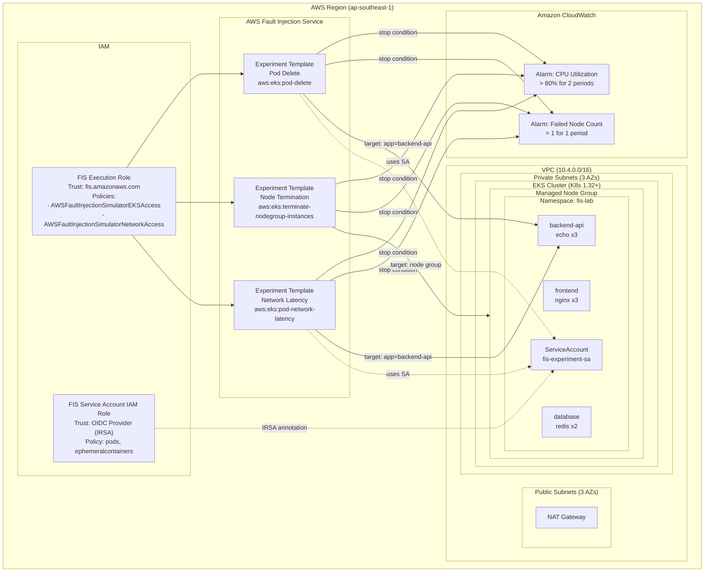

## Overview


AWS FIS is a managed AWS service purpose-built for running controlled fault injection experiments on AWS resources. Unlike third-party tools such as Chaos Mesh or Litmus that require installing controllers inside the cluster, FIS integrates directly with the AWS ecosystem and offers several advantages:

- **No agent installation** — FIS pod actions use ephemeral containers to inject faults, rather than DaemonSets or sidecars that must be deployed on every node
- **IAM-based access control** — Permissions are managed entirely through IAM roles and policies, providing granular control consistent with the AWS security model
- **CloudWatch integration** — Stop conditions use CloudWatch alarms to automatically halt an experiment if the cluster becomes unhealthy
- **Audit trail** — All experiments are recorded in AWS CloudTrail, providing full visibility for compliance and post-mortem analysis

This lab walks you through running **AWS Fault Injection Service (FIS)** experiments on an EKS cluster to test application resilience using a **fully managed, AWS-native** chaos engineering platform.

In this lab, you will run **three FIS experiments**:

1. **Pod Delete** (`aws:eks:pod-delete`) — Deletes a backend-api pod to test Kubernetes self-healing
2. **Node Group Termination** (`aws:eks:terminate-nodegroup-instances`) — Terminates 34% of EC2 instances to test workload redistribution
3. **Pod Network Latency** (`aws:eks:pod-network-latency`) — Injects 200ms latency into backend-api pods to test degraded network behavior

This lab is **self-contained** — all infrastructure (VPC, EKS cluster, IAM roles, FIS experiment templates, CloudWatch alarms, sample application) is provisioned from scratch by Terraform. You do not need to complete any other lab first.

## Objectives

1. Deploy an EKS cluster with FIS experiment templates using Terraform
2. Run an FIS pod-delete experiment to test self-healing
3. Run an FIS node-termination experiment to test workload redistribution
4. Run an FIS pod-network-latency experiment to test degraded network behavior
5. Understand IAM roles, IRSA, and CloudWatch stop conditions for FIS

## Prerequisites

### Required Tools

| Tool | Minimum Version | Install Guide |
| --- | --- | --- |
| AWS CLI | 2.x | [Install AWS CLI](https://docs.aws.amazon.com/cli/latest/userguide/getting-started-install.html) |
| Terraform | >= 1.7 | [Install Terraform](https://developer.hashicorp.com/terraform/install) |
| kubectl | >= 1.32 | [Install kubectl](https://kubernetes.io/docs/tasks/tools/) |

> **Note**: This lab **does not require Helm** — AWS FIS is a managed service that does not require installing a controller inside the cluster. All Kubernetes resources are deployed as plain manifests.

### Required Knowledge

- Basic understanding of Kubernetes (Pods, Deployments, Services, Namespaces)
- Basic experience with EKS (or familiarity with managed Kubernetes)
- Understanding of IAM roles and IRSA (IAM Roles for Service Accounts)
- Basic Terraform experience (init, plan, apply)

### AWS Account

- An active AWS account with permissions to create VPCs, EKS clusters, IAM roles, FIS experiment templates, and CloudWatch alarms
- AWS CLI already configured (`aws configure`)

## Architecture Overview



```plain
┌──────────────────────────────────────────────────────────────────────┐
│                      AWS Region (ap-southeast-1)                      │
│                                                                       │
│  ┌──────────────── VPC (10.4.0.0/16) ────────────────────────────┐  │
│  │                                                                │  │
│  │  ┌──────────────── EKS Cluster (K8s 1.32+) ───────────────┐  │  │
│  │  │                                                          │  │  │
│  │  │  AWS FIS (managed service, no in-cluster agent):         │  │  │
│  │  │  ├── Experiment: pod-delete (aws:eks:pod-delete)         │  │  │
│  │  │  ├── Experiment: node-termination (terminate-nodegroup)  │  │  │
│  │  │  └── Experiment: network-latency (pod-network-latency)   │  │  │
│  │  │                                                          │  │  │
│  │  │  fis-lab namespace:                                      │  │  │
│  │  │  ├── frontend (nginx x3) ─────────┐                     │  │  │
│  │  │  │                                  │                     │  │  │
│  │  │  ├── backend-api (echo x3) ◄───────┘                    │  │  │
│  │  │  │        ▲                                              │  │  │
│  │  │  │        │ FIS Targets:                                 │  │  │
│  │  │  │        │ ├── pod-delete (COUNT 1)                     │  │  │
│  │  │  │        │ └── network-latency (COUNT 3, 200ms)         │  │  │
│  │  │  │        │                                              │  │  │
│  │  │  ├── database (redis x2) ◄────────┘                     │  │  │
│  │  │  │                                                       │  │  │
│  │  │  └── fis-experiment-sa (ServiceAccount + IRSA)           │  │  │
│  │  │                                                          │  │  │
│  │  │  Managed Node Group (t3.medium x3):                      │  │  │
│  │  │  └── Target: node-termination (34% instances)            │  │  │
│  │  │                                                          │  │  │
│  │  └──────────────────────────────────────────────────────────┘  │  │
│  │                                                                │  │
│  └────────────────────────────────────────────────────────────────┘  │
│                                                                       │
│  IAM Roles:                                                           │
│  ├── FIS Execution Role (fis.amazonaws.com trust)                     │
│  │   ├── AWSFaultInjectionSimulatorEKSAccess                          │
│  │   └── AWSFaultInjectionSimulatorNetworkAccess                      │
│  └── FIS SA IAM Role (OIDC/IRSA trust)                               │
│      └── Pod management permissions (fis-lab namespace)               │
│                                                                       │
│  CloudWatch Alarms (Stop Conditions):                                 │
│  ├── CPU Utilization > 80% (2 periods x 60s)                         │
│  └── Failed Node Count > 1 (1 period x 60s)                          │
│                                                                       │
└───────────────────────────────────────────────────────────────────────┘
```

## Step-by-Step Guide

### Step 1: Create the Project Structure

Create the directory structure for the lab:

```bash
mkdir -p aws-fis-chaos-engineering/{terraform,k8s,scripts}
cd aws-fis-chaos-engineering
```

The final project structure will look like this:

```plain
aws-fis-chaos-engineering/
├── terraform/
│   ├── variables.tf                   # Input variables
│   ├── main.tf                        # VPC, EKS, providers
│   ├── fis.tf                         # FIS IAM roles + 3 experiment templates
│   ├── cloudwatch.tf                  # CloudWatch alarms (stop conditions)
│   ├── outputs.tf                     # Outputs (cluster, FIS IDs, alarms)
│   └── terraform.tfvars.example       # Example variable overrides
├── k8s/
│   ├── namespace.yaml                 # fis-lab namespace
│   ├── sample-app.yaml                # frontend, backend-api, database
│   └── fis-rbac.yaml                  # ServiceAccount + RBAC for FIS
└── scripts/
    ├── deploy.sh                      # Provision all infrastructure
    ├── destroy.sh                     # Clean up all resources
    └── run-fis-experiment.sh          # Run and monitor FIS experiments
```

Set the region so all AWS CLI commands in this lab use the correct region:

```bash
export AWS_DEFAULT_REGION=ap-southeast-1
```

> **Note**: This lab deploys resources in `ap-southeast-1` (Singapore). If you are using a different region, update the value in `terraform/terraform.tfvars` and export the appropriate region.

### Step 2: Create the Terraform Files

#### Variables and Configuration

Create `terraform/variables.tf`:

This file defines the input variables for the lab — region, naming prefix, VPC CIDR, and Kubernetes version.

```hcl
# =============================================================================
# variables.tf — AWS FIS Chaos Engineering Lab
# =============================================================================

variable "aws_region" {
  description = "AWS region for lab resources"
  type        = string
  default     = "ap-southeast-1"
}

variable "lab_name" {
  description = "Name prefix for all lab resources"
  type        = string
  default     = "aws-fis-chaos-lab"
}

# -----------------------------------------------------------------------------
# VPC
# -----------------------------------------------------------------------------
variable "vpc_cidr" {
  description = "CIDR block for the VPC"
  type        = string
  default     = "10.4.0.0/16"
}

# -----------------------------------------------------------------------------
# EKS Cluster
# -----------------------------------------------------------------------------
variable "kubernetes_version" {
  description = "Kubernetes version for the EKS cluster"
  type        = string
  default     = "1.32"
}
```

#### Main Infrastructure (VPC + EKS)

Create `terraform/main.tf`:

This file provisions the VPC with public/private subnets across 3 AZs, the EKS cluster with a managed node group, and configures the Kubernetes provider.

```hcl
# =============================================================================
# main.tf — EKS Cluster for AWS FIS Chaos Engineering Lab
# Provisions VPC, EKS cluster, and node groups for FIS experiments
# =============================================================================

terraform {
  required_version = ">= 1.7"
  required_providers {
    aws = {
      source  = "hashicorp/aws"
      version = ">= 5.0"
    }
    kubernetes = {
      source  = "hashicorp/kubernetes"
      version = ">= 2.0"
    }
  }

  # Uncomment for remote state (recommended for team environments):
  # backend "s3" {
  #   bucket = "your-terraform-state-bucket"
  #   key    = "devops-blog-labs/kubernetes-eks/aws-fis-chaos-engineering/terraform.tfstate"
  #   region = "ap-southeast-1"
  # }
}

provider "aws" {
  region = var.aws_region

  default_tags {
    tags = local.common_tags
  }
}

locals {
  common_tags = {
    Project   = "devops-blog-labs"
    Lab       = var.lab_name
    ManagedBy = "terraform"
  }

  azs = slice(data.aws_availability_zones.available.names, 0, 3)
}

data "aws_availability_zones" "available" {
  state = "available"
}

# =============================================================================
# VPC — Public and private subnets across 3 AZs
# =============================================================================
module "vpc" {
  source  = "terraform-aws-modules/vpc/aws"
  version = "~> 5.0"

  name = "${var.lab_name}-vpc"
  cidr = var.vpc_cidr

  azs             = local.azs
  private_subnets = [for i, az in local.azs : cidrsubnet(var.vpc_cidr, 4, i)]
  public_subnets  = [for i, az in local.azs : cidrsubnet(var.vpc_cidr, 4, i + 4)]

  enable_nat_gateway   = true
  single_nat_gateway   = true  # Cost optimization: single NAT
  enable_dns_hostnames = true
  enable_dns_support   = true

  # Tags required for EKS
  public_subnet_tags = {
    "kubernetes.io/role/elb"                    = 1
    "kubernetes.io/cluster/${var.lab_name}-eks" = "shared"
  }

  private_subnet_tags = {
    "kubernetes.io/role/internal-elb"           = 1
    "kubernetes.io/cluster/${var.lab_name}-eks" = "shared"
  }

  tags = local.common_tags
}

# =============================================================================
# EKS Cluster — Kubernetes 1.32+ with managed node groups
# =============================================================================
module "eks" {
  source  = "terraform-aws-modules/eks/aws"
  version = "~> 20.0"

  cluster_name    = "${var.lab_name}-eks"
  cluster_version = var.kubernetes_version

  vpc_id     = module.vpc.vpc_id
  subnet_ids = module.vpc.private_subnets

  # Allow public access to API server for lab convenience
  cluster_endpoint_public_access = true

  # Grant the cluster creator admin access to Kubernetes API
  enable_cluster_creator_admin_permissions = true

  # Enable OIDC provider (required for IRSA / FIS service account)
  enable_irsa = true

  # EKS managed node groups
  eks_managed_node_groups = {
    system = {
      name           = "${var.lab_name}-ng"
      instance_types = ["t3.medium"]
      min_size       = 2
      max_size       = 4
      desired_size   = 3  # 3 nodes for chaos experiment headroom

      iam_role_use_name_prefix = false

      labels = {
        role = "system"
      }
    }
  }

  # Cluster addons
  cluster_addons = {
    coredns = {
      most_recent = true
    }
    kube-proxy = {
      most_recent = true
    }
    vpc-cni = {
      most_recent = true
    }
    amazon-cloudwatch-observability = {
      most_recent = true
    }
  }

  tags = local.common_tags
}

# =============================================================================
# Kubernetes provider — configured after EKS is created
# =============================================================================
data "aws_eks_cluster_auth" "cluster" {
  name = module.eks.cluster_name
}

provider "kubernetes" {
  host                   = module.eks.cluster_endpoint
  cluster_ca_certificate = base64decode(module.eks.cluster_certificate_authority_data)
  token                  = data.aws_eks_cluster_auth.cluster.token
}
```

#### FIS Experiment Templates and IAM Roles

Create `terraform/fis.tf`:

This file defines the FIS execution role, the IRSA-based service account role, and three experiment templates (pod delete, node termination, network latency).

```hcl
# =============================================================================
# fis.tf — AWS FIS Experiment Templates and IAM Roles
# Defines FIS execution role, service account IAM role (IRSA), and
# experiment templates for pod delete, node termination, and network latency
# =============================================================================

# =============================================================================
# Data Sources
# =============================================================================
data "aws_caller_identity" "current" {}

# =============================================================================
# FIS Execution Role — assumed by FIS to run experiments
# =============================================================================
resource "aws_iam_role" "fis_execution" {
  name = "${var.lab_name}-fis-execution-role"

  assume_role_policy = jsonencode({
    Version = "2012-10-17"
    Statement = [
      {
        Effect = "Allow"
        Principal = {
          Service = "fis.amazonaws.com"
        }
        Action = "sts:AssumeRole"
      }
    ]
  })

  tags = merge(local.common_tags, {
    Name = "${var.lab_name}-fis-execution-role"
  })
}

resource "aws_iam_role_policy_attachment" "fis_eks_access" {
  role       = aws_iam_role.fis_execution.name
  policy_arn = "arn:aws:iam::aws:policy/service-role/AWSFaultInjectionSimulatorEKSAccess"
}

resource "aws_iam_role_policy_attachment" "fis_network_access" {
  role       = aws_iam_role.fis_execution.name
  policy_arn = "arn:aws:iam::aws:policy/service-role/AWSFaultInjectionSimulatorNetworkAccess"
}

# Inline policy for permissions not covered by managed policies
resource "aws_iam_role_policy" "fis_execution_extra" {
  name = "${var.lab_name}-fis-execution-extra"
  role = aws_iam_role.fis_execution.id

  policy = jsonencode({
    Version = "2012-10-17"
    Statement = [
      {
        Effect = "Allow"
        Action = [
          "tag:GetResources",
          "eks:DescribeCluster",
          "ec2:DescribeInstances",
          "ec2:DescribeSubnets",
          "ec2:DescribeSecurityGroups",
          "ec2:DescribeVpcs",
          "eks:DescribeNodegroup",
          "ec2:TerminateInstances"
        ]
        Resource = "*"
      }
    ]
  })
}

# EKS access entry for FIS execution role (required for API auth mode)
resource "aws_eks_access_entry" "fis_execution" {
  cluster_name  = module.eks.cluster_name
  principal_arn = aws_iam_role.fis_execution.arn
  type          = "STANDARD"
}

resource "aws_eks_access_policy_association" "fis_execution" {
  cluster_name  = module.eks.cluster_name
  principal_arn = aws_iam_role.fis_execution.arn
  policy_arn    = "arn:aws:eks::aws:cluster-access-policy/AmazonEKSClusterAdminPolicy"

  access_scope {
    type = "cluster"
  }

  depends_on = [aws_eks_access_entry.fis_execution]
}

# =============================================================================
# FIS Service Account IAM Role — IRSA for FIS pod actions
# =============================================================================
resource "aws_iam_role" "fis_service_account" {
  name = "${var.lab_name}-fis-sa-role"

  assume_role_policy = jsonencode({
    Version = "2012-10-17"
    Statement = [
      {
        Effect = "Allow"
        Principal = {
          Federated = module.eks.oidc_provider_arn
        }
        Action = "sts:AssumeRoleWithWebIdentity"
        Condition = {
          StringEquals = {
            "${module.eks.oidc_provider}:sub" = "system:serviceaccount:fis-lab:fis-experiment-sa"
            "${module.eks.oidc_provider}:aud" = "sts.amazonaws.com"
          }
        }
      }
    ]
  })

  tags = merge(local.common_tags, {
    Name = "${var.lab_name}-fis-sa-role"
  })
}

resource "aws_iam_role_policy" "fis_service_account_policy" {
  name = "${var.lab_name}-fis-sa-policy"
  role = aws_iam_role.fis_service_account.id

  policy = jsonencode({
    Version = "2012-10-17"
    Statement = [
      {
        Effect = "Allow"
        Action = [
          "eks:DescribeCluster",
          "ec2:DescribeSubnets",
          "ec2:DescribeSecurityGroups",
          "ec2:DescribeVpcs"
        ]
        Resource = "*"
      }
    ]
  })
}

# =============================================================================
# FIS Experiment Template — Pod Delete
# Deletes one backend-api pod to test self-healing
# =============================================================================
resource "aws_fis_experiment_template" "pod_delete" {
  description = "Delete a backend-api pod in fis-lab namespace to test self-healing"
  role_arn    = aws_iam_role.fis_execution.arn

  stop_condition {
    source = "aws:cloudwatch:alarm"
    value  = aws_cloudwatch_metric_alarm.cpu_utilization.arn
  }

  stop_condition {
    source = "aws:cloudwatch:alarm"
    value  = aws_cloudwatch_metric_alarm.failed_node_count.arn
  }

  action {
    name      = "pod-delete-action"
    action_id = "aws:eks:pod-delete"

    target {
      key   = "Pods"
      value = "backend-api-pods"
    }

    parameter {
      key   = "kubernetesServiceAccount"
      value = "fis-experiment-sa"
    }
  }

  target {
    name           = "backend-api-pods"
    resource_type  = "aws:eks:pod"
    selection_mode = "COUNT(1)"

    parameters = {
      clusterIdentifier = module.eks.cluster_arn
      namespace         = "fis-lab"
      selectorType      = "labelSelector"
      selectorValue     = "app=backend-api"
    }
  }

  tags = {
    Name       = "${var.lab_name}-pod-delete"
    Experiment = "pod-delete"
    Lab        = var.lab_name
    ManagedBy  = "terraform"
  }
}

# =============================================================================
# FIS Experiment Template — Node Termination
# Terminates 34% of node group instances to test workload redistribution
# =============================================================================
resource "aws_fis_experiment_template" "node_termination" {
  description = "Terminate 34% of EKS node group instances to test workload redistribution"
  role_arn    = aws_iam_role.fis_execution.arn

  stop_condition {
    source = "aws:cloudwatch:alarm"
    value  = aws_cloudwatch_metric_alarm.cpu_utilization.arn
  }

  stop_condition {
    source = "aws:cloudwatch:alarm"
    value  = aws_cloudwatch_metric_alarm.failed_node_count.arn
  }

  action {
    name      = "node-termination-action"
    action_id = "aws:eks:terminate-nodegroup-instances"

    target {
      key   = "Nodegroups"
      value = "eks-nodegroup"
    }

    parameter {
      key   = "instanceTerminationPercentage"
      value = "34"
    }
  }

  target {
    name           = "eks-nodegroup"
    resource_type  = "aws:eks:nodegroup"
    selection_mode = "ALL"

    resource_arns = [module.eks.eks_managed_node_groups["system"].node_group_arn]
  }

  tags = {
    Name       = "${var.lab_name}-node-termination"
    Experiment = "node-termination"
    Lab        = var.lab_name
    ManagedBy  = "terraform"
  }
}

# =============================================================================
# FIS Experiment Template — Network Latency
# Injects 200ms latency (+50ms jitter) into backend-api pods for 5 minutes
# =============================================================================
resource "aws_fis_experiment_template" "network_latency" {
  description = "Inject network latency into backend-api pods to test degraded network behavior"
  role_arn    = aws_iam_role.fis_execution.arn

  stop_condition {
    source = "aws:cloudwatch:alarm"
    value  = aws_cloudwatch_metric_alarm.cpu_utilization.arn
  }

  stop_condition {
    source = "aws:cloudwatch:alarm"
    value  = aws_cloudwatch_metric_alarm.failed_node_count.arn
  }

  action {
    name      = "network-latency-action"
    action_id = "aws:eks:pod-network-latency"

    target {
      key   = "Pods"
      value = "backend-api-pods"
    }

    parameter {
      key   = "kubernetesServiceAccount"
      value = "fis-experiment-sa"
    }

    parameter {
      key   = "duration"
      value = "PT5M"
    }

    parameter {
      key   = "delayMilliseconds"
      value = "200"
    }

    parameter {
      key   = "jitterMilliseconds"
      value = "50"
    }

    parameter {
      key   = "sources"
      value = "0.0.0.0/0"
    }
  }

  target {
    name           = "backend-api-pods"
    resource_type  = "aws:eks:pod"
    selection_mode = "COUNT(3)"

    parameters = {
      clusterIdentifier = module.eks.cluster_arn
      namespace         = "fis-lab"
      selectorType      = "labelSelector"
      selectorValue     = "app=backend-api"
    }
  }

  tags = {
    Name       = "${var.lab_name}-network-latency"
    Experiment = "network-latency"
    Lab        = var.lab_name
    ManagedBy  = "terraform"
  }
}
```

#### CloudWatch Alarms (Stop Conditions)

Create `terraform/cloudwatch.tf`:

These CloudWatch alarms act as safety nets — FIS automatically stops an experiment if CPU utilization spikes above 80% or more than 1 node enters a failed state.

```hcl
# =============================================================================
# cloudwatch.tf — CloudWatch Alarms for FIS Stop Conditions
# Monitors EKS cluster health and automatically stops FIS experiments
# if the cluster becomes unhealthy (CPU spike or node failures)
# =============================================================================

# =============================================================================
# CloudWatch Alarm — CPU Utilization
# Triggers when average node CPU exceeds 80% for 2 consecutive periods
# =============================================================================
resource "aws_cloudwatch_metric_alarm" "cpu_utilization" {
  alarm_name          = "${var.lab_name}-cpu-utilization"
  alarm_description   = "Stops FIS experiments when EKS node CPU utilization exceeds 80% for 2 consecutive minutes"
  namespace           = "ContainerInsights"
  metric_name         = "node_cpu_utilization"
  comparison_operator = "GreaterThanThreshold"
  threshold           = 80
  evaluation_periods  = 2
  period              = 60
  statistic           = "Average"
  treat_missing_data  = "notBreaching"

  dimensions = {
    ClusterName = module.eks.cluster_name
  }

  tags = merge(local.common_tags, {
    Name = "${var.lab_name}-cpu-utilization"
  })
}

# =============================================================================
# CloudWatch Alarm — Failed Node Count
# Triggers when more than 1 node is in a failed state
# =============================================================================
resource "aws_cloudwatch_metric_alarm" "failed_node_count" {
  alarm_name          = "${var.lab_name}-failed-node-count"
  alarm_description   = "Stops FIS experiments when more than 1 EKS node enters a failed state"
  namespace           = "ContainerInsights"
  metric_name         = "cluster_failed_node_count"
  comparison_operator = "GreaterThanThreshold"
  threshold           = 1
  evaluation_periods  = 1
  period              = 60
  statistic           = "Maximum"
  treat_missing_data  = "notBreaching"

  dimensions = {
    ClusterName = module.eks.cluster_name
  }

  tags = merge(local.common_tags, {
    Name = "${var.lab_name}-failed-node-count"
  })
}
```

#### Outputs

Create `terraform/outputs.tf`:

This file exports the cluster name, FIS template IDs, and CloudWatch alarm ARNs used by the deploy and experiment scripts.

```hcl
# =============================================================================
# outputs.tf — AWS FIS Chaos Engineering Lab
# =============================================================================

# -----------------------------------------------------------------------------
# Cluster
# -----------------------------------------------------------------------------
output "cluster_name" {
  description = "Name of the EKS cluster"
  value       = module.eks.cluster_name
}

output "cluster_endpoint" {
  description = "Endpoint URL for the EKS cluster API server"
  value       = module.eks.cluster_endpoint
}

output "cluster_version" {
  description = "Kubernetes version running on the cluster"
  value       = module.eks.cluster_version
}

# -----------------------------------------------------------------------------
# Kubeconfig
# -----------------------------------------------------------------------------
output "kubeconfig_command" {
  description = "AWS CLI command to update kubeconfig for this cluster"
  value       = "aws eks update-kubeconfig --region ${var.aws_region} --name ${module.eks.cluster_name}"
}

# -----------------------------------------------------------------------------
# VPC
# -----------------------------------------------------------------------------
output "vpc_id" {
  description = "ID of the VPC"
  value       = module.vpc.vpc_id
}

# -----------------------------------------------------------------------------
# FIS
# -----------------------------------------------------------------------------
output "fis_execution_role_arn" {
  description = "ARN of the IAM role assumed by FIS to run experiments"
  value       = aws_iam_role.fis_execution.arn
}

output "fis_service_account_role_arn" {
  description = "ARN of the IAM role for the FIS Kubernetes service account (IRSA)"
  value       = aws_iam_role.fis_service_account.arn
}

output "fis_template_pod_delete_id" {
  description = "ID of the FIS experiment template for pod delete"
  value       = aws_fis_experiment_template.pod_delete.id
}

output "fis_template_node_termination_id" {
  description = "ID of the FIS experiment template for node termination"
  value       = aws_fis_experiment_template.node_termination.id
}

output "fis_template_network_latency_id" {
  description = "ID of the FIS experiment template for network latency"
  value       = aws_fis_experiment_template.network_latency.id
}

# -----------------------------------------------------------------------------
# CloudWatch
# -----------------------------------------------------------------------------
output "cloudwatch_alarm_cpu_arn" {
  description = "ARN of the CloudWatch alarm for CPU utilization (FIS stop condition)"
  value       = aws_cloudwatch_metric_alarm.cpu_utilization.arn
}

output "cloudwatch_alarm_failed_node_arn" {
  description = "ARN of the CloudWatch alarm for failed node count (FIS stop condition)"
  value       = aws_cloudwatch_metric_alarm.failed_node_count.arn
}
```

#### Example Variable Overrides

Create `terraform/terraform.tfvars.example`:

Copy this file to `terraform.tfvars` and adjust values if you want to use a different region or naming prefix.

```hcl
# =============================================================================
# terraform.tfvars.example — AWS FIS Chaos Engineering Lab
# Copy this file to terraform.tfvars and adjust values as needed:
#   cp terraform.tfvars.example terraform.tfvars
# =============================================================================

aws_region         = "ap-southeast-1"
lab_name           = "aws-fis-chaos-lab"
vpc_cidr           = "10.4.0.0/16"
kubernetes_version = "1.32"
```

(Optional) Override defaults:

```bash
cp terraform/terraform.tfvars.example terraform/terraform.tfvars
```

### Step 3: Create the Kubernetes Manifests

#### Namespace

Create `k8s/namespace.yaml`:

This creates a dedicated namespace for all lab resources, keeping them isolated from other workloads.

```yaml
# =============================================================================
# namespace.yaml — Lab namespace for AWS FIS Chaos Engineering experiments
# =============================================================================
apiVersion: v1
kind: Namespace
metadata:
  name: fis-lab
  labels:
    app.kubernetes.io/part-of: aws-fis-chaos-engineering-lab
    purpose: fis-experiments
```

#### Sample Application

Create `k8s/sample-app.yaml`:

This deploys a multi-tier application with frontend (NGINX x3), backend-api (HTTP echo x3), and database (Redis x2) — the target workloads for FIS experiments.

```yaml
# =============================================================================
# sample-app.yaml — Target application for AWS FIS chaos experiments
# Multi-replica deployment with frontend, backend, and Redis database
# =============================================================================

# -----------------------------------------------------------------------------
# Frontend — NGINX reverse proxy (3 replicas for resilience testing)
# -----------------------------------------------------------------------------
apiVersion: apps/v1
kind: Deployment
metadata:
  name: frontend
  namespace: fis-lab
  labels:
    app: frontend
    tier: web
    app.kubernetes.io/part-of: aws-fis-chaos-engineering-lab
spec:
  replicas: 3
  selector:
    matchLabels:
      app: frontend
  template:
    metadata:
      labels:
        app: frontend
        tier: web
    spec:
      containers:
                - name: nginx
          image: nginx:1.25-alpine
          ports:
                        - containerPort: 80
              name: http
          resources:
            requests:
              cpu: 50m
              memory: 64Mi
            limits:
              cpu: 200m
              memory: 128Mi
          readinessProbe:
            httpGet:
              path: /
              port: 80
            initialDelaySeconds: 5
            periodSeconds: 10
          livenessProbe:
            httpGet:
              path: /
              port: 80
            initialDelaySeconds: 10
            periodSeconds: 15
---
apiVersion: v1
kind: Service
metadata:
  name: frontend
  namespace: fis-lab
  labels:
    app: frontend
spec:
  selector:
    app: frontend
  ports:
        - port: 80
      targetPort: 80
      name: http
  type: ClusterIP

# -----------------------------------------------------------------------------
# Backend API — HTTP echo service (3 replicas)
# -----------------------------------------------------------------------------
---
apiVersion: apps/v1
kind: Deployment
metadata:
  name: backend-api
  namespace: fis-lab
  labels:
    app: backend-api
    tier: api
    app.kubernetes.io/part-of: aws-fis-chaos-engineering-lab
spec:
  replicas: 3
  selector:
    matchLabels:
      app: backend-api
  template:
    metadata:
      labels:
        app: backend-api
        tier: api
    spec:
      containers:
                - name: echo
          image: hashicorp/http-echo:0.2.3
          args:
                        - "-listen=:8080"
                        - '-text={"service":"backend-api","status":"healthy","hostname":"$(HOSTNAME)"}'
          env:
                        - name: HOSTNAME
              valueFrom:
                fieldRef:
                  fieldPath: metadata.name
          ports:
                        - containerPort: 8080
              name: http
          resources:
            requests:
              cpu: 50m
              memory: 64Mi
            limits:
              cpu: 200m
              memory: 128Mi
          readinessProbe:
            httpGet:
              path: /
              port: 8080
            initialDelaySeconds: 3
            periodSeconds: 10
          livenessProbe:
            httpGet:
              path: /
              port: 8080
            initialDelaySeconds: 5
            periodSeconds: 15
---
apiVersion: v1
kind: Service
metadata:
  name: backend-api
  namespace: fis-lab
  labels:
    app: backend-api
spec:
  selector:
    app: backend-api
  ports:
        - port: 8080
      targetPort: 8080
      name: http
  type: ClusterIP

# -----------------------------------------------------------------------------
# Database — Redis (2 replicas for resilience testing)
# -----------------------------------------------------------------------------
---
apiVersion: apps/v1
kind: Deployment
metadata:
  name: database
  namespace: fis-lab
  labels:
    app: database
    tier: data
    app.kubernetes.io/part-of: aws-fis-chaos-engineering-lab
spec:
  replicas: 2
  selector:
    matchLabels:
      app: database
  template:
    metadata:
      labels:
        app: database
        tier: data
    spec:
      containers:
                - name: redis
          image: redis:7.2-alpine
          ports:
                        - containerPort: 6379
              name: redis
          resources:
            requests:
              cpu: 50m
              memory: 64Mi
            limits:
              cpu: 200m
              memory: 128Mi
          readinessProbe:
            exec:
              command: ["redis-cli", "ping"]
            initialDelaySeconds: 5
            periodSeconds: 10
          livenessProbe:
            exec:
              command: ["redis-cli", "ping"]
            initialDelaySeconds: 10
            periodSeconds: 15
---
apiVersion: v1
kind: Service
metadata:
  name: database
  namespace: fis-lab
  labels:
    app: database
spec:
  selector:
    app: database
  ports:
        - port: 6379
      targetPort: 6379
      name: redis
  type: ClusterIP
```

#### FIS Service Account and RBAC

Create `k8s/fis-rbac.yaml`:

This creates the Kubernetes ServiceAccount (with IRSA annotation), Role, and RoleBinding that FIS needs to perform pod-level actions. The `<FIS_SA_ROLE_ARN>` placeholder is replaced by `deploy.sh` at deploy time.

```yaml
# =============================================================================
# fis-rbac.yaml — ServiceAccount, Role, and RoleBinding for AWS FIS experiments
# Provides IRSA-based authentication and least-privilege RBAC for FIS pod actions
# =============================================================================

# -----------------------------------------------------------------------------
# ServiceAccount — Used by FIS pod actions via IRSA
# The role ARN annotation is replaced by deploy.sh with the actual IAM role ARN
# -----------------------------------------------------------------------------
apiVersion: v1
kind: ServiceAccount
metadata:
  name: fis-experiment-sa
  namespace: fis-lab
  labels:
    app.kubernetes.io/part-of: aws-fis-chaos-engineering-lab
  annotations:
    eks.amazonaws.com/role-arn: <FIS_SA_ROLE_ARN>

# -----------------------------------------------------------------------------
# Role — Namespace-scoped permissions required by FIS pod actions
# Ref: https://docs.aws.amazon.com/fis/latest/userguide/eks-pod-actions.html
# -----------------------------------------------------------------------------
---
apiVersion: rbac.authorization.k8s.io/v1
kind: Role
metadata:
  name: fis-experiment-role
  namespace: fis-lab
  labels:
    app.kubernetes.io/part-of: aws-fis-chaos-engineering-lab
rules:
    - apiGroups: [""]
    resources: ["configmaps"]
    verbs: ["get", "create", "patch", "delete"]
    - apiGroups: [""]
    resources: ["pods"]
    verbs: ["create", "list", "get", "delete", "deletecollection"]
    - apiGroups: [""]
    resources: ["pods/ephemeralcontainers"]
    verbs: ["update"]
    - apiGroups: [""]
    resources: ["pods/exec"]
    verbs: ["create"]
    - apiGroups: ["apps"]
    resources: ["deployments"]
    verbs: ["get"]

# -----------------------------------------------------------------------------
# RoleBinding — Binds the Role to the FIS ServiceAccount
# -----------------------------------------------------------------------------
---
apiVersion: rbac.authorization.k8s.io/v1
kind: RoleBinding
metadata:
  name: fis-experiment-binding
  namespace: fis-lab
  labels:
    app.kubernetes.io/part-of: aws-fis-chaos-engineering-lab
subjects:
    - kind: ServiceAccount
    name: fis-experiment-sa
    namespace: fis-lab
roleRef:
  kind: Role
  name: fis-experiment-role
  apiGroup: rbac.authorization.k8s.io
```

### Step 4: Create the Shell Scripts

#### Deploy Script

Create `scripts/deploy.sh`:

This script validates prerequisites, provisions all AWS infrastructure with Terraform, configures kubeconfig, and deploys the Kubernetes manifests.

```bash
#!/bin/bash
set -euo pipefail

# =============================================================================
# deploy.sh — AWS FIS Chaos Engineering — Deploy
# Provisions VPC, EKS cluster, FIS experiment templates, deploys sample app
# =============================================================================

# Colors for output
RED='\033[0;31m'
GREEN='\033[0;32m'
YELLOW='\033[1;33m'
CYAN='\033[0;36m'
NC='\033[0m' # No Color

SCRIPT_DIR="$(cd "$(dirname "${BASH_SOURCE[0]}")" && pwd)"
LAB_DIR="$(dirname "$SCRIPT_DIR")"

echo -e "${CYAN}========================================${NC}"
echo -e "${CYAN}  AWS FIS Chaos Engineering — Deploy${NC}"
echo -e "${CYAN}========================================${NC}"
echo ""

# ---------------------------------------------------------------------------
# Step 1: Check prerequisites
# ---------------------------------------------------------------------------
echo -e "${YELLOW}[1/8] Checking prerequisites...${NC}"

# AWS CLI
if ! command -v aws &> /dev/null; then
    echo -e "${RED}ERROR: AWS CLI is not installed.${NC}"
    echo "  Install: https://docs.aws.amazon.com/cli/latest/userguide/getting-started-install.html"
    exit 1
fi

# AWS credentials configured
if ! aws sts get-caller-identity &> /dev/null 2>&1; then
    echo -e "${RED}ERROR: AWS credentials are not configured.${NC}"
    echo "  Run: aws configure"
    exit 1
fi

# Terraform
if ! command -v terraform &> /dev/null; then
    echo -e "${RED}ERROR: Terraform is not installed.${NC}"
    echo "  Install: https://developer.hashicorp.com/terraform/install"
    exit 1
fi

# Terraform version check (>= 1.7)
TF_VERSION=$(terraform version -json 2>/dev/null | python3 -c "import sys,json; print(json.load(sys.stdin)['terraform_version'])" 2>/dev/null || terraform version | head -1 | sed 's/[^0-9.]//g')
TF_MAJOR=$(echo "$TF_VERSION" | cut -d. -f1)
TF_MINOR=$(echo "$TF_VERSION" | cut -d. -f2)
if [ "$TF_MAJOR" -lt 1 ] || { [ "$TF_MAJOR" -eq 1 ] && [ "$TF_MINOR" -lt 7 ]; }; then
    echo -e "${RED}ERROR: Terraform >= 1.7 required (found $TF_VERSION).${NC}"
    exit 1
fi

# kubectl
if ! command -v kubectl &> /dev/null; then
    echo -e "${RED}ERROR: kubectl is not installed.${NC}"
    echo "  Install: https://kubernetes.io/docs/tasks/tools/"
    exit 1
fi

echo -e "${GREEN}  ✓ AWS CLI configured${NC}"
echo -e "${GREEN}  ✓ Terraform $TF_VERSION${NC}"
echo -e "${GREEN}  ✓ kubectl available${NC}"
echo ""

# ---------------------------------------------------------------------------
# Step 2: Display lab info
# ---------------------------------------------------------------------------
echo -e "${YELLOW}[2/8] Lab information${NC}"
echo "  Lab    : AWS FIS Chaos Engineering"
echo "  Track  : 2 — Kubernetes on AWS (EKS)"
echo "  Type   : AWS (Terraform + FIS + K8s manifests)"
echo "  Resources:"
echo "    - VPC with public/private subnets (3 AZs)"
echo "    - EKS cluster (Kubernetes 1.32)"
echo "    - System node group (t3.medium x3)"
echo "    - AWS FIS experiment templates (3)"
echo "    - CloudWatch alarms (2)"
echo "    - Sample multi-replica app"
echo ""
# ---------------------------------------------------------------------------
# Step 3: Cost warning
# ---------------------------------------------------------------------------
echo -e "${RED}========================================${NC}"
echo -e "${RED}    COST WARNING${NC}"
echo -e "${RED}========================================${NC}"
echo ""
echo "  Estimated cost: \$0.35 - \$0.80 per hour"
echo ""
echo "  Breakdown:"
echo "    EKS Control Plane  : \$0.10/hr"
echo "    EC2 t3.medium x3   : ~\$0.125/hr"
echo "    NAT Gateway        : \$0.045/hr + data"
echo "    EBS Volumes        : ~\$0.005/hr"
echo "    FIS                : \$0.10 per action-minute"
echo "    Total (approx)     : \$0.35 - \$0.80/hr"
echo ""
echo -e "  ${YELLOW}Run ./scripts/destroy.sh when done to avoid charges!${NC}"
echo ""
read -p "  Continue? (y/N): " CONFIRM
if [[ ! "$CONFIRM" =~ ^[Yy]$ ]]; then
    echo -e "${YELLOW}Aborted.${NC}"
    exit 0
fi
echo ""

# ---------------------------------------------------------------------------
# Step 4: Terraform init
# ---------------------------------------------------------------------------
echo -e "${YELLOW}[3/8] Running terraform init...${NC}"
terraform -chdir="$LAB_DIR/terraform" init

echo ""

# ---------------------------------------------------------------------------
# Step 5: Terraform apply
# ---------------------------------------------------------------------------
echo -e "${YELLOW}[4/8] Running terraform apply (this takes 15-20 minutes)...${NC}"
terraform -chdir="$LAB_DIR/terraform" apply -auto-approve

echo ""
# ---------------------------------------------------------------------------
# Step 6: Configure kubeconfig
# ---------------------------------------------------------------------------
echo -e "${YELLOW}[5/8] Configuring kubeconfig...${NC}"
CLUSTER_NAME=$(terraform -chdir="$LAB_DIR/terraform" output -raw cluster_name)
AWS_REGION=$(terraform -chdir="$LAB_DIR/terraform" output -raw cluster_endpoint | sed -n 's/.*\.\([a-z]*-[a-z]*-[0-9]*\)\..*/\1/p')
AWS_REGION=${AWS_REGION:-ap-southeast-1}

aws eks update-kubeconfig --region "$AWS_REGION" --name "$CLUSTER_NAME"
echo -e "${GREEN}  ✓ kubeconfig updated${NC}"
echo ""

# ---------------------------------------------------------------------------
# Step 7: Apply K8s manifests
# ---------------------------------------------------------------------------
echo -e "${YELLOW}[6/8] Applying Kubernetes manifests...${NC}"

# Create namespace
kubectl apply -f "$LAB_DIR/k8s/namespace.yaml"
echo -e "${GREEN}  ✓ Namespace fis-lab created${NC}"

# Get FIS SA role ARN from terraform output and apply RBAC with substitution
FIS_SA_ROLE_ARN=$(terraform -chdir="$LAB_DIR/terraform" output -raw fis_service_account_role_arn)
sed "s|<FIS_SA_ROLE_ARN>|${FIS_SA_ROLE_ARN}|g" "$LAB_DIR/k8s/fis-rbac.yaml" | kubectl apply -f -
echo -e "${GREEN}  ✓ FIS service account and RBAC configured${NC}"

# Deploy sample app
kubectl apply -f "$LAB_DIR/k8s/sample-app.yaml"
echo -e "${GREEN}  ✓ Sample application deployed${NC}"

echo ""
echo -e "${YELLOW}[7/8] Waiting for deployments to be ready...${NC}"
kubectl rollout status deployment/frontend -n fis-lab --timeout=120s || true
kubectl rollout status deployment/backend-api -n fis-lab --timeout=120s || true
kubectl rollout status deployment/database -n fis-lab --timeout=120s || true

echo -e "${GREEN}  ✓ All deployments ready${NC}"
echo ""
# ---------------------------------------------------------------------------
# Step 8: Summary
# ---------------------------------------------------------------------------
echo -e "${CYAN}========================================${NC}"
echo -e "${CYAN}  Deploy Complete!${NC}"
echo -e "${CYAN}========================================${NC}"
echo ""

# Retrieve FIS template IDs
POD_DELETE_ID=$(terraform -chdir="$LAB_DIR/terraform" output -raw fis_template_pod_delete_id)
NODE_TERM_ID=$(terraform -chdir="$LAB_DIR/terraform" output -raw fis_template_node_termination_id)
NET_LATENCY_ID=$(terraform -chdir="$LAB_DIR/terraform" output -raw fis_template_network_latency_id)

echo "  Cluster     : $CLUSTER_NAME"
echo ""
echo "  FIS Experiment Templates:"
echo "    pod-delete         : $POD_DELETE_ID"
echo "    node-termination   : $NODE_TERM_ID"
echo "    network-latency    : $NET_LATENCY_ID"
echo ""
echo "  Sample App (fis-lab namespace):"
echo "    frontend    — NGINX reverse proxy (3 replicas)"
echo "    backend-api — HTTP echo service (3 replicas)"
echo "    database    — Redis (2 replicas)"
echo ""
echo "  Useful commands:"
echo "    kubectl get pods -n fis-lab"
echo "    ./scripts/run-fis-experiment.sh pod-delete"
echo "    ./scripts/run-fis-experiment.sh node-termination"
echo "    ./scripts/run-fis-experiment.sh network-latency"
echo ""
echo "  Next steps:"
echo "    1. Verify:  kubectl get pods -n fis-lab"
echo "    2. Run experiment: ./scripts/run-fis-experiment.sh pod-delete"
echo "    3. Observe: kubectl get pods -n fis-lab -w"
echo -e "    4. Cleanup: ${RED}./scripts/destroy.sh${NC}"
echo ""
echo -e "  ${RED} Remember to destroy resources when done!${NC}"
echo ""
```

#### Destroy Script

Create `scripts/destroy.sh`:

This script stops any running FIS experiments, removes Kubernetes resources, runs `terraform destroy`, and verifies cleanup.

```bash
#!/bin/bash
set -euo pipefail

# =============================================================================
# destroy.sh — AWS FIS Chaos Engineering — Destroy
# Stops FIS experiments, removes K8s resources, then destroys AWS infrastructure
# =============================================================================

# Colors for output
RED='\033[0;31m'
GREEN='\033[0;32m'
YELLOW='\033[1;33m'
CYAN='\033[0;36m'
NC='\033[0m' # No Color

SCRIPT_DIR="$(cd "$(dirname "${BASH_SOURCE[0]}")" && pwd)"
LAB_DIR="$(dirname "$SCRIPT_DIR")"

echo -e "${CYAN}========================================${NC}"
echo -e "${CYAN}  AWS FIS Chaos Engineering — Destroy${NC}"
echo -e "${CYAN}========================================${NC}"
echo ""

# ---------------------------------------------------------------------------
# Step 1: Display resources to be destroyed
# ---------------------------------------------------------------------------
echo -e "${YELLOW}[1/5] Resources that will be destroyed:${NC}"
echo "  - Active FIS experiments"
echo "  - Sample application (frontend, backend-api, database)"
echo "  - fis-lab namespace"
echo "  - FIS experiment templates (3)"
echo "  - CloudWatch alarms (2)"
echo "  - IAM roles (FIS execution, FIS service account)"
echo "  - EKS cluster and node groups"
echo "  - VPC, subnets, NAT gateway"
echo ""
# ---------------------------------------------------------------------------
# Step 2: Stop running FIS experiments
# ---------------------------------------------------------------------------
echo -e "${YELLOW}[2/5] Stopping running FIS experiments...${NC}"

# Get AWS region from terraform output (fallback to ap-southeast-1)
AWS_REGION=$(terraform -chdir="$LAB_DIR/terraform" output -raw cluster_endpoint 2>/dev/null \
    | sed -n 's/.*\.\([a-z]*-[a-z]*-[0-9]*\)\..*/\1/p')
AWS_REGION=${AWS_REGION:-ap-southeast-1}

# List and stop any running experiments
RUNNING_EXPERIMENTS=$(aws fis list-experiments \
        --region "$AWS_REGION" \
        --query "experiments[?state.status=='running'].id" \
        --output text 2>/dev/null || true)

if [ -n "$RUNNING_EXPERIMENTS" ]; then
    for exp_id in $RUNNING_EXPERIMENTS; do
        echo "  Stopping experiment: $exp_id"
        aws fis stop-experiment --id "$exp_id" --region "$AWS_REGION" || true
    done
    echo -e "${GREEN}  ✓ Running experiments stopped${NC}"
else
    echo -e "${GREEN}  ✓ No running experiments found${NC}"
fi

echo ""

# ---------------------------------------------------------------------------
# Step 3: Remove Kubernetes resources
# ---------------------------------------------------------------------------
echo -e "${YELLOW}[3/5] Removing Kubernetes resources...${NC}"

# Remove FIS RBAC resources
kubectl delete -f "$LAB_DIR/k8s/fis-rbac.yaml" --ignore-not-found=true 2>/dev/null || true

# Remove sample app
kubectl delete -f "$LAB_DIR/k8s/sample-app.yaml" --ignore-not-found=true 2>/dev/null || true

# Remove namespace
kubectl delete -f "$LAB_DIR/k8s/namespace.yaml" --ignore-not-found=true 2>/dev/null || true

echo -e "${GREEN}  ✓ Kubernetes resources removed${NC}"
echo ""

# ---------------------------------------------------------------------------
# Step 4: Terraform destroy
# ---------------------------------------------------------------------------
echo -e "${YELLOW}[4/5] Running terraform destroy (this takes 10-15 minutes)...${NC}"
terraform -chdir="$LAB_DIR/terraform" destroy -auto-approve

echo ""

# ---------------------------------------------------------------------------
# Step 5: Verify cleanup
# ---------------------------------------------------------------------------
echo -e "${YELLOW}[5/5] Verifying cleanup...${NC}"

# Check if any resources remain in Terraform state
REMAINING=$(terraform -chdir="$LAB_DIR/terraform" state list 2>/dev/null | wc -l || echo "0")

if [ "$REMAINING" -eq 0 ]; then
    echo -e "${GREEN}  ✓ All resources destroyed successfully${NC}"
else
    echo -e "${RED}  ⚠ $REMAINING resource(s) may still exist:${NC}"
    terraform -chdir="$LAB_DIR/terraform" state list 2>/dev/null || true
    echo ""
    echo "  Manual cleanup may be required:"
    echo "    1. Check AWS Console → FIS → Experiment templates"
    echo "    2. Check AWS Console → EKS → Clusters"
    echo "    3. Check AWS Console → VPC → NAT Gateways"
    echo "    4. Check AWS Console → IAM → Roles (fis-*)"
    echo "    5. Run: terraform -chdir=\"$LAB_DIR/terraform\" destroy -auto-approve (retry)"
fi

echo ""
echo -e "${CYAN}========================================${NC}"
echo -e "${CYAN}  Destroy Complete${NC}"
echo -e "${CYAN}========================================${NC}"
echo ""
echo -e "${GREEN}  All lab resources have been cleaned up.${NC}"
echo "  No further AWS charges will be incurred for this lab."
echo ""
```

Make all scripts executable:

```bash
chmod +x scripts/*.sh
```

### Step 5: Deploy the Lab

Run the deploy script. This script will:

- Validate prerequisites (AWS CLI, Terraform, kubectl)
- Display a cost warning and prompt for confirmation
- Run `terraform init` and `terraform apply` (VPC, EKS, IAM, FIS templates, CloudWatch alarms)
- Configure kubeconfig via `aws eks update-kubeconfig`
- Deploy Kubernetes manifests (namespace, sample app, FIS service account + RBAC)
- Wait for all deployments to become ready

```bash
./scripts/deploy.sh
```

> The deploy process takes **15-20 minutes** (EKS cluster creation + node group + sample app).


### Step 6: Verify the Setup

After the deploy completes, verify that all components are running correctly:

```bash
# Check nodes
kubectl get nodes

# Check all pods in the fis-lab namespace
kubectl get pods -n fis-lab
# Expected: 8 pods (3 frontend + 3 backend-api + 2 database), all Running

# Check the FIS service account
kubectl get serviceaccount fis-experiment-sa -n fis-lab -o yaml
# Verify the eks.amazonaws.com/role-arn annotation is present

# Check FIS experiment templates via AWS CLI
aws fis list-experiment-templates --query "experimentTemplates[].{ID:id,Description:description}" --output table

# Check CloudWatch alarms
aws cloudwatch describe-alarms --alarm-name-prefix "aws-fis-chaos-lab" --query "MetricAlarms[].{Name:AlarmName,State:StateValue}" --output table
```

### Step 7: Run the Experiment — Pod Delete

This experiment deletes one backend-api pod to test Kubernetes self-healing. We will run each step manually via the AWS CLI so you can see exactly what happens behind the scenes.

#### 7a. Check pod status before the experiment

```bash
kubectl get pods -n fis-lab -l app=backend-api
```

Expected output — 3 pods Running:

```plain
```

#### 7b. Get the FIS template ID from Terraform output

```bash
# Get the template ID for the pod-delete experiment
POD_DELETE_ID=$(terraform -chdir=terraform output -raw fis_template_pod_delete_id)
echo "Template ID: $POD_DELETE_ID"
```

#### 7c. Inspect the experiment template details

Before running the experiment, review the template configuration:

```bash
aws fis get-experiment-template --region ap-southeast-1 \
    --id "$POD_DELETE_ID" \
    --query 'experimentTemplate.{Description: description, Actions: actions, Targets: targets, StopConditions: stopConditions}' \
    --output yaml
```

Note the following:

- **Action**: `aws:eks:pod-delete` — FIS will delete the pod
- **Target**: namespace `fis-lab`, label `app=backend-api`, selection mode `COUNT(1)` — only 1 pod
- **Stop Conditions**: 2 CloudWatch alarms (CPU and failed node count)

#### 7d. Start the experiment

```bash
# Start the experiment and capture the experiment ID
EXPERIMENT_ID=$(aws fis start-experiment \
    --experiment-template-id "$POD_DELETE_ID" \
    --query "experiment.id" \
    --region ap-southeast-1 \
    --output text)

echo "Experiment started: $EXPERIMENT_ID"
```

#### 7e. Monitor the experiment state

In **terminal 1** — watch the experiment status:

```bash
# Poll status every 10 seconds
while true; do
  STATE=$(aws fis get-experiment \
        --id "$EXPERIMENT_ID" \
        --query "experiment.state.status" \
        --region ap-southeast-1 \
        --output text)
  echo "[$(date '+%H:%M:%S')] State: $STATE"

  if [[ "$STATE" == "completed" || "$STATE" == "stopped" || "$STATE" == "failed" ]]; then
    break
  fi
  sleep 10
done
```

In **terminal 2** — observe the pod lifecycle in real time:

```bash
kubectl get pods -n fis-lab -l app=backend-api -w
```

You will see:

```plain
backend-api-xxxxxxxxx-yyyyy    1/1     Terminating   0      10m    # <-- pod deleted by FIS
backend-api-xxxxxxxxx-aaaaa    0/1     Pending       0      0s     # <-- new pod created
backend-api-xxxxxxxxx-aaaaa    0/1     ContainerCreating   0   1s
backend-api-xxxxxxxxx-aaaaa    1/1     Running       0      5s     # <-- recovered!
```

#### 7f. Check the experiment results

```bash
# View detailed experiment results
aws fis get-experiment \
    --id "$EXPERIMENT_ID" \
    --query '{
    State: experiment.state,
    Actions: experiment.actions,
    StartTime: experiment.startTime,
    EndTime: experiment.endTime
  }' \
    --region ap-southeast-1 \
    --output yaml

# Check Kubernetes events
kubectl get events -n fis-lab --sort-by='.lastTimestamp' | tail -10
```

FIS deleted 1 backend-api pod via the Kubernetes API (using the `fis-experiment-sa` service account through IRSA). The Kubernetes Deployment controller detected that the replica count was below the desired state (3) and created a new pod. Recovery time is typically 5-15 seconds. Since there are 3 replicas and only 1 was deleted, at least 2 pods remain Running at all times — no downtime.

### Step 8: Run the Experiment — Network Latency

This experiment injects 200ms latency (±50ms jitter) into all backend-api pods for 5 minutes. FIS uses **ephemeral containers** to inject the latency — no sidecar or DaemonSet required.

#### 8a. Measure baseline latency (before the experiment)

Measure the total round-trip time. The absolute numbers include kubectl overhead, but what matters is the **difference** before and after latency injection:

```bash
for i in $(seq 1 5); do
  echo "--- Request $i ---"
  time kubectl exec -n fis-lab deploy/frontend -- \
    wget -qO- --timeout=5 http://backend-api:8080/
  echo ""
done
```

Note the `total` value from each request. After FIS injects 200ms latency, this number will increase by \~0.2s.

#### 8b. Get the FIS template ID

```bash
NET_LATENCY_ID=$(terraform -chdir=terraform output -raw fis_template_network_latency_id)
echo "Template ID: $NET_LATENCY_ID"
```

#### 8c. Inspect the experiment template details

```bash
aws fis get-experiment-template \
    --id "$NET_LATENCY_ID" \
    --region ap-southeast-1 \
    --query 'experimentTemplate.{
    Description: description,
    Actions: actions,
    Targets: targets
  }' \
    --output yaml
```

Note the action parameters:

- `delayMilliseconds`: 200 — adds 200ms of latency
- `jitterMilliseconds`: 50 — variation of ±50ms
- `duration`: PT5M — experiment runs for 5 minutes
- `sources`: 0.0.0.0/0 — all traffic is affected
- Selection mode `COUNT(3)` — all 3 backend-api pods

#### 8d. Start the experiment

```bash
EXPERIMENT_ID=$(aws fis start-experiment \
    --experiment-template-id "$NET_LATENCY_ID" \
    --query "experiment.id" \
    --region ap-southeast-1 \
    --output text)

echo "Experiment started: $EXPERIMENT_ID"
```

#### 8e. Monitor and measure the latency impact

In **terminal 1** — watch the experiment status:

```bash
aws fis get-experiment \
    --id "$EXPERIMENT_ID" \
    --query '{Status: experiment.state.status}' \
    --region ap-southeast-1 \
    --output text
```

In **terminal 2** — measure latency while the experiment is running:

```bash
# Wait a few seconds for FIS to finish injecting ephemeral containers
sleep 15

# Measure latency — compare the 'total' value with the baseline
for i in $(seq 1 5); do
  echo "--- Request $i ---"
  time kubectl exec -n fis-lab deploy/frontend -- \
    wget -qO- --timeout=5 http://backend-api:8080/
  echo ""
done
```

Compare the `total` value with the baseline. A difference of \~0.2s (200ms) is the latency injected by FIS.

#### 8f. Check the ephemeral containers injected by FIS

```bash
# List pods — notice the ephemeral containers added by FIS
kubectl get pods -n fis-lab -l app=backend-api -o wide

# Describe one of the pods to see the ephemeral container
kubectl describe pod -n fis-lab -l app=backend-api | grep -A 5 "Ephemeral"
```

#### 8g. Wait for the experiment to complete

```bash
# Poll until complete (experiment runs for 5 minutes)
while true; do
  STATE=$(aws fis get-experiment \
        --id "$EXPERIMENT_ID" \
        --query "experiment.state.status" \
        --region ap-southeast-1 \
        --output text)
  echo "[$(date '+%H:%M:%S')] State: $STATE"

  if [[ "$STATE" == "completed" || "$STATE" == "stopped" || "$STATE" == "failed" ]]; then
    break
  fi
  sleep 30
done
```

#### 8h. Verify latency returns to normal

After the experiment completes, measure latency again:

```bash
for i in $(seq 1 3); do
  echo "--- Request $i ---"
  time kubectl exec -n fis-lab deploy/frontend -- \
    wget -qO- --timeout=5 http://backend-api:8080/
  echo ""
done
```

The `total` value should return to the baseline.

  **What happened**: FIS injected an ephemeral container into each backend-api pod. The ephemeral container configured network delay using `tc` (traffic control). For 5 minutes, all traffic to/from the backend-api pods experienced an additional 200ms ±50ms of latency. After the duration expired, FIS removed the configuration and latency returned to normal. Pods remained Running throughout the experiment — only network performance was degraded, not availability.

### Step 9: Run the Experiment — Node Termination

This experiment terminates 34% of instances in the node group (1 out of 3 nodes). This is the most impactful experiment — one node is actually shut down.

#### 9a. Record the initial state

```bash
# List nodes
kubectl get nodes -o wide

# View pod distribution per node
kubectl get pods -n fis-lab -o wide --sort-by='.spec.nodeName'
```

Note which node is running which pods — after the experiment, the distribution will change.

#### 9b. Get the FIS template ID

```bash
NODE_TERM_ID=$(terraform -chdir=terraform output -raw fis_template_node_termination_id)
echo "Template ID: $NODE_TERM_ID"
```

#### 9c. Inspect the experiment template details

```bash
aws fis get-experiment-template \
    --id "$NODE_TERM_ID" \
    --region ap-southeast-1 \
    --query 'experimentTemplate.{
    Description: description,
    Actions: actions,
    Targets: targets
  }' \
    --output yaml
```

Note the following:

- **Action**: `aws:eks:terminate-nodegroup-instances`
- **Parameter**: `instanceTerminationPercentage = 33` — terminates 1 out of 3 nodes
- **Target**: EKS managed node group ARN
- This experiment **does not use a service account** — FIS calls the EC2 API directly via the Execution Role

#### 9d. Start the experiment

```bash
EXPERIMENT_ID=$(aws fis start-experiment \
    --experiment-template-id "$NODE_TERM_ID" \
    --query "experiment.id" \
    --region ap-southeast-1 \
    --output text)

echo "Experiment started: $EXPERIMENT_ID"
```

#### 9e. Monitor the experiment and observe the impact

In **terminal 1** — watch the experiment status:

```bash
while true; do
  STATE=$(aws fis get-experiment \
        --id "$EXPERIMENT_ID" \
        --query "experiment.state.status" \
        --output text)
  echo "[$(date '+%H:%M:%S')] State: $STATE"

  if [[ "$STATE" == "completed" || "$STATE" == "stopped" || "$STATE" == "failed" ]]; then
    break
  fi
  sleep 10
done
```

In **terminal 2** — observe node status:

```bash
kubectl get nodes -w
```

You will see one of the nodes transition to `NotReady`:

```plain
ip-10-4-16-50.ap-southeast-1.compute.internal   NotReady   <none>   25m   v1.32
```

In **terminal 3** — observe pod redistribution:

```bash
kubectl get pods -n fis-lab -o wide -w
```

#### 9f. Check the results after the experiment completes

```bash
# Check node status — 1 node NotReady or already removed
kubectl get nodes

# Check pods — all pods should be Running on the 2 remaining nodes
kubectl get pods -n fis-lab -o wide --sort-by='.spec.nodeName'

# Check experiment result
aws fis get-experiment \
    --id "$EXPERIMENT_ID" \
    --query '{
    State: experiment.state,
    Actions: experiment.actions
  }' \
    --output yaml
```

#### 9g. Wait for the new node (Auto Scaling Group recovery)

The EKS managed node group uses an Auto Scaling Group (ASG). After an instance is terminated, the ASG will launch a new instance:

```bash
# Wait 3-5 minutes, then check nodes
kubectl get nodes

# After the new node is Ready, check pods
kubectl get pods -n fis-lab -o wide --sort-by='.spec.nodeName'
```

  **What happened**: FIS called the EC2 API to terminate 1 instance (34% of 3). The node transitioned to `NotReady`, and pods on that node entered `Terminating` state. The Kubernetes scheduler redistributed the pods to the 2 remaining nodes. After a few minutes, the ASG detected that the instance count was below the desired size and launched a new EC2 instance. The new node joined the cluster and the cluster returned to 3 nodes.

## Troubleshooting

| Problem | Root Cause | Solution |
| --- | --- | --- |
| FIS experiment fails to start | Insufficient IAM role permissions | Check FIS execution role policies: ensure `AWSFaultInjectionSimulatorEKSAccess` and `AWSFaultInjectionSimulatorNetworkAccess` are attached. Run: `aws iam list-attached-role-policies --role-name <fis-execution-role>` |
| Pod delete does not work | Service account not configured correctly | Check the IRSA annotation: `kubectl get sa fis-experiment-sa -n fis-lab -o yaml`. Verify that `eks.amazonaws.com/role-arn` points to the correct IAM role. |
| Network latency not injected | FIS agent/ephemeral container issue | Check pod logs and ephemeral containers: `kubectl describe pod <pod-name> -n fis-lab`. Ensure the EKS cluster version is >= 1.23 (minimum for FIS pod actions). |
| Stop condition triggers immediately | CloudWatch alarm already in ALARM state | Check alarm state: `aws cloudwatch describe-alarms --alarm-name-prefix aws-fis-chaos-lab`. Ensure the alarm threshold is not set too low. Reset the alarm if needed. |
| Experiment stuck in "initiating" | EKS cluster not accessible by FIS | Check the cluster endpoint and security groups. Ensure EKS public endpoint access is enabled. Run: `aws eks describe-cluster --name <cluster-name> --query "cluster.resourcesVpcConfig"` |
| Terraform apply fails | Provider version mismatch | Update providers: `terraform init -upgrade`. Ensure Terraform >= 1.7 and AWS provider >= 5.0. |
| RBAC permission denied | Role/RoleBinding mismatch | Check RBAC: `kubectl describe role fis-experiment-role -n fis-lab` and `kubectl describe rolebinding fis-experiment-binding -n fis-lab`. Ensure all verbs required by FIS are present. |
| Network latency — "Qdisc netem already exists" | Stale `tc` rules from a previous experiment | Restart pods: `kubectl rollout restart deployment/backend-api -n fis-lab`. This happens when a previous experiment failed during cleanup. New pods will have a clean network interface. |
| Node termination — pods not rescheduled | Resource limits too restrictive | Check events: `kubectl get events -n fis-lab --sort-by='.lastTimestamp'`. Ensure the 2 remaining nodes have enough resources to accommodate all pods. |

## Cost Estimates

| Resource | Cost per Hour | Notes |
| --- | --- | --- |
| EKS Control Plane | $0.10/hr | Fixed cost per cluster |
| EC2 t3.medium x3 | \~$0.125/hr | 3 instances × $0.0416/hr (ap-southeast-1) |
| NAT Gateway | $0.045/hr + data | Fixed hourly + $0.045/GB data processed |
| EBS Volumes | \~$0.005/hr | gp3 volumes for the node group |
| FIS | $0.10/action-minute | Only charged while an experiment is running |
| **Total (approx)** | **$0.35 - $0.80/hr** | Depends on the number of experiments run |

> FIS is only charged while an experiment is running ($0.10 per action-minute). The main costs come from the EKS control plane and EC2 instances. Run `./scripts/destroy.sh` as soon as you finish the lab.

## Cleanup

 **IMPORTANT**: Run cleanup immediately after finishing to avoid ongoing charges!

```bash
./scripts/destroy.sh
```

This script will:

1. Stop all running FIS experiments (`aws fis stop-experiment`)
2. Delete Kubernetes resources (FIS RBAC, sample app, `fis-lab` namespace)
3. Run `terraform destroy` to remove all AWS resources (FIS templates, CloudWatch alarms, IAM roles, EKS cluster, VPC)
4. Verify that all resources have been deleted via `terraform state list`

> The destroy process takes **10-15 minutes** (primarily EKS cluster deletion).

Verify in the AWS Console:

- **EKS** : Clusters (cluster has been deleted)
- **VPC**: Your VPCs (lab VPC `10.4.0.0/16` has been deleted)
- **IAM**: Roles (no `aws-fis-chaos-lab-*` roles remain)
- **FIS**: Experiment templates (no templates remain)
- **CloudWatch**: Alarms (no `aws-fis-chaos-lab-*` alarms remain)
- **VPC**: Elastic IPs (no orphaned EIPs)

## References

- [AWS Fault Injection Service — User Guide](https://docs.aws.amazon.com/fis/latest/userguide/what-is.html) — Complete AWS FIS documentation
- [FIS EKS Pod Actions](https://docs.aws.amazon.com/fis/latest/userguide/eks-pod-actions.html) — Actions, requirements, and RBAC configuration for EKS pod experiments
- [IAM Roles for FIS Experiments](https://docs.aws.amazon.com/fis/latest/userguide/getting-started-iam-service-role.html) — Trust policy and managed policies for the FIS execution role
- [FIS Experiment Template Components](https://docs.aws.amazon.com/fis/latest/userguide/experiment-templates.html) — Template structure: actions, targets, stop conditions
- [FIS Actions Reference](https://docs.aws.amazon.com/fis/latest/userguide/fis-actions-reference.html) — Complete list of FIS actions including EKS-specific actions
- [IRSA — IAM Roles for Service Accounts](https://docs.aws.amazon.com/eks/latest/userguide/iam-roles-for-service-accounts.html) — Configuring IRSA on EKS
- [Chaos Engineering — Principles, Tools, and Implementation](../../../articles/03-advanced/sre/03-chaos-engineering.md) — Companion article on chaos engineering principles
