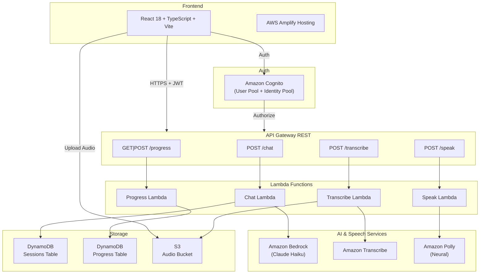
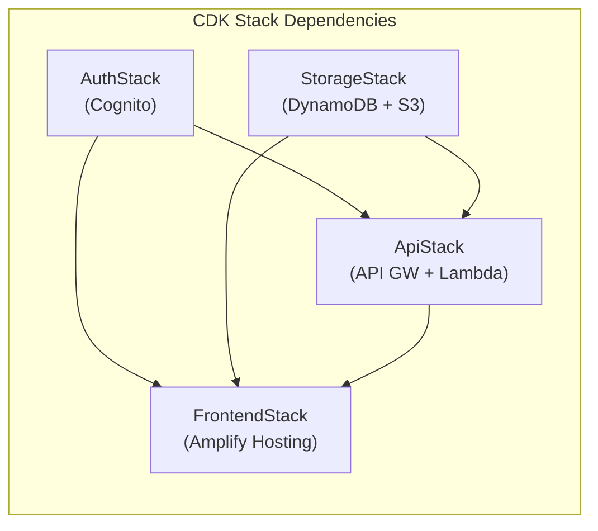

## 1. Background & Motivation

There are more opportunities than ever to work abroad — whether remote for international companies or through relocation. Almost all of these require English proficiency, especially during the interview process. As non-native English speakers, this presents a real challenge. Self-practice is difficult because there's no real-time feedback on grammar, vocabulary, or answer relevance. There's no "sparring partner" who can objectively assess your answers.

This problem inspired me to build the **English Learning App** — a full-stack web application that uses AI to simulate English job interviews, complete with speech-to-text, text-to-speech, and detailed AI feedback.

***

## 2. What I Built

English Learning App is an English learning platform focused on job interview preparation. It has 3 main modules and progress tracking.

### Speaking Module — AI Interview Simulation

The core feature. Simulates a real-time job interview:

- Choose a job position (Software Engineer, Product Manager, Data Analyst, Marketing Manager, UI/UX Designer, DevOps Engineer, Cloud Engineer)
- Select seniority level (Junior, Mid, Senior, Lead) and question category (General/Technical)
- First question is always a self-introduction (hardcoded, no AI) — just like a real interview
- Subsequent questions are AI-generated follow-ups based on previous answers
- Answers recorded via microphone → auto-transcribed → AI-analyzed
- Detailed feedback: grammar, vocabulary, relevance, filler words, coherence (scored 0-100)
- Summary report at session end
- Session resume capability for interrupted sessions

#### Speaking Component Architecture

```plain
SpeakingModule (orchestrator)
├── ResumePrompt          → Prompt to resume interrupted session
├── JobPositionSelector   → Select position, seniority, category
├── InterviewSession      → Main interview loop
│   ├── AudioRecorder     → Record answer via microphone
│   ├── TranscriptionDisplay → Display transcription
│   └── FeedbackDisplay   → Display AI feedback
└── SummaryReport         → End-of-session report
```

#### Interview Flow

```plain
1. Select position → seniority → question category
2. AI reads question via audio (Amazon Polly)
3. User records answer via microphone
4. Answer is transcribed (Amazon Transcribe)
5. AI analyzes answer → detailed feedback
6. Continue to next question (contextual follow-up)
7. Repeat until user ends session
8. Summary Report
```

#### Audio Pipeline

```plain
User clicks Record → MediaRecorder API → Blob (audio/webm)
  → Upload to S3 (path: userId/sessionId/questionId.webm)
  → Call /transcribe API → Amazon Transcribe
  → Return transcription text
```

#### AI Feedback System

After transcription, AI analyzes the answer and provides structured JSON feedback:

```typescript
interface FeedbackReport {
  scores: {
    grammar: number;      // 0-100
    vocabulary: number;   // 0-100
    relevance: number;    // 0-100
    fillerWords: number;  // 0-100 (100 = no filler words)
    coherence: number;    // 0-100
    overall: number;      // 0-100
  };
  grammarErrors: Array<{ original: string; correction: string; rule: string }>;
  fillerWordsDetected: Array<{ word: string; count: number }>;
  suggestions: string[];
  improvedAnswer: string;
}
```

#### Session Resume

Handles interrupted sessions. When SpeakingModule mounts, the backend checks for active sessions (< 24 hours) in DynamoDB. If found, the user can choose "Resume" or "Start New". The resume point is determined by the last question's state — unanswered, answered but not analyzed, or all complete.

#### Text-to-Speech

Each question is read aloud using Amazon Polly Neural. If TTS fails, the interview continues — the user can read the question on screen.

### Grammar Module — Interactive Quiz

- Choose a topic: Tenses, Articles, Prepositions, Conditionals, Passive Voice
- AI-generated multiple choice questions via Bedrock
- Detailed explanations for each answer

### Writing Module — Writing Practice

- Choose type: Essay or Email
- AI provides writing prompts
- Automated review: grammar, structure, vocabulary

### Progress Tracking

- Per-module statistics
- Score trend charts over time
- Data stored in DynamoDB Progress table

***

## 3. Tech Stack

| Layer | Technology |
| --- | --- |
| Frontend | React 18, TypeScript, Vite, Tailwind CSS |
| Routing | react-router-dom |
| Auth | AWS Amplify + Amazon Cognito |
| Backend | AWS Lambda (Node.js/TypeScript), API Gateway REST |
| AI | Amazon Bedrock (Claude Haiku) |
| Speech-to-Text | Amazon Transcribe |
| Text-to-Speech | Amazon Polly (Neural voices) |
| Database | Amazon DynamoDB |
| File Storage | Amazon S3 |
| Infrastructure | AWS CDK (TypeScript) |
| Hosting | AWS Amplify Hosting |
| Testing | Vitest, Jest, React Testing Library, fast-check |

Why this stack?

1. **Serverless = Cost-efficient**: Pay-per-use with no idle costs. Perfect for a portfolio project.
2. **Fully managed AI services**: No need to train your own models. Bedrock, Transcribe, and Polly are production-ready.
3. **TypeScript end-to-end**: One language from frontend to infrastructure. Type safety across the entire codebase.
4. **CDK over CloudFormation**: More readable, reusable, and testable than raw YAML/JSON.

***

## 4. High-Level Architecture





Fully serverless architecture. Each service has a specific responsibility:

- **Chat Lambda**: Handles all AI interactions (interview questions, feedback, grammar quiz, writing review) via Amazon Bedrock
- **Transcribe Lambda**: Converts user audio recordings to text via Amazon Transcribe
- **Speak Lambda**: Converts question text to audio via Amazon Polly Neural
- **Progress Lambda**: CRUD operations for user progress data in DynamoDB

***

## 5. Backend & AI

### 4 Lambda Functions Architecture

```plain
API Gateway REST
├── POST /chat        → Chat Lambda (Bedrock + DynamoDB)
├── POST /transcribe  → Transcribe Lambda (S3 + Amazon Transcribe)
├── POST /speak       → Speak Lambda (Amazon Polly)
├── GET  /progress    → Progress Lambda (DynamoDB)
└── POST /progress    → Progress Lambda (DynamoDB)
```

All endpoints are protected by a Cognito Authorizer — every request must include a valid JWT token.

### Chat Lambda — The Brain

The largest and most complex handler. A single function handles 10 different actions:

```typescript
const VALID_ACTIONS = [
  'start_session',     // Start new interview session
  'analyze_answer',    // Analyze user's answer
  'next_question',     // Generate next question
  'end_session',       // End session, generate summary
  'resume_session',    // Check for active sessions to resume
  'abandon_session',   // Abandon old session
  'grammar_quiz',      // Generate grammar questions
  'grammar_explain',   // Explain grammar answers
  'writing_prompt',    // Generate writing prompt
  'writing_review',    // Review user's writing
];
```

Each action has strict field validation before processing, ensuring errors are caught early with clear messages.

### Prompt Engineering for Bedrock

The most challenging and iterative part. Prompts must produce consistent JSON output that can be directly parsed.

#### Feedback Analysis Prompt

```plain
System: You are an expert English language assessor specializing in job interview preparation.
Analyze the candidate's answer and return ONLY a valid JSON object matching this exact structure
(no markdown, no extra text):
{
  "scores": { "grammar": <0-100>, "vocabulary": <0-100>, ... },
  "grammarErrors": [{"original": "...", "correction": "...", "rule": "..."}],
  "fillerWordsDetected": [{"word": "...", "count": <number>}],
  "suggestions": ["..."],
  "improvedAnswer": "..."
}
```

Key decisions:

- System prompt explicitly defines the expected JSON structure
- "Return ONLY a valid JSON object" prevents Bedrock from adding explanations
- Scoring guidelines included for cross-session consistency

#### Contextual Follow-Up Questions

Prompts include max 3 recent Q&A pairs for context, instructions to dig into specific details from the last answer, and a list of previous questions to prevent repetition.

#### JSON Parsing Strategy

Bedrock sometimes adds text outside JSON despite instructions:

```typescript
let result;
try {
  result = JSON.parse(responseText);
} catch {
  const jsonMatch = responseText.match(/\{[\s\S]*\}/);
  if (!jsonMatch) throw new Error('Failed to parse');
  result = JSON.parse(jsonMatch[0]);
}
```

This try/catch + regex fallback pattern is used across all handlers expecting JSON from Bedrock.

### DynamoDB Session Management

Sessions are stored in the `EnglishLearningApp-Sessions` table:

```plain
Partition Key: userId (String)
Sort Key: sessionId (String)
```

Each session stores the entire interview state in a single item — questions, transcriptions, feedback — reducing the number of read/write operations. The status field supports lifecycle: `active → completed/expired/abandoned`.

### Authorization Pattern

Every handler verifies ownership:

```typescript
const userId = event.requestContext.authorizer?.claims?.sub;
if (session.userId !== userId) {
  throw new AuthorizationError('Access denied');
}
```

This prevents users from accessing other users' sessions, even if they know the sessionId.

### Error Handling

All Lambdas use a consistent pattern: try/catch with specific error types (AuthorizationError → 403, generic → 500), always returning structured JSON error responses with CORS headers.

***

## 6. Infrastructure as Code

### CDK Stack Organization

Infrastructure is split into 4 stacks by concern:

```typescript
const authStack = new AuthStack(app, 'EnglishLearningApp-AuthStack');
const storageStack = new StorageStack(app, 'EnglishLearningApp-StorageStack');
const apiStack = new ApiStack(app, 'EnglishLearningApp-ApiStack', {
  apiProps: { auth: authStack.outputs, storage: storageStack.outputs }
});
new FrontendStack(app, 'EnglishLearningApp-FrontendStack', {
  auth: authStack.outputs, storage: storageStack.outputs, apiUrl: apiStack.apiUrl
});
```

| Stack | Responsibility |
| --- | --- |
| AuthStack | Cognito User Pool, Identity Pool, IAM roles |
| StorageStack | DynamoDB (Sessions + Progress tables), S3 (Audio bucket) |
| ApiStack | API Gateway + 4 Lambda functions |
| FrontendStack | Amplify Hosting configuration |

Why split?

- **Independent deployment**: AuthStack and StorageStack can deploy in parallel
- **Blast radius**: API changes don't affect auth or storage
- **Type safety**: Stacks communicate via typed interfaces, not string magic

### Inter-Stack Communication

```typescript
export interface AuthStackOutputs {
  userPoolId: string;
  userPoolClientId: string;
  userPoolArn: string;
  identityPoolId: string;
}

export interface StorageStackOutputs {
  sessionsTableName: string;
  progressTableName: string;
  audioBucketName: string;
  audioBucketArn: string;
}
```

Typos in table names or ARNs are caught at compile time.

### DynamoDB Design

Two tables with PAY_PER_REQUEST billing:

| Table | Partition Key | Sort Key | Use Case |
| --- | --- | --- | --- |
| Sessions | userId | sessionId | Interview session data |
| Progress | userId | moduleType | Per-module progress tracking |

PAY_PER_REQUEST was chosen because traffic is unpredictable for a portfolio project — no idle cost and auto-scaling without configuration.

### S3 Audio Isolation

```typescript
const audioBucket = new s3.Bucket(this, 'AudioBucket', {
  encryption: s3.BucketEncryption.S3_MANAGED,
  blockPublicAccess: s3.BlockPublicAccess.BLOCK_ALL,
});
```

Audio files follow a per-user path convention (`userId/sessionId/questionId.webm`):

- Each user can only access their own files
- IAM policy in Identity Pool restricts access to the userId prefix
- At-rest encryption for all audio
- No public access

### Lambda IAM — Least Privilege

Each Lambda gets minimal permissions:

- Chat Lambda: Bedrock + DynamoDB Sessions only
- Transcribe Lambda: Transcribe + S3 read only
- Speak Lambda: Polly only
- Progress Lambda: DynamoDB Progress only

### Cost Optimization

| Service | Estimated Cost (low traffic) |
| --- | --- |
| Lambda | \~$0 (free tier: 1M requests/month) |
| API Gateway | \~$0 (free tier: 1M requests/month) |
| DynamoDB | \~$0 (free tier: 25 WCU/RCU) |
| S3 | \~$0.023/GB |
| Cognito | \~$0 (free tier: 50K MAU) |
| Bedrock | \~$0.25/1M input tokens |
| Transcribe | \~$0.024/minute |
| Polly | \~$16/1M characters (Neural) |

Estimated total for light usage: **< $5/month**, mostly from Bedrock and Transcribe.

***

## 7. Development Process

### Development with Kiro IDE

The entire development process for this project used **Kiro IDE** — an AI-powered IDE with native support for spec-driven development. Kiro isn't just a code assistant; it's a development partner that understands the full project context.

#### Spec Workflow in Kiro

Kiro has a **Specs** feature that transforms rough ideas into structured documents and implementation plans. The workflow:

```plain
Feature idea → Requirements Document → Design Document → Tasks Document → Implementation
```

Each spec is stored in `.kiro/specs/{feature-name}/` with 3 files:

- `requirements.md` — User stories and acceptance criteria
- `design.md` — Architecture, data models, correctness properties, error handling
- `tasks.md` — Implementation checklist that can be executed task by task

This project has 5 specs developed through Kiro:

| Spec | Description |
| --- | --- |
| english-learning-app | Initial app setup and core modules |
| interview-position-enhancement | Adding position, seniority, and category selection |
| interview-flow-restructure | Restructuring interview flow (introduction → contextual) |
| hybrid-interview-questions | Hybrid question system (hardcoded + AI-generated) |
| speaking-session-resume | Session resume for interrupted interviews |

For example, for the "Speaking Session Resume" feature, Kiro helped create a requirements document with 7 requirements and 25+ acceptance criteria, a design document with detailed architecture and 7 correctness properties, then a tasks document with incremental implementation from types → backend → frontend → tests.

#### Steering Files — Persistent Context

Kiro uses **steering files** (`.kiro/steering/`) to provide context that's always available in every interaction. This project has 3 steering files:

| File | Content |
| --- | --- |
| `product.md` | Product description, modules, target audience, key characteristics |
| `structure.md` | Project folder structure, naming conventions, architecture patterns |
| `tech.md` | Tech stack, frameworks, common commands for build/test/deploy |

With steering files, Kiro always knows this is an English learning app for interview prep, uses React + CDK + Bedrock, and follows specific conventions — without needing to re-explain in every conversation.

#### Task Execution

Once a spec is complete, Kiro can execute tasks from `tasks.md` one by one. Each task references the relevant requirement, so implementation is always traceable. Kiro reads the design document to understand the expected architecture, then implements code according to the specification — including writing property-based tests for every correctness property defined in the design.

#### Property-Based Testing Integration

One of the strengths of Kiro's workflow is property-based testing integration. In the design document, correctness properties are formally defined:

```plain
Property 3: Expiry threshold correctly classifies sessions
For any active session, if the difference between the current time
and the session's updatedAt exceeds 24 hours, handleResumeSession
should return type: 'no_active_session'. If within 24 hours,
the session should be returned as type: 'session_resumed'.
```

Kiro then implements this property as an executable fast-check test — bridging the gap between formal specification and automatically verifiable code.

#### Agent Hooks

Kiro supports **hooks** — automations that run when specific events occur in the IDE. For example, a hook can be configured to automatically run a linter when a file is saved, or run the test suite after a task is executed. This helps maintain consistent code quality throughout development.

## 8. Deployment

### Prerequisites

Make sure you have:

- Node.js 20+
- AWS CLI (configured with credentials)
- AWS CDK CLI (`npm install -g aws-cdk`)

### Local Development

#### 1. Install Dependencies

```bash
# Frontend
npm install

# Backend / Infrastructure
cd infra
npm install
```

#### 2. Deploy Backend to AWS

The frontend requires a running AWS backend (Cognito, API Gateway, DynamoDB, S3). There are no local mocks for these services, so the backend must be deployed first:

```bash
cd infra
npx cdk bootstrap   # only needed once per account/region
npx cdk deploy --all
```

After deployment, CDK outputs the API URL, User Pool ID, and other resource identifiers.

#### 3. Configure Environment Variables

Copy CDK outputs to a `.env` file in the project root:

```bash
VITE_API_URL=https://xxxxxxxxxx.execute-api.us-east-1.amazonaws.com/prod/
VITE_USER_POOL_ID=us-east-1_xxxxxxxxx
VITE_USER_POOL_CLIENT_ID=xxxxxxxxxxxxxxxxxxxxxxxxxx
VITE_IDENTITY_POOL_ID=us-east-1:xxxxxxxx-xxxx-xxxx-xxxx-xxxxxxxxxxxx
VITE_AUDIO_BUCKET_NAME=englishlearningapp-storagestack-audiobucketxxxxxxxx
VITE_AWS_REGION=us-east-1
```

All variables use the `VITE_` prefix so Vite can expose them to the frontend.

#### 4. Enable Bedrock Model Access

Amazon Bedrock requires model access to be enabled manually:

1. Open the Amazon Bedrock Console
2. Navigate to "Model access"
3. Enable access for **Claude Haiku** (Anthropic)

Without this step, the Chat Lambda will fail when calling Bedrock.

#### 5. Run Dev Server

```bash
npm run dev
```

The Vite dev server reads `.env` and connects the frontend to the deployed AWS backend.

#### 6. Run Tests

```bash
# Frontend tests (Vitest)
npm test

# Backend tests (Jest)
cd infra
npm test
```

### Production Deployment

Once development is complete, the frontend is deployed via AWS Amplify Hosting.

#### Deploy Frontend via Amplify

The FrontendStack (CDK) creates an Amplify App with a pre-configured build spec:

1. Open the AWS Amplify Console
2. Connect your GitHub repository to the Amplify App created by CDK
3. Select a branch (e.g., `main`)
4. Amplify will automatically build and deploy on every push to that branch

Build spec used:

```yaml
version: 1
frontend:
  phases:
    preBuild:
      commands:
        - npm ci
    build:
      commands:
        - npm run build
  artifacts:
    baseDirectory: dist
    files:
      - "**/*"
  cache:
    paths:
      - node_modules/**/*
```

Environment variables (API URL, Cognito IDs, etc.) are automatically wired from other stacks to the Amplify App via CDK — no manual configuration needed in the Amplify Console.

#### Verification

```bash
cd infra
npx cdk diff    # ensure no pending changes
```

Access the app on local: http://localhost:5173


***

## 9. Lessons Learned

1. **Property-based testing finds bugs that unit tests miss** — especially boundary condition edge cases (e.g., exactly 24 hours for session expiry)
2. **Prompt engineering requires iteration** — first prompts rarely produce consistent output. It takes several iterations to get reliable JSON formatting
3. **Spec-driven development slows the start but accelerates overall delivery** — writing requirements and design takes time, but significantly reduces rework
4. **Serverless debugging is harder** — without a local server, debugging Lambda requires CloudWatch Logs. Good test mocking is essential
5. **TypeScript end-to-end is a huge help** — shared types between frontend and backend prevent many integration bugs
6. **Browser audio handling is tricky** — MediaRecorder API has many quirks: permission handling, format support, and cleanup
7. **DynamoDB single-item design has trade-offs** — simple but can hit the 400KB item size limit for very long sessions
8. **AI output isn't always consistent** — even with optimized prompts, Bedrock sometimes returns slightly different formats. Fallback parsing is essential

## Resources

- Source: [Github](https://github.com/ahakimx/english-learning-app)
- [Kiro IDE](https://kiro.dev/)
- [Amazon Bedrock](https://aws.amazon.com/bedrock/pricing/)
- [Amazon Transcibe](https://aws.amazon.com/transcribe/)
- [AWS Amplify](https://aws.amazon.com/amplify/)
