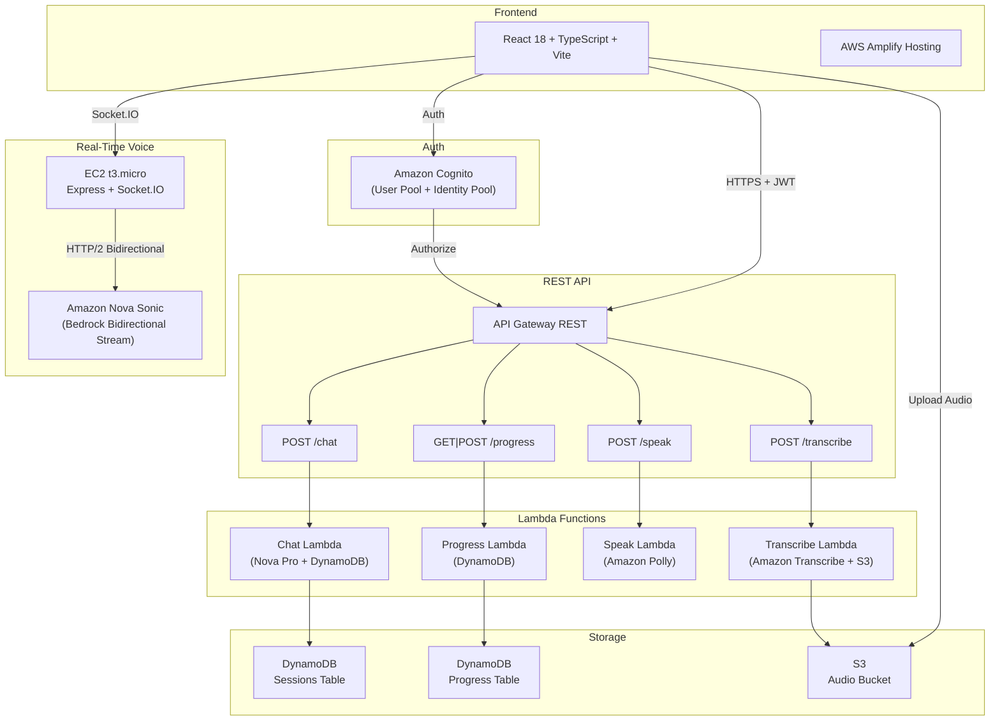

## 1. Background & Motivation

As an Indonesian native speaker who thinks, works, and lives in Bahasa Indonesia every day from casual conversations to office meetings to debugging code English doesn't come out naturally. Reading docs? Sure. Writing code review comments? Decent enough. But speaking spontaneously in a job interview in English? That's a whole different story.

The thing is, practicing speaking on your own is awkward. Who do you talk to? A mirror won't tell you your grammar is off, your vocabulary is too basic, or your answer went completely off-topic. Online conversation partners are nice, but they're not interviewers they can't give you structured feedback on answer relevance or filler word usage.

Out of that frustration, I started building the English Learning App — a full-stack web app that uses AI to simulate English job interviews. The idea: an AI sparring partner that's available 24/7, gives objective feedback, and doesn't judge you when your grammar falls apart.

The first version used a traditional pipeline: record audio > transcribe > AI analyzes text > text-to-speech for the next question. It worked, but felt like talking to an answering machine, there was a 3-5 second gap every turn. Then Amazon released Nova Sonic, an AI model that can have real-time voice conversations, bidirectional, with automatic turn detection. I refactored the entire speaking module architecture. Now the interview feels much more natural, almost like talking to a real interviewer.

This article covers everything: architecture, backend AI, infrastructure as code, and testing strategy. Written from hands-on experience building this project — including the wrong decisions I had to redo.

***

## 2. What I Built

English Learning App is an English learning platform focused on job interview preparation. It has 3 main modules and progress tracking.

### Speaking Module — AI Interview Simulation

This is the core feature. Users have a live voice conversation with an AI interviewer — not text chat, actual voice, real-time, bidirectional.

How it works:

- Pick a job position (Software Engineer, Product Manager, Data Analyst, etc.), seniority level (Junior/Mid/Senior/Lead), and question category (General/Technical)
- AI starts talking right away — the first question is always a self-introduction, just like a real interview
- User answers via microphone, AI listens and immediately responds with contextual follow-up questions
- Behind the scenes, every answer is analyzed: grammar, vocabulary, relevance, filler words, coherence (scored 0-100)
- If the connection drops, the session can be resumed
- At the end, there's a full summary report

What makes this different from a typical chatbot: it's genuinely voice-to-voice. The AI can detect when the user finishes speaking (turn detection), the user can interrupt the AI mid-sentence (barge-in), and latency is low thanks to bidirectional streaming.

#### Speaking Component Architecture

```plain
SpeakingModule (orchestrator)
├── ResumePrompt          → Prompt to resume interrupted session
├── JobPositionSelector   → Pick position, seniority, category
├── LiveTranscriptPanel   → Real-time transcript (AI + user)
├── SessionInfoPanel      → Connection status, duration, question count
└── SummaryReport         → End-of-session report
```

State machine:

```typescript
type Phase = 'checking' | 'resume-prompt' | 'select' | 'loading' | 'interview' | 'summary'
```

#### Audio Pipeline (Nova Sonic)

The audio pipeline is much simpler now compared to the old version that used Polly + Transcribe separately:

```plain
User speaks → MediaRecorder API → ScriptProcessorNode
  → Downsample to 16kHz PCM 16-bit mono
  → Socket.IO → Proxy Server → Bedrock Nova Sonic (bidirectional stream)
  → AI audio response (24kHz PCM) → Socket.IO → AudioWorklet → Speaker
```

Everything happens in real-time. No file uploads to S3, no polling for transcription jobs. Audio flows both ways continuously.

#### AI Feedback System

Even though the conversation is real-time, feedback is still analyzed per-answer via the REST API. Every time the turn switches from user to AI, the proxy server emits a `turnSwitch` event. The frontend detects this and sends the user's answer transcript to the `/chat` endpoint for deep analysis:

```typescript
interface FeedbackReport {
  scores: {
    grammar: number;      // 0-100
    vocabulary: number;   // 0-100
    relevance: number;    // 0-100
    fillerWords: number;  // 0-100 (100 = no filler words)
    coherence: number;    // 0-100
    overall: number;      // 0-100
  };
  grammarErrors: Array<{ original: string; correction: string; rule: string }>;
  fillerWordsDetected: Array<{ word: string; count: number }>;
  suggestions: string[];
  improvedAnswer: string;
}
```

Feedback is collected throughout the session and shown in the summary report — not displayed inline so it doesn't break the conversation flow.

#### Session Resume

I added this feature after my connection dropped mid-interview a few times (Indonesian internet, you know). When SpeakingModule mounts, the backend checks if there's an active session (< 24 hours) in DynamoDB. If found, the user can choose "Resume" or "Start New." The resume point is determined by the last question's state.

### Grammar Module — Interactive Quiz

- Choose a topic: Tenses, Articles, Prepositions, Conditionals, Passive Voice
- AI-generated multiple choice questions via Bedrock
- Detailed explanations for each answer

### Writing Module — Writing Practice

- Choose type: Essay or Email
- AI provides writing prompts
- Automated review: grammar, structure, vocabulary

### Progress Tracking

- Per-module statistics
- Score trend charts over time
- Data stored in DynamoDB Progress table

***

## 3. Tech Stack

| Layer | Technology |
| --- | --- |
| Frontend | React 18, TypeScript, Vite, Tailwind CSS 4 |
| Routing | react-router-dom v7 |
| Auth | AWS Amplify + Amazon Cognito |
| Real-time Audio | Socket.IO client, Web Audio API, AudioWorklet |
| Backend (REST) | AWS Lambda (Node.js 20), API Gateway REST |
| Backend (Real-time) | Express + Socket.IO server on EC2 |
| AI (Voice) | Amazon Nova Sonic (bidirectional streaming via Bedrock) |
| AI (Text Analysis) | Amazon Nova Pro via Bedrock |
| Database | Amazon DynamoDB |
| File Storage | Amazon S3 |
| Infrastructure | AWS CDK (TypeScript) |
| Hosting | AWS Amplify Hosting |
| Testing | Vitest, Jest, React Testing Library, fast-check |

Why this stack?

**Serverless + one small EC2.** Almost everything is serverless (Lambda, API Gateway, DynamoDB) — pay-per-use, no idle cost. The only exception is the Nova Sonic proxy server, which needs an EC2 t3.micro (\~$8/month or free if you're still on free tier). Nova Sonic requires a persistent HTTP/2 connection for bidirectional streaming, which doesn't work with Lambda's request-response model and 15-minute timeout.

**Nova Sonic vs. the old pipeline.** The first version used Amazon Polly (text-to-speech) + Amazon Transcribe (speech-to-text) separately. Every question had to be synthesized first, every answer had to be uploaded to S3 then transcribed. Latency was 3-5 seconds per turn. With Nova Sonic, everything is real-time — the AI listens and responds immediately. The user experience is dramatically more natural.

**TypeScript end-to-end.** From the React frontend, Express proxy server, Lambda handlers, to CDK infrastructure — all TypeScript. Shared types between frontend and backend prevent a lot of integration bugs that usually only surface at runtime.

**CDK over CloudFormation.** More readable, reusable, and testable. And most importantly: inter-stack communication uses typed interfaces, not string magic that only errors at deploy time.

***

## 4. Architecture



### Hybrid Architecture: REST + Real-Time

This was the architectural decision I spent the most time on. I initially tried to run everything through WebSocket API Gateway + Lambda, but there's a fundamental problem: Nova Sonic needs a persistent bidirectional HTTP/2 stream that can run for 5-10 minutes per interview session. Lambda has a hard 15-minute limit, but more importantly — every cold start means the Bedrock connection has to be re-established. This makes latency inconsistent.

The solution: **hybrid architecture**.

- **REST API (Lambda)** handles everything that doesn't need real-time: session management (create, resume, abandon, end), feedback analysis, grammar quiz, writing review, progress tracking. That's 10 different actions handled by a single Chat Lambda.
- **Real-time voice (EC2 + Socket.IO)** is dedicated to bidirectional audio streaming between the browser and Nova Sonic. This server is stateless per-connection — each Socket.IO connection has one Bedrock stream that lives for the duration of the session.

Why not go full WebSocket? Because the REST API is proven, easy to test, and Cognito authorization is straightforward. No need to reinvent the wheel for operations that are inherently request-response.

### CDK Stack Organization

Infrastructure is split into 6 stacks:

```typescript
// 1. Auth — Cognito (no dependencies)
const authStack = new AuthStack(app, 'EnglishLearningApp-AuthStack');

// 2. Storage — DynamoDB + S3 (no dependencies)
const storageStack = new StorageStack(app, 'EnglishLearningApp-StorageStack');

// 3. REST API — API Gateway + 4 Lambda (depends on Auth + Storage)
const apiStack = new ApiStack(app, 'EnglishLearningApp-ApiStack', {
  apiProps: { auth: authStack.outputs, storage: storageStack.outputs }
});

// 4. WebSocket — API Gateway v2 WebSocket + Lambda (depends on Auth + Storage)
const webSocketStack = new WebSocketStack(app, 'EnglishLearningApp-WebSocketStack', {
  wsProps: { auth: authStack.outputs, storage: storageStack.outputs }
});

// 5. Sonic Server — EC2 t3.micro for Nova Sonic proxy
const sonicServerStack = new SonicServerStack(app, 'EnglishLearningApp-SonicServerStack');

// 6. Frontend — Amplify Hosting
new FrontendStack(app, 'EnglishLearningApp-FrontendStack', {
  auth: authStack.outputs, storage: storageStack.outputs,
  apiUrl: apiStack.apiUrl, webSocketUrl: webSocketStack.webSocketUrl
});
```

| Stack | Responsibility |
| --- | --- |
| AuthStack | Cognito User Pool, Identity Pool, IAM roles |
| StorageStack | DynamoDB (Sessions + Progress), S3 (Audio bucket) |
| ApiStack | API Gateway REST + 4 Lambda functions |
| WebSocketStack | WebSocket API Gateway v2 + 3 Lambda (auth, nova-sonic, cleanup) |
| SonicServerStack | EC2 t3.micro + Security Group + IAM Role + Elastic IP |
| FrontendStack | Amplify Hosting configuration |

Stacks are separated so they can be deployed independently. Changes to the API don't require redeploying auth or storage. And most importantly: if something goes wrong, the blast radius is contained.

Inter-stack communication uses typed interfaces:

```typescript
export interface AuthStackOutputs {
  userPoolId: string;
  userPoolClientId: string;
  userPoolArn: string;
  identityPoolId: string;
}

export interface StorageStackOutputs {
  sessionsTableName: string;
  progressTableName: string;
  audioBucketName: string;
  audioBucketArn: string;
}
```

Typos in table names or ARNs get caught at compile time, not deploy time.

***

## 5. Backend & AI

### Two Backend Layers

The backend has two layers that complement each other:

**Layer 1: REST API (Lambda)** — the analytical brain. All operations that need to "think" go through here: generating feedback, creating grammar quizzes, reviewing writing, managing sessions in DynamoDB.

**Layer 2: Proxy Server (EC2)** — the mouth and ears. Dedicated to real-time audio streaming between the browser and Nova Sonic. This server doesn't persist any state to the database — it's purely a proxy.

### Chat Lambda — 10 Actions in One Function

This is the most complex handler. A single Lambda handles all non-realtime AI interactions:

```typescript
const VALID_ACTIONS = [
  'start_session',     // Create new interview session in DynamoDB
  'analyze_answer',    // Analyze user's answer (grammar, vocab, etc.)
  'next_question',     // Generate follow-up question (legacy pipeline)
  'end_session',       // End session, generate summary report
  'resume_session',    // Check for active sessions to resume
  'abandon_session',   // Abandon old session
  'grammar_quiz',      // Generate grammar multiple choice questions
  'grammar_explain',   // Explain why an answer is correct/wrong
  'writing_prompt',    // Generate writing prompt
  'writing_review',    // Review user's writing
];
```

Every action has strict field validation. If `analyze_answer` is called without a `transcription`, it immediately returns 400 with a clear message — not a generic "Internal Server Error" that turns debugging into guesswork.

### Nova Sonic Proxy Server

This is the most technically interesting part. An Express + Socket.IO server that bridges the browser and Amazon Nova Sonic via Bedrock bidirectional streaming.

```plain
Browser (React) ←→ Socket.IO ←→ Express Server ←→ Bedrock Nova Sonic
```

Why a proxy server? Because Bedrock bidirectional streaming uses HTTP/2 with AWS Signature V4 — browsers can't connect directly. Plus, AWS credentials must never be exposed to the frontend.

#### How the Bidirectional Stream Works

Nova Sonic has a fairly specific event-based protocol. When a session starts, the server must send the correct sequence of events:

```plain
1. sessionStart     → inference config (temperature, topP, maxTokens)
2. promptStart      → audio output config (voice, sample rate)
3. contentStart     → system prompt (TEXT, SYSTEM role)
4. textInput        → system prompt content
5. contentEnd       → close system prompt
6. contentStart     → audio input (AUDIO, USER role, 16kHz PCM)
7. [silence frames] → 10 frames of silence so Nova Sonic knows the audio stream is active
```

After that, audio from the user's microphone flows continuously as `audioInput` events. Nova Sonic processes audio in real-time, detects when the user stops speaking (endpoint detection), then responds with audio + text via streaming.

The output stream from Nova Sonic contains a mix of event types:

- `audioOutput` — PCM audio response from AI (24kHz, 16-bit, mono)
- `textOutput` — real-time transcript (some `SPECULATIVE` / partial, some `FINAL`)
- `contentStart` / `contentEnd` — turn boundaries (AI done speaking, user starts speaking, etc.)

The tricky part: Nova Sonic sometimes re-sends the full transcript after `END_TURN` as TEXT blocks. Without proper handling, the UI transcript gets duplicated. I solved this with a `skipAssistantTextUntilUserTurn` flag — skip all ASSISTANT TEXT after END_TURN until the user starts speaking again.

```typescript
// Detect turn switch from output stream
if (role === 'ASSISTANT' && type === 'TEXT' && lastRole === 'USER') {
  socket.emit('turnSwitch', { from: 'user', to: 'ai' });
  skipAssistantTextUntilUserTurn = false;
} else if (role === 'USER' && type === 'TEXT' && lastRole === 'ASSISTANT') {
  socket.emit('turnSwitch', { from: 'ai', to: 'user' });
}
```

#### System Prompt for Nova Sonic

The system prompt is built dynamically based on the position, seniority, and question category the user selected. It instructs Nova Sonic to act as a professional interviewer — asking questions in English, following up based on previous answers, and maintaining a tone appropriate for the seniority level.

### Prompt Engineering for Text Analysis

This part had the most iterations. Prompts must produce consistent JSON that can be parsed directly — if the format varies, the frontend crashes.

#### Feedback Analysis Prompt

```plain
System: You are an expert English language assessor specializing in
job interview preparation. Analyze the candidate's answer and return
ONLY a valid JSON object matching this exact structure (no markdown,
no extra text):
{
  "scores": { "grammar": <0-100>, "vocabulary": <0-100>, ... },
  "grammarErrors": [{"original": "...", "correction": "...", "rule": "..."}],
  ...
}
```

Key points:

- "Return ONLY a valid JSON object" — this is critical. Without it, the model often adds explanations outside the JSON
- Scoring guidelines are included for cross-session consistency
- Example output is included so the model knows the exact expected format

#### Defensive JSON Parsing

Even with optimized prompts, Bedrock sometimes adds text outside the JSON. Maybe "Here's the analysis:" at the start, or extra explanation at the end. So I use this pattern across all handlers:

```typescript
let result;
try {
  result = JSON.parse(responseText);
} catch {
  // Fallback: extract JSON object using regex
  const jsonMatch = responseText.match(/\{[\s\S]*\}/);
  if (!jsonMatch) throw new Error('Failed to parse AI response');
  result = JSON.parse(jsonMatch[0]);
}
```

Not elegant, but pragmatic. Better to have a fallback that works than to crash in production because the AI response format is slightly different.

### DynamoDB Session Management

Sessions are stored in the `EnglishLearningApp-Sessions` table:

```plain
Partition Key: userId (String)
Sort Key: sessionId (String)
```

One session = one DynamoDB item containing the entire interview state: questions, transcriptions, feedback, metadata. This is intentional — single-item design reduces the number of read/write operations and makes session resume simple (one GetItem, not Query + multiple GetItems).

The trade-off: DynamoDB has a 400KB per-item limit. For very long interviews (20+ questions with detailed feedback), this could be a problem. Haven't hit this limit yet, but if it happens, the solution is to split questions into separate items with a sort key of `sessionId#questionId`.

Sessions have a lifecycle: `active → completed/expired/abandoned`. An `architecture` field marks whether the session was created via the old pipeline (`pipeline`) or Nova Sonic (`hybrid`) — for backward compatibility.

### Authorization

Every handler verifies ownership:

```typescript
const userId = event.requestContext.authorizer?.claims?.sub;
if (session.userId !== userId) {
  throw new AuthorizationError('Access denied');
}
```

Simple but important. Without this, anyone who knows a sessionId could access someone else's session.

***

## 6. Infrastructure as Code

### DynamoDB Design

Two tables, both PAY_PER_REQUEST:

| Table | Partition Key | Sort Key | Purpose |
| --- | --- | --- | --- |
| Sessions | userId | sessionId | Interview session data (questions, feedback, status) |
| Progress | userId | moduleType | Per-module progress (speaking, grammar, writing) |

PAY_PER_REQUEST because traffic is unpredictable. A portfolio project doesn't have a steady traffic pattern — sometimes I use it intensively during development, sometimes it sits untouched for weeks. With on-demand, there's no cost when idle.

### S3 Audio Isolation

```typescript
const audioBucket = new s3.Bucket(this, 'AudioBucket', {
  encryption: s3.BucketEncryption.S3_MANAGED,
  blockPublicAccess: s3.BlockPublicAccess.BLOCK_ALL,
});
```

Audio files are stored with the path `userId/sessionId/questionId.webm`. The IAM policy in the Identity Pool restricts each user to only access their own `userId` prefix. At-rest encryption is on, public access is fully blocked.

Note: with the Nova Sonic architecture, audio is no longer uploaded to S3 for the speaking module — it streams directly to Bedrock. S3 is still used for the legacy pipeline (Transcribe needs files in S3).

### EC2 for the Nova Sonic Proxy

This is the only non-serverless component:

```typescript
const instance = new ec2.Instance(this, 'SonicServerInstance', {
  vpc,
  instanceType: ec2.InstanceType.of(ec2.InstanceClass.T3, ec2.InstanceSize.MICRO),
  machineImage: ec2.MachineImage.latestAmazonLinux2023(),
  securityGroup,
  role,  // IAM role with Bedrock permissions
  vpcSubnets: { subnetType: ec2.SubnetType.PUBLIC },
  associatePublicIpAddress: true,
});
```

Why EC2 and not Lambda or Fargate?

- **Lambda**: 15-minute timeout, cold starts cause inconsistent latency, and bidirectional HTTP/2 streams don't fit Lambda's request-response model
- **Fargate**: overkill for a single small container, and more expensive than t3.micro for an always-on workload
- **EC2 t3.micro**: \~$8/month (or free for the first year), always on = no cold start, enough to handle several concurrent sessions

An Elastic IP is attached so the IP doesn't change on instance restart. The security group opens port 3001 (Socket.IO), 443 (HTTPS for future Nginx setup), and 22 (SSH for debugging).

The IAM role is minimal: just `bedrock:InvokeModel` and `bedrock:InvokeModelWithBidirectionalStream`. Plus SSM Managed Instance Core for remote access without SSH when needed.

### Lambda IAM — Least Privilege

Each Lambda gets truly minimal permissions:

- **Chat Lambda**: Bedrock InvokeModel + DynamoDB Sessions (read/write)
- **Transcribe Lambda**: Amazon Transcribe + S3 read
- **Speak Lambda**: Amazon Polly only
- **Progress Lambda**: DynamoDB Progress (read/write) only

No wildcard `*` in resource ARNs (except Bedrock, which doesn't support resource-level permissions). If the Chat Lambda gets compromised, the attacker can't access the Progress table or S3 bucket.

### Cost Breakdown

| Service | Estimate (low traffic) |
| --- | --- |
| Lambda | \~$0 (free tier: 1M requests/month) |
| API Gateway | \~$0 (free tier: 1M requests/month) |
| DynamoDB | \~$0 (free tier: 25 WCU/RCU) |
| S3 | \~$0.023/GB |
| Cognito | \~$0 (free tier: 50K MAU) |
| EC2 t3.micro | \~$8/month (or free tier for 1 year) |
| Nova Sonic (Bedrock) | \~$0.0007/second streaming |
| Nova Pro (Bedrock) | \~$0.80/1M input tokens |
| Transcribe | \~$0.024/minute (legacy pipeline) |
| Polly Neural | \~$16/1M characters (legacy pipeline) |

Total for light usage: **\~$10-15/month**, mostly from EC2 and Bedrock Nova Sonic. If you're still on EC2 free tier, it can be under $5.

***

## 7. Real-Time Audio in the Browser

This was the part with the most trial and error. Browser audio handling is full of quirks.

### Audio Capture (Microphone → PCM)

Nova Sonic needs audio in a specific format: PCM 16-bit, 16kHz, mono. Browsers typically capture audio at 44.1kHz or 48kHz. So downsampling is needed.

```typescript
// Downsample from native sample rate to 16kHz
function downsample(buffer: Float32Array, sourceSampleRate: number, targetSampleRate: number): Float32Array {
  const ratio = sourceSampleRate / targetSampleRate;
  const newLength = Math.round(buffer.length / ratio);
  const result = new Float32Array(newLength);
  for (let i = 0; i < newLength; i++) {
    const srcIndex = i * ratio;
    const floor = Math.floor(srcIndex);
    const ceil = Math.min(floor + 1, buffer.length - 1);
    const fraction = srcIndex - floor;
    result[i] = buffer[floor] * (1 - fraction) + buffer[ceil] * fraction;
  }
  return result;
}

// Convert float samples to 16-bit PCM
function float32ToPcm16(samples: Float32Array): ArrayBuffer {
  const pcm = new Int16Array(samples.length);
  for (let i = 0; i < samples.length; i++) {
    const clamped = Math.max(-1, Math.min(1, samples[i]));
    pcm[i] = clamped < 0 ? clamped * 0x8000 : clamped * 0x7fff;
  }
  return pcm.buffer;
}
```

I'm using `ScriptProcessorNode` (deprecated but still widely supported) because AudioWorklet for capture requires more complex setup and cross-browser support is still spotty for input processing.

### Audio Playback (PCM → Speaker)

For playback, I use AudioWorklet — the modern, performant approach. Nova Sonic sends audio chunks as PCM 24kHz 16-bit base64-encoded. These chunks arrive irregularly (sometimes in bursts, sometimes with gaps), so buffering is needed.

```javascript
// audio-playback-processor.js (AudioWorklet)
class AudioPlayerProcessor extends AudioWorkletProcessor {
  constructor() {
    super();
    this.buffer = new Float32Array(0);
    this.port.onmessage = (event) => {
      if (event.data.type === 'audio') {
        // Append to ring buffer
        this.appendToBuffer(event.data.audioData);
      } else if (event.data.type === 'barge-in') {
        // User interrupt — clear buffer
        this.buffer = new Float32Array(0);
      }
    };
  }
  // process() reads from buffer, outputs to speaker
}
```

Barge-in (user interrupts the AI mid-sentence) is handled by clearing the buffer — AI audio stops immediately, and the user's microphone becomes active.

### Audio Error Handling

Permission handling in browsers is tricky. Every browser behaves differently:

```typescript
try {
  const stream = await navigator.mediaDevices.getUserMedia({ audio: { ... } });
} catch (err) {
  if (err instanceof DOMException) {
    switch (err.name) {
      case 'NotAllowedError':  // User denied permission
      case 'NotFoundError':    // No microphone detected
      case 'NotReadableError': // Mic used by another app
    }
  }
}
```

And don't forget cleanup. If MediaStream tracks aren't stopped when the component unmounts, the microphone stays active (the red indicator in the browser stays on). That freaks users out.

***

## 8. Development & Deployment

### Prerequisites

- Node.js 20+
- AWS CLI (configured)
- AWS CDK CLI (`npm install -g aws-cdk`)

### Setup

```bash
# Frontend
npm install

# Infrastructure
cd infra && npm install

# Nova Sonic proxy server
cd server && npm install
```

### Deploy Backend

The frontend needs a running AWS backend. There are no local mocks for Cognito, DynamoDB, or Bedrock.

```bash
cd infra
npx cdk bootstrap   # once per account/region
npx cdk deploy --all
```

CDK output includes the API URL, User Pool ID, WebSocket URL, and other resource identifiers.

### Environment Variables

```bash
VITE_API_URL=https://xxx.execute-api.us-east-1.amazonaws.com/prod/
VITE_USER_POOL_ID=us-east-1_xxxxxxxxx
VITE_USER_POOL_CLIENT_ID=xxxxxxxxxxxxxxxxxxxxxxxxxx
VITE_IDENTITY_POOL_ID=us-east-1:xxxxxxxx-xxxx-xxxx-xxxx-xxxxxxxxxxxx
VITE_AUDIO_BUCKET_NAME=englishlearningapp-storagestack-audiobucketxxxxxxxx
VITE_AWS_REGION=us-east-1
VITE_SONIC_SERVER_URL=http://localhost:3001

# Model IDs
BEDROCK_SONIC_MODEL_ID=amazon.nova-2-sonic-v1:0
BEDROCK_TEXT_MODEL_ID=us.anthropic.claude-haiku-4-5-20251001-v1:0
```

### Enable Bedrock Model Access

Amazon Bedrock requires model access to be enabled manually in the console:

1. Open Bedrock Console → Model access
2. Enable **Amazon Nova Sonic** and **Amazon Nova Pro** (or Claude Haiku if you're using that for text analysis)

Without this, all Bedrock calls will fail with AccessDeniedException.

### Development

```bash
# Terminal 1: Nova Sonic proxy server
cd server && npm run dev

# Terminal 2: Frontend dev server
npm run dev

# Or both at once:
npm run dev:all
```

### Development with Kiro IDE

The entire project was developed using [Kiro](https://kiro.dev), an AI-powered IDE with native support for spec-driven development.

What I found most useful:

**Specs.** Kiro has a feature that turns rough ideas into structured documents. I'd say "I want a feature to resume interrupted sessions," and Kiro would help create requirements (7 requirements, 25+ acceptance criteria), design (detailed architecture, 7 correctness properties), then tasks (incremental implementation checklist). Each task references the relevant requirement, so implementation is always traceable.

**Steering files.** Files in `.kiro/steering/` that are always available in every interaction. I have 3: `product.md` (product description), `structure.md` (folder structure), `tech.md` (tech stack and commands). So Kiro always knows the project context without needing to re-explain.

### Spec-Driven Development

Every major feature follows a spec-driven approach:

```plain
1. Requirements → User stories + acceptance criteria
2. Design → Architecture, correctness properties, error handling
3. Tasks → Implementation checklist
4. Implementation → Guided by tasks, validated by property tests
```

This slows down the start — writing requirements and design takes time. But it significantly reduces rework. I once jumped straight into coding the session resume feature without a spec, and ended up refactoring 3 times because of edge cases I hadn't thought of upfront. After adopting spec-driven development, refactoring dropped dramatically because edge cases were already considered during the design phase.

This project has 5 specs:

| Spec | Description |
| --- | --- |
| english-learning-app | Initial setup and core modules |
| interview-position-enhancement | Position, seniority, and category selection |
| interview-flow-restructure | Restructuring the interview flow |
| hybrid-interview-questions | Hybrid question system (hardcoded + AI) |
| speaking-session-resume | Session resume for interrupted interviews |

### Testing

```bash
# Frontend (Vitest)
npm test

# Backend Lambda + CDK (Jest)
cd infra && npm test
```

### Production Deployment

The frontend is deployed via Amplify Hosting. The FrontendStack (CDK) already creates an Amplify App with a build spec:

```yaml
version: 1
frontend:
  phases:
    preBuild:
      commands:
        - npm ci
    build:
      commands:
        - npm run build
  artifacts:
    baseDirectory: dist
    files:
      - "**/*"
```

Environment variables are automatically wired from other stacks to Amplify via CDK.

For the Nova Sonic proxy server in production, there are a few options:

- **EC2 directly** (current setup) — simple, cheap, but single point of failure
- **App Runner** — managed container service, auto-scaling, but needs a Docker image
- **ECS Fargate** — more control, but more complex

I'm using EC2 directly because this is a portfolio project — simplicity matters more than high availability.

***

### Demo

Access the app on local: http://localhost:5173


Choose on speaking, click continue.


Click start practice > choose job position > level > choose type general or technical.


Feedback and resume after click End Session


## 9. Lessons Learned

1. **Nova Sonic changes everything.** Moving from the Polly + Transcribe pipeline to Nova Sonic isn't just an upgrade — it's a fundamental shift. Latency dropped from 3-5 seconds per turn to sub-second. But the architecture also got more complex because you need a persistent server for bidirectional streaming.
2. **Bidirectional streaming is hard to debug.** With a REST API error, there's a clear request/response. With a bidirectional stream error, it could be in the input events, output parsing, or timing. CloudWatch logs become your only friend. I learned to log every event type going in and out.
3. **Browser audio APIs are full of traps.** MediaRecorder, AudioContext, ScriptProcessorNode, AudioWorklet — each has its own quirks. The most annoying: AudioContext on mobile Safari must be resumed after a user gesture, and ScriptProcessorNode is deprecated but its replacement (AudioWorklet) isn't fully supported for input processing across all browsers.
4. **Property-based testing finds bugs that unit tests miss.** Especially boundary conditions. Exactly 24 hours for session expiry, empty arrays for question history, strings with unicode characters for transcription.
5. **Prompt engineering takes a lot of iteration.** The first prompt rarely produces consistent output. I iterated 5-6 times on the feedback analysis prompt until the JSON format was reliable. And you still need fallback parsing because AI sometimes gets "creative" with the format.
6. **Spec-driven development slows the start but accelerates overall delivery.** Writing requirements and design takes time, but reduces rework. Correctness properties defined in the design become test cases that can be automatically verified.
7. **DynamoDB single-item design has limits.** Simple and efficient for most cases, but the 400KB per-item limit can be a problem for very long sessions. Need a migration strategy if per-session data keeps growing.
8. **Hybrid architecture is pragmatic.** Not everything needs to be real-time, and not everything needs to be serverless. REST API for request-response operations, persistent server for streaming — each in the right place.
9. **EC2 is still relevant.** In the serverless era, it's easy to forget that sometimes a small always-on VM is simpler and cheaper than an over-engineered managed solution. The t3.micro for this proxy server is a perfect example.

## Resources

- [Github](https://github.com/ahakimx/english-learning-app)[ source code](https://github.com/ahakimx/english-learning-app)
- [Kiro IDE](https://kiro.dev/)
- [Amazon Bedrock](https://aws.amazon.com/bedrock/pricing/)
- [Amazon Transcibe](https://aws.amazon.com/transcribe/)
- [AWS Amplify](https://aws.amazon.com/amplify/)
