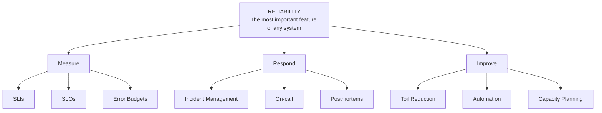
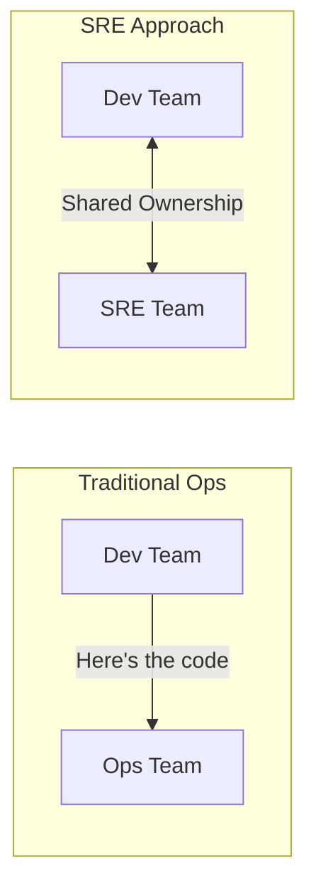
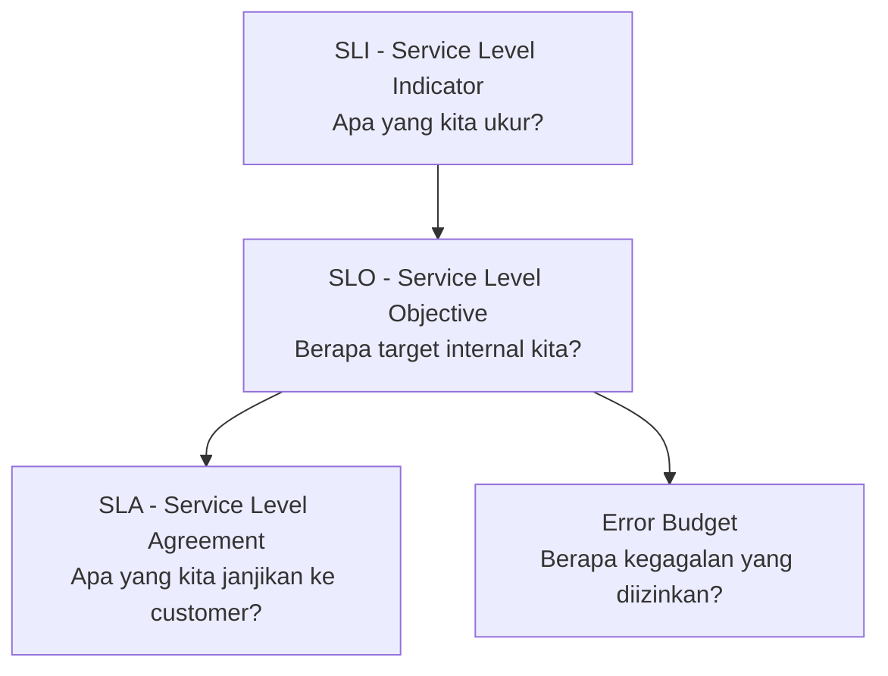

## Overview

Site Reliability Engineering (SRE) adalah disiplin engineering yang menerapkan prinsip software engineering pada masalah infrastruktur dan operasional. Diperkenalkan oleh Google pada awal 2000-an, SRE memberikan framework untuk menyeimbangkan kecepatan pengembangan fitur (velocity) dan keandalan sistem (reliability). Artikel ini membahas fondasi SRE — mulai dari definisi, perbedaan dengan traditional operations, hingga pengenalan konsep toil.

## Prerequisites

- Pemahaman dasar Linux dan command line
- Familiar dengan konsep dasar containers
- Tidak memerlukan pengalaman SRE sebelumnya — artikel ini adalah starting point

## Apa Itu Site Reliability Engineering?

SRE adalah pendekatan engineering untuk mengelola production systems yang reliable, scalable, dan efficient. Alih-alih mengandalkan manual processes dan tribal knowledge, SRE menggunakan automation, measurement, dan engineering rigor.

Ben Treynor Sloss mendefinisikan SRE sebagai _"what happens when you ask a software engineer to design an operations function."_

### Core Principles SRE

1. **Engineering Approach to Operations**

- Treat operations as a software problem
- Automate repetitive tasks (reduce toil)
- Apply software engineering practices to infra

2. **Service Level Objectives (SLOs)**

- Define measurable reliability targets
- Use data to make decisions
- Balance reliability vs feature velocity

3. **Error Budgets**

- 100% reliability is the wrong target
- Error budget = acceptable unreliability
- Budget habis → freeze features, fokus reliability

4. **Toil Reduction**

- Identify manual, repetitive operational work
- Automate toil systematically
- Target: max 50% time on toil, 50% on engineering

5. **Blameless Postmortems**

- Learn from failures, don't blame individuals
- Focus on systemic improvements
- Share learnings across organization

### Definisi Kunci dalam SRE

| Term | Definisi | Contoh |
| --- | --- | --- |
| **Reliability** | Kemampuan sistem untuk berfungsi sesuai harapan | Uptime 99.9% per bulan |
| **SLI** (Service Level Indicator) | Metric yang mengukur level layanan | % requests yang berhasil |
| **SLO** (Service Level Objective) | Target untuk SLI | 99.9% availability per bulan |
| **SLA** (Service Level Agreement) | Kontrak formal dengan konsekuensi | 99.9% uptime atau refund |
| **Error Budget** | Jumlah unreliability yang diizinkan | 0.1% = 43.8 menit downtime/bulan |
| **Toil** | Pekerjaan manual, repetitif, automatable | Manual deployment, manual scaling |
| **Postmortem** | Analisis setelah incident tanpa blame | "Mengapa database crash?" bukan "Siapa yang salah?" |

### Pilar-Pilar SRE



## SRE vs Traditional Operations

Perbedaan antara SRE dan traditional operations bukan hanya soal tools atau job title — ini adalah perbedaan filosofi dan pendekatan terhadap masalah operasional.



### Perbandingan Detail

| Aspek | Traditional Ops | SRE |
| --- | --- | --- |
| **Mindset** | "Keep it running" | "Engineer reliability" |
| **Reliability Target** | 100% uptime (unrealistic) | SLO-based (e.g., 99.9%) |
| **Failure Response** | Blame individuals | Blameless postmortems |
| **Manual Work** | Accepted as normal | Classified as "toil", harus dikurangi |
| **Deployment** | Manual, ticket-based | Automated, CI/CD pipeline |
| **Monitoring** | Reactive alerting | Proactive SLO-based alerting |
| **Decision Making** | Gut feeling, experience | Data-driven (metrics, SLIs) |
| **Change Management** | Resist change (risk) | Embrace change (with error budget) |

### Mengapa 100% Reliability Bukan Target yang Tepat?

Salah satu insight paling penting dari SRE: **100% reliability bukanlah target yang benar**.

1. **User tidak bisa membedakan 99.99% vs 100%** — ISP, device, dan network juga punya downtime
2. **Cost meningkat eksponensial** — mencapai 99% relatif murah, 99.99% butuh investasi besar (redundancy, multi-region), dan 100% secara praktis tidak mungkin dicapai
3. **Menghambat innovation** — 100% target berarti tidak boleh ada perubahan

Solusinya adalah **error budget**: SLO 99.9% memberikan error budget 0.1% (43.8 menit/bulan). Selama budget tersedia, tim boleh deploy fitur baru. Budget habis berarti fokus ke reliability.

## Reliability Mindset

Transisi dari traditional ops ke SRE dimulai dari perubahan mindset:

### Hope is Not a Strategy

```bash
# Traditional Ops approach:
# "Semoga deployment malam ini tidak break production..."
# Manual deployment, no rollback plan

# SRE approach:
# "Kita punya automated rollback jika error rate > 1%"
# Canary deployment, automated monitoring, defined rollback criteria
```

### Embrace Risk

SRE tidak berusaha menghilangkan semua risiko, SRE mengelola risiko secara terukur melalui tiga tahap: 
- **Identify** (apa yang bisa fail?),
- **Measure** (seberapa buruk dampaknya?), dan 
- **Manage** (bagaimana menanganinya?).

### Measure Everything

| Apa yang Diukur | Mengapa Penting | Tool Modern |
| --- | --- | --- |
| **Availability** | Apakah user bisa mengakses service? | Prometheus, OpenTelemetry |
| **Latency** | Apakah response cukup cepat? | Prometheus histograms |
| **Error Rate** | Berapa banyak request yang gagal? | Prometheus counters |
| **Saturation** | Seberapa penuh resource kita? | node_exporter, cAdvisor |
| **Toil** | Berapa banyak waktu untuk manual work? | Time tracking |

> OpenTelemetry (OTel) telah menjadi standar industri untuk instrumentasi observability, menyediakan unified API untuk metrics, traces, dan logs.

## Pengenalan Konsep Toil

Toil adalah pekerjaan yang terkait dengan menjalankan production service yang bersifat **manual, repetitif, automatable, tactical, tanpa enduring value, dan bertumbuh linear seiring pertumbuhan service**.

### Toil vs Engineering Work

**Toil (Harus Dikurangi):**

- Manual deployment ke production
- Restart service yang crash secara manual
- Copy-paste konfigurasi antar environment
- Manual scaling saat traffic naik
- Respond alert yang sama berulang kali

**Engineering Work (Harus Ditingkatkan):**

- Membangun CI/CD pipeline
- Menulis auto-scaling policies
- Membuat self-healing mechanisms
- Menulis runbooks dan automation scripts

> **Target Google SRE:** Max 50% waktu untuk toil, min 50% untuk engineering work.

### Cara Mengidentifikasi Toil

| Karakteristik | Pertanyaan | Jika Ya = Toil |
| --- | --- | --- |
| **Manual** | Apakah harus dilakukan oleh manusia? | Ya |
| **Repetitive** | Apakah dilakukan berulang kali? | Ya |
| **Automatable** | Bisakah diotomasi dengan script/tool? | Ya |
| **Tactical** | Apakah bersifat reaktif, bukan proaktif? | Ya |
| **No Enduring Value** | Apakah tidak menghasilkan improvement permanen? | Ya |
| **O(n) with Service Growth** | Apakah bertambah seiring pertumbuhan service? | Ya |

> Tidak semua manual work adalah toil. Meeting, planning, dan strategic thinking bukan toil — itu bagian penting dari engineering work.

## SLO dan Error Budget

### Hubungan SLI > SLO > SLA > Error Budget



- **SLI**: Metric yang mengukur level layanan (contoh: % request berhasil)
- **SLO**: Target reliability internal (contoh: 99.9% request harus berhasil per bulan)
- **SLA**: Kontrak formal dengan customer (biasanya lebih longgar dari SLO)
- **Error Budget**: 100% - SLO = jumlah kegagalan yang masih diizinkan

### Cara Menghitung Error Budget

Asumsi 1 bulan = 30 hari = 43.200 menit:

| SLO | Error Budget | Downtime Diizinkan/Bulan |
| --- | --- | --- |
| 99% | 1% | 432 menit (7 jam 12 menit) |
| 99.5% | 0.5% | 216 menit (3 jam 36 menit) |
| 99.9% | 0.1% | 43.2 menit |
| 99.95% | 0.05% | 21.6 menit |
| 99.99% | 0.01% | 4.32 menit |

### Error Budget Policy

| Sisa Error Budget | Status | Tindakan |
| --- | --- | --- |
| > 50% | Healthy | Deploy normal, eksperimen diizinkan |
| 25% - 50% | Warning | Deploy dengan extra review |
| 5% - 25% | Critical | Hanya deploy bug fixes |
| < 5% | Exhausted | Freeze semua deployment, fokus reliability |

## Hands-on: Basic Reliability Assessment

Sebelum memperbaiki reliability, kita perlu tahu posisi saat ini.

### Service Inventory

Langkah pertama: buat daftar semua service yang dikelola beserta status monitoring-nya saat ini.

| Service | Type | Owner | Criticality | Current Monitoring |
|---------|------|-------|-------------|-------------------|
| api-gateway | Web Service | Platform Team | Critical | Basic health check |
| user-service | Microservice | Backend Team | High | Logs only |
| payment-service | Microservice | Payment Team | Critical | APM + Logs |
| database | PostgreSQL | DBA | Critical | CloudWatch |
| cache | Redis | Platform Team | Medium | None |

> Dari tabel ini langsung terlihat gap: service critical seperti database hanya punya CloudWatch basic, dan cache tidak punya monitoring sama sekali. Ini yang perlu diprioritaskan.

### Simple Availability Calculator

```bash
#!/bin/bash
# simple-availability-calc.sh
echo "=== Simple Availability Calculator ==="
read -p "Total jam dalam periode (e.g., 720 untuk 1 bulan): " total_hours
read -p "Total jam downtime dalam periode: " downtime_hours

availability=$(echo "scale=4; ($total_hours - $downtime_hours) / $total_hours * 100" | bc)
echo "Availability: ${availability}%"
```

## Studi Kasus: TechStartup Indonesia

### Konteks

TechStartup Indonesia (TSI) adalah startup e-commerce dengan 50.000 DAU yang di awal 2020 menghadapi growing pains:
- Downtime yang sering
- Firefighting konstan
- Arsitektur monolith Node.js yang mulai tidak mampu menangani pertumbuhan 20%/bulan
- Tim: 15 developer + 5 DevOps engineer
- Deployment manual via SSH, monitoring hanya CloudWatch basic

### Trigger: Monday Morning Incident

Januari 2020 — database connection pool exhausted + memory leak menyebabkan **3.5 jam downtime** dan kerugian **Rp 35 juta**. CTO memutuskan untuk memulai perjalanan SRE.

Kondisi sebelumnya: 95% waktu tim DevOps dihabiskan untuk toil:
- Firefighting: 65%
- Manual deployment: 20%
- Manual monitoring: 10%

### Implementasi (4 Minggu)

**Minggu 1: Reliability Assessment**

Tim membuat checklist 20 poin (monitoring, backup, runbook, SLO, dll) dan menilai kondisi saat ini. Hasilnya: skor 3/20 — hanya punya basic health check, tidak ada runbook, tidak ada SLO yang terdefinisi.

**Minggu 2: Setup Monitoring**

Install Prometheus + Grafana di satu VM dedicated. Konfigurasi scraping untuk 3 service paling critical (API gateway, payment, database). Buat dashboard pertama yang menampilkan four golden signals: request rate, error rate, latency p95, dan CPU/memory usage.

**Minggu 3: Runbook Pertama**

Memory leak terjadi 3x/minggu dan selalu ditangani dengan cara yang sama: SSH > check memory > restart app. Tim dokumentasikan langkah-langkahnya jadi runbook formal, lalu buat alert di Prometheus yang trigger sebelum OOM kill. MTTR untuk masalah ini turun dari 45 menit ke 10 menit.

**Minggu 4: Toil Audit**

Setiap engineer mencatat semua pekerjaan manual selama 1 minggu. Hasilnya mengejutkan: rata-rata 12 jam/minggu/engineer dihabiskan untuk pekerjaan repetitif. Tim prioritaskan automation berdasarkan formula **frequency × time**:

| Task | Frekuensi | Waktu/Kejadian | Total/Minggu |
|------|-----------|----------------|-------------|
| Log checking | 5x/hari | 30 min | 150 min |
| Manual deployment | 3x/minggu | 45 min | 135 min |
| App restart (memory leak) | 3x/minggu | 15 min | 45 min |

### Metrics Improvement

| Metric | Sebelum | Sesudah | Perubahan |
| --- | --- | --- | --- |
| Availability | \~95% | \~98.5% | +3.5% |
| MTTD (detect) | 30 min | 5 min | -83% |
| MTTR (recover) | 3.5 hrs | 45 min | -79% |
| Incidents/month | 12 | 6 | -50% |
| Toil % (per engineer) | 65% | 40% | -25pp |

### Lessons Learned

**Yang Berhasil:**

- **Start Small, Show Value Fast** — Mulai dari monitoring basic dan satu runbook, bukan overhaul besar-besaran
- **Use Real Incidents as Motivation** — Monday Morning Incident menjadi catalyst untuk perubahan
- **Toil Audit Opens Eyes** — Ketika tim melihat 65% waktu mereka adalah toil, motivasi untuk berubah meningkat drastis
- **CTO Buy-in is Critical** — Dukungan leadership membuat perubahan cultural lebih mudah

**Yang Perlu Dihindari:**

- Jangan coba ubah semuanya sekaligus — TSI fokus pada 4 hal dalam 4 minggu
- Jangan skip assessment — tanpa data baseline, Anda tidak tahu apakah ada improvement
- Jangan blame individuals — postmortem pertama TSI hampir menjadi blame session sebelum CTO intervensi

## Best Practices

- **Mulai dari assessment** — ukur kondisi saat ini sebelum membuat perubahan apapun
- **Definisikan reliability dari perspektif user** — "Apakah user bisa checkout?" bukan "Apakah CPU < 80%?"
- **Buat runbook untuk masalah yang sering terjadi** — dokumentasi langkah penanganan incident mengurangi MTTR
- **Lakukan postmortem tanpa blame** — fokus pada systemic improvement, bukan mencari siapa yang salah
- **Track toil secara regular** — identifikasi dan prioritaskan automation berdasarkan frequency × time
- **Mulai kecil dan iterate** — satu service, satu runbook, satu dashboard, lalu expand
- **Dapatkan leadership buy-in** — dukungan management membuat perubahan cultural lebih mudah

## Selanjutnya

Artikel berikutnya: [Foundation SRE: Monitoring Basics](/posts/foundation-sre-monitoring-basics/) — membahas dasar-dasar monitoring dari perspektif SRE, termasuk four golden signals dan setup observability stack.

Topik terkait yang bisa Anda eksplorasi:

- Konsep four golden signals (latency, traffic, errors, saturation)
- OpenTelemetry sebagai standar observability modern
- Incident response dan komunikasi saat incident

## References

- [Google SRE Book — Introduction](https://sre.google/sre-book/introduction/) — Definisi original SRE oleh Ben Treynor Sloss
- [Google SRE Book — Embracing Risk](https://sre.google/sre-book/embracing-risk/) — Mengapa 100% bukan target yang tepat
- [Google SRE Book — Eliminating Toil](https://sre.google/sre-book/eliminating-toil/) — Framework untuk mengidentifikasi dan mengurangi toil
- [Google SRE Workbook](https://sre.google/workbook/table-of-contents/) — Panduan praktis implementasi SRE
- [OpenTelemetry Documentation](https://opentelemetry.io/docs/) — Standar modern untuk observability (OTel)
- [Prometheus Documentation](https://prometheus.io/docs/) — Monitoring dan alerting toolkit
- [Grafana Documentation](https://grafana.com/docs/grafana/latest/) — Visualization dan dashboarding (Grafana 11+)

***

## Navigasi Series

**Selanjutnya:** [Foundation SRE: Monitoring Basics](/posts/foundation-sre-monitoring-basics/)
