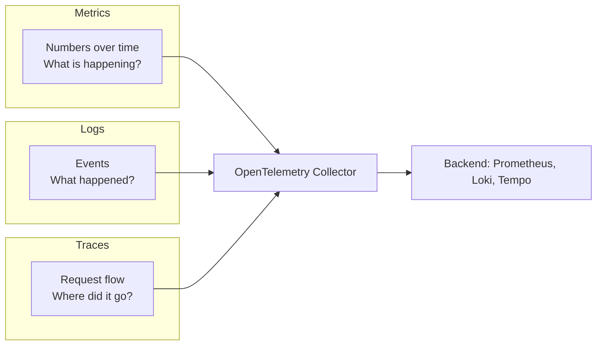
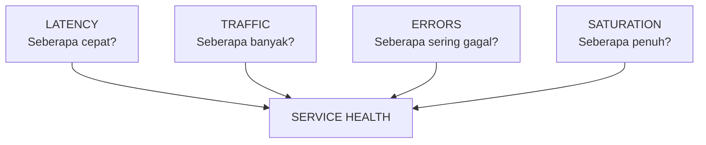
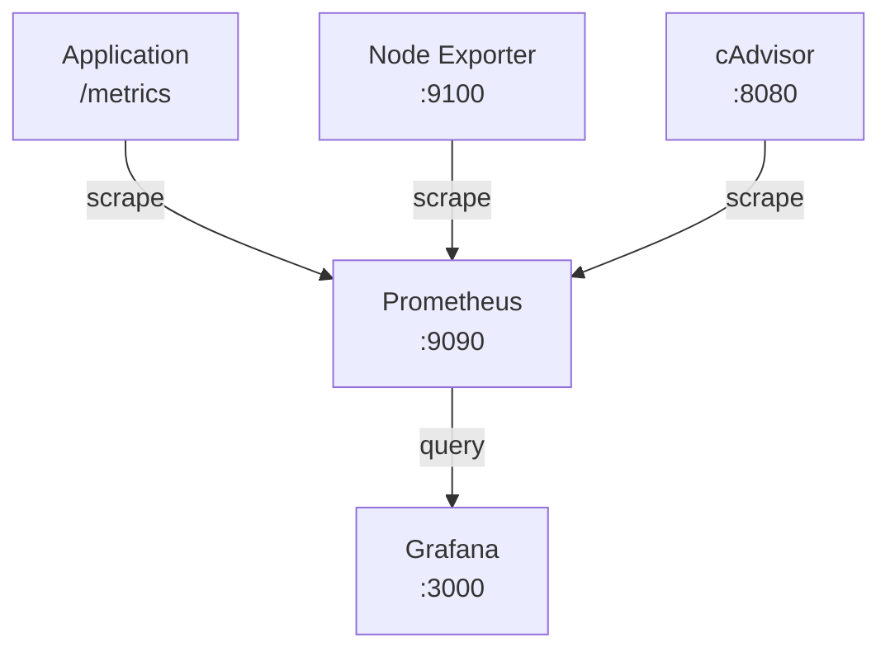

Monitoring adalah mata dan telinga dari setiap SRE team. Tanpa monitoring yang baik, Anda seperti mengemudikan mobil di malam hari tanpa lampu, mungkin tetap bisa berjalan, tapi tidak akan tahu ada masalah di perjalanan. Artikel ini membahas fondasi monitoring dari perspektif SRE: four golden signals, perbedaan monitoring vs observability, dan hands-on setup Prometheus dan Grafana untuk memantau kesehatan service.

> Jika Anda belum membaca artikel sebelumnya, mulai dari [Foundation SRE: Apa Itu Site Reliability Engineering](/posts/foundation-sre-apa-itu-site-reliability-engineering/).

## Prerequisites

- Pemahaman dasar Linux dan command line
- Memahami konsep dasar SRE, toil, dan reliability mindset — baca: [Foundation SRE: Apa Itu Site Reliability Engineering](/posts/foundation-sre-apa-itu-site-reliability-engineering/)
- Familiar dengan Docker dan docker-compose
- Tidak memerlukan pengalaman monitoring sebelumnya — artikel ini adalah starting point

## Mengapa Monitoring Penting untuk SRE?

Monitoring adalah fondasi dari semua SRE practices. Tanpa monitoring, Anda tidak bisa:
- Mengetahui apakah SLO Anda terpenuhi
- Mendeteksi incident sebelum user melaporkan
- Membuat keputusan berbasis data tentang error budget
- Mengidentifikasi toil yang perlu diotomasi
- Melakukan capacity planning yang akurat

## Tiga Pilar Observability

Monitoring modern dibangun di atas tiga pilar utama yang saling melengkapi:

| Pilar | Deskripsi | Contoh | Tool Modern |
|-------|-----------|--------|-------------|
| **Metrics** | Data numerik yang diukur dari waktu ke waktu | CPU usage 75%, request rate 500 rps | Prometheus, OpenTelemetry Metrics |
| **Logs** | Record event diskrit yang terjadi di sistem | "ERROR: Database connection timeout" | Loki, OpenTelemetry Logs |
| **Traces** | Jejak request yang melewati multiple services | Request → API Gateway → User Service → DB (250ms) | Jaeger, Tempo, OpenTelemetry Traces |



> **Catatan:** OpenTelemetry (OTel) telah menjadi standar industri untuk instrumentasi observability. OTel Collector berfungsi sebagai telemetry pipeline yang menerima, memproses, dan mengekspor data dari ketiga pilar ini ke berbagai backend. Jika Anda baru memulai, gunakan OTel SDK sebagai fondasi — ini menghindari vendor lock-in.

## Four Golden Signals

Google SRE Book mendefinisikan empat sinyal emas yang harus dimonitor untuk setiap service:



### Signal 1: Latency

Latency mengukur waktu yang dibutuhkan untuk memproses sebuah request. Yang penting: bedakan antara latency dari request yang berhasil dan request yang gagal.

| Aspek | Detail |
|-------|--------|
| **Definisi** | Waktu dari request diterima hingga response dikirim |
| **Metric type** | Histogram (distribusi, bukan rata-rata) |
| **Contoh SLI** | 95th percentile latency < 200ms |
| **Common mistake** | Hanya melihat average — ini menyembunyikan outliers |

> **Tip:** Gunakan percentiles (p50, p90, p95, p99) bukan average. 1% dari 1 juta request = 10.000 user yang terkena tail latency.

### Signal 2: Traffic

Traffic mengukur seberapa banyak demand yang diterima oleh service Anda.

| Aspek | Detail |
|-------|--------|
| **Definisi** | Volume request yang diterima service per satuan waktu |
| **Metric type** | Counter (monotonically increasing) |
| **Contoh SLI** | HTTP requests per second |
| **Variasi** | Web: HTTP rps, API: API calls/sec, DB: queries/sec |

Anomaly detection pada traffic: drop tiba-tiba → possible outage, spike 10x → flash sale atau DDoS, traffic = 0 → service down.

### Signal 3: Errors

Errors mengukur rate request yang gagal — baik secara eksplisit (HTTP 5xx) maupun implisit (response yang salah atau terlalu lambat).

| Aspek | Detail |
|-------|--------|
| **Definisi** | Persentase request yang gagal |
| **Metric type** | Counter → dihitung sebagai rate |
| **Contoh SLI** | Error rate < 0.1% dari total requests |
| **Jenis error** | Explicit (5xx), implicit (wrong content), policy (> SLA threshold) |

**Formula:** Error Rate = (Total Errors / Total Requests) × 100%

### Signal 4: Saturation

Saturation mengukur seberapa "penuh" resource Anda — seberapa dekat sistem dengan kapasitas maksimumnya.

| Aspek | Detail |
|-------|--------|
| **Definisi** | Persentase utilisasi resource terhadap kapasitas maksimum |
| **Metric type** | Gauge (nilai yang naik-turun) |
| **Contoh SLI** | CPU utilization < 70%, memory usage < 80% |
| **Key insight** | Performa degradasi sebelum 100% — monitor threshold |

| Resource | Healthy | Warning | Critical |
|----------|---------|---------|----------|
| CPU | < 60% | 60-80% | > 80% |
| Memory | < 70% | 70-85% | > 85% |
| Disk | < 70% | 70-85% | > 85% |
| DB Connections | < 60% | 60-80% | > 80% |

### Ringkasan Four Golden Signals

| Signal | Pertanyaan | Metric Type | Contoh PromQL |
|--------|-----------|-------------|---------------|
| **Latency** | Seberapa cepat? | Histogram | `histogram_quantile(0.95, rate(http_request_duration_seconds_bucket[5m]))` |
| **Traffic** | Seberapa banyak? | Counter | `sum(rate(http_requests_total[5m]))` |
| **Errors** | Seberapa sering gagal? | Counter | `sum(rate(http_requests_total{status=~"5.."}[5m])) / sum(rate(http_requests_total[5m]))` |
| **Saturation** | Seberapa penuh? | Gauge | `node_memory_MemAvailable_bytes / node_memory_MemTotal_bytes` |

## Monitoring vs Observability

Monitoring dan observability sering digunakan secara bergantian, tapi memiliki perbedaan penting:

| Aspek | Monitoring | Observability |
|-------|-----------|---------------|
| **Fokus** | Known-knowns dan known-unknowns | Unknown-unknowns |
| **Pertanyaan** | "Apakah X bermasalah?" | "Mengapa X bermasalah?" |
| **Data** | Metrics dan alerts | Metrics + Logs + Traces (correlated) |
| **Approach** | Predefined dashboards | Ad-hoc exploration |
| **Maturity** | Foundation (mulai di sini) | Intermediate-Advanced |

**Relationship:** Monitoring adalah subset dari observability — Anda butuh monitoring dulu, baru bisa observability. Artikel ini fokus pada monitoring sebagai fondasi.

> **Untuk Foundation level:** Fokus pada monitoring dulu — setup metrics collection, buat dashboard untuk four golden signals, dan konfigurasi basic alerts. Observability yang lebih mendalam (distributed tracing, log correlation) akan dibahas di level Intermediate.

## Hands-on: Prometheus + Grafana Setup

### Architecture Overview



### Docker Compose untuk Monitoring Stack

```yaml
# docker-compose.yml — Basic Monitoring Stack
version: '3.8'

services:
  prometheus:
    image: prom/prometheus:v2.53.0
    container_name: prometheus
    ports:
      - "9090:9090"
    volumes:
      - ./prometheus/prometheus.yml:/etc/prometheus/prometheus.yml
      - ./prometheus/alert-rules.yml:/etc/prometheus/alert-rules.yml
      - prometheus-data:/prometheus
    command:
      - '--config.file=/etc/prometheus/prometheus.yml'
      - '--storage.tsdb.retention.time=15d'
      - '--web.enable-lifecycle'
      - '--enable-feature=native-histograms'
    restart: unless-stopped

  grafana:
    image: grafana/grafana:11.1.0
    container_name: grafana
    ports:
      - "3000:3000"
    environment:
      - GF_SECURITY_ADMIN_USER=admin
      - GF_SECURITY_ADMIN_PASSWORD=monitoring-2024
      - GF_USERS_ALLOW_SIGN_UP=false
    volumes:
      - grafana-data:/var/lib/grafana
      - ./grafana/provisioning:/etc/grafana/provisioning
    depends_on:
      - prometheus
    restart: unless-stopped

  node-exporter:
    image: prom/node-exporter:v1.8.1
    container_name: node-exporter
    ports:
      - "9100:9100"
    restart: unless-stopped

  cadvisor:
    image: gcr.io/cadvisor/cadvisor:v0.49.1
    container_name: cadvisor
    ports:
      - "8080:8080"
    restart: unless-stopped

volumes:
  prometheus-data:
  grafana-data:
```

### Konfigurasi Prometheus

```yaml
# prometheus/prometheus.yml
global:
  scrape_interval: 15s
  evaluation_interval: 15s
  scrape_timeout: 10s

rule_files:
  - "alert-rules.yml"

scrape_configs:
  - job_name: 'prometheus'
    static_configs:
      - targets: ['localhost:9090']

  - job_name: 'node-exporter'
    static_configs:
      - targets: ['node-exporter:9100']

  - job_name: 'cadvisor'
    static_configs:
      - targets: ['cadvisor:8080']

  - job_name: 'application'
    metrics_path: '/metrics'
    static_configs:
      - targets: ['app:8080']
```

### Basic Alert Rules

```yaml
# prometheus/alert-rules.yml
groups:
  - name: golden-signals
    rules:
      - alert: HighLatency
        expr: |
          histogram_quantile(0.95,
            sum(rate(http_request_duration_seconds_bucket[5m])) by (le, job)
          ) > 0.5
        for: 5m
        labels:
          severity: warning
        annotations:
          summary: "High p95 latency on {{ $labels.job }}"

      - alert: HighErrorRate
        expr: |
          sum(rate(http_requests_total{status=~"5.."}[5m])) by (job)
          / sum(rate(http_requests_total[5m])) by (job)
          > 0.01
        for: 5m
        labels:
          severity: critical
        annotations:
          summary: "Error rate > 1% on {{ $labels.job }}"

      - alert: HighCPUUsage
        expr: |
          100 - (avg by(instance) (rate(node_cpu_seconds_total{mode="idle"}[5m])) * 100)
          > 80
        for: 10m
        labels:
          severity: warning
        annotations:
          summary: "CPU > 80% on {{ $labels.instance }}"

      - alert: HighMemoryUsage
        expr: |
          (1 - node_memory_MemAvailable_bytes / node_memory_MemTotal_bytes) * 100
          > 85
        for: 5m
        labels:
          severity: warning
        annotations:
          summary: "Memory > 85% on {{ $labels.instance }}"
```

### Jalankan Monitoring Stack

```bash
# Buat folder structure
mkdir -p prometheus grafana/provisioning/datasources

# Jalankan stack
docker-compose up -d

# Verifikasi semua container running
docker-compose ps

# Akses UI
# Prometheus: http://localhost:9090/targets
# Grafana:    http://localhost:3000 (admin/monitoring-2024)
```

## PromQL Queries untuk Golden Signals

### Latency Queries

```promql
# p95 latency
histogram_quantile(0.95,
  sum(rate(http_request_duration_seconds_bucket[5m])) by (le)
)

# p99 latency
histogram_quantile(0.99,
  sum(rate(http_request_duration_seconds_bucket[5m])) by (le)
)

# Latency per endpoint
histogram_quantile(0.95,
  sum(rate(http_request_duration_seconds_bucket[5m])) by (le, handler)
)
```

### Traffic Queries

```promql
# Total request rate (requests per second)
sum(rate(http_requests_total[5m]))

# Request rate per status code
sum(rate(http_requests_total[5m])) by (status)

# Traffic comparison: sekarang vs 1 jam lalu
sum(rate(http_requests_total[5m]))
/ sum(rate(http_requests_total[5m] offset 1h))
```

### Error Queries

```promql
# Error rate (percentage)
sum(rate(http_requests_total{status=~"5.."}[5m]))
/ sum(rate(http_requests_total[5m]))

# Availability (inverse of error rate)
1 - (
  sum(rate(http_requests_total{status=~"5.."}[5m]))
  / sum(rate(http_requests_total[5m]))
)
```

### Saturation Queries

```promql
# CPU utilization (%)
100 - (avg by(instance) (rate(node_cpu_seconds_total{mode="idle"}[5m])) * 100)

# Memory utilization (%)
(1 - node_memory_MemAvailable_bytes / node_memory_MemTotal_bytes) * 100

# Disk utilization (%)
(1 - node_filesystem_avail_bytes{mountpoint="/"}
/ node_filesystem_size_bytes{mountpoint="/"}) * 100
```

## Studi Kasus: TechStartup Indonesia

### Konteks

Setelah "Monday Morning Incident", CTO menugaskan tim DevOps untuk membangun monitoring yang proper.

Kondisi sebelumnya:
- **Stack:** Node.js monolith di AWS EC2, 50.000 DAU
- **Monitoring:** hanya CloudWatch basic + manual SSH log checking
- **MTTD:** 30-45 menit
- **80% incident** diketahui dari customer complaint, bukan dari alert

Tantangan utama:
- Tidak ada application-level metrics (hanya infra metrics dari CloudWatch)
- Budget terbatas: Rp 5 juta/bulan
- Tim belum familiar dengan Prometheus/Grafana

### Apa yang Dilakukan (3 Minggu)

1. **Install Prometheus + Grafana** self-hosted di 1 VM (biaya ~$15/bulan)
2. **Instrumentasi golden signals** ke aplikasi Node.js menggunakan library `prom-client`
3. **Konfigurasi basic alerts** ke Slack channel `#incidents`
4. **Pertahankan CloudWatch** sebagai backup untuk RDS dan infra metrics

### Metrics Improvement

| Metric | Sebelum | Sesudah | Perubahan |
|--------|---------|---------|-----------|
| MTTD (detect) | 30-45 min | 2-5 min | -90% |
| MTTR (recover) | 3.5 hours | 30 min | -86% |
| Customer-reported incidents | 80% | 15% | -65pp |
| Golden signals coverage | 0/4 | 4/4 | Full coverage |
| Dashboard usage (views/day) | 0 | 50+ | Team habit |

Dalam minggu pertama setelah monitoring aktif, TSI menemukan: memory leak (Node.js heap growing 50MB/hour), slow endpoint `/api/search` dengan p95 = 2.3s (missing database index), error spike 5% setiap jam 02:00 (cron job conflict), dan traffic pattern 3x spike setiap Jumat sore (payday effect).

### Lessons Learned

**Yang Berhasil:**
- Mulai dari four golden signals saja — 4 signals sudah cukup untuk detect 90% masalah
- Grafana dashboard sebagai "morning ritual" — membangun awareness terhadap baseline normal
- Alert ke Slack channel dedicated (`#incidents`) — semua orang bisa lihat, tidak ada yang terlewat

**Yang Perlu Dihindari:**
- Alert threshold terlalu sensitif (CPU > 50%) menyebabkan alert fatigue — gunakan symptom-based alerts
- Tidak set retention policy di awal — Prometheus disk penuh setelah 2 minggu
- Gunakan `rate()` bukan `value` untuk error metrics — rate memberikan trend yang lebih actionable

## Best Practices

- **Monitor four golden signals** — latency, traffic, errors, saturation adalah minimum yang harus dimonitor untuk setiap service
- **Gunakan percentiles, bukan averages** — p50, p95, p99 memberikan gambaran distribusi yang jauh lebih akurat
- **Set alert berdasarkan user impact** — "Error rate > 1%" lebih bermakna daripada "CPU > 80%"
- **Buat dashboard yang actionable** — dashboard harus menjawab "apakah ada masalah?" dalam 5 detik pertama
- **Mulai dengan sedikit metrics, tambahkan gradually** — 10 metrics yang dipahami lebih baik dari 1000 yang diabaikan
- **Dokumentasikan setiap dashboard** — tambahkan deskripsi panel: apa yang diukur, threshold, dan tindakan jika abnormal
- **Monitor your monitoring** — Prometheus down = blind spot total

## Selanjutnya

Artikel berikutnya: [Foundation SRE: Pengantar Incident Response](/posts/foundation-sre-pengantar-incident-response/) — membahas proses incident response, severity levels, dan komunikasi saat incident terjadi.

Topik terkait yang bisa Anda eksplorasi:
- Incident response dan komunikasi saat incident
- Alerting strategy untuk mengurangi alert fatigue
- OpenTelemetry sebagai standar observability modern

## References

- [Google SRE Book — Monitoring Distributed Systems](https://sre.google/sre-book/monitoring-distributed-systems/) — Chapter tentang four golden signals dan monitoring philosophy
- [Google SRE Book — Practical Alerting](https://sre.google/sre-book/practical-alerting/) — Panduan alerting dari perspektif SRE
- [Prometheus Documentation](https://prometheus.io/docs/) — Official docs untuk Prometheus setup dan PromQL
- [Prometheus Native Histograms](https://prometheus.io/docs/concepts/native_histograms/) — Fitur native histograms (v2.40+) untuk distribusi latency yang lebih efisien
- [Grafana Documentation](https://grafana.com/docs/grafana/latest/) — Official docs untuk Grafana 11+ dashboards dan alerting
- [OpenTelemetry Documentation](https://opentelemetry.io/docs/) — Standar modern untuk instrumentasi observability (metrics, logs, traces)
- [OpenTelemetry Collector](https://opentelemetry.io/docs/collector/) — OTel Collector sebagai preferred telemetry pipeline
- [PromQL Cheat Sheet](https://promlabs.com/promql-cheat-sheet/) — Quick reference untuk PromQL queries

---

## Navigasi Series

⬅️ **Sebelumnya:** [Foundation SRE: Apa Itu Site Reliability Engineering](/posts/foundation-sre-apa-itu-site-reliability-engineering/)

➡️ **Selanjutnya:** [Foundation SRE: Pengantar Incident Response](/posts/foundation-sre-pengantar-incident-response/)