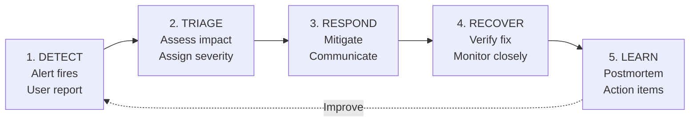
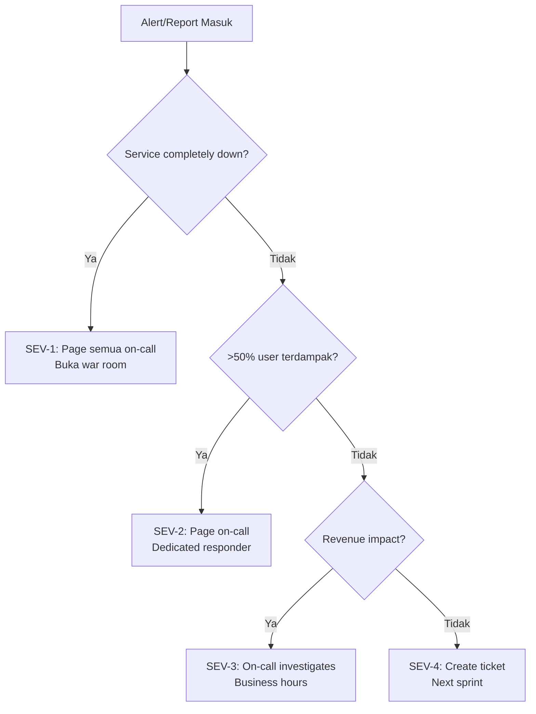
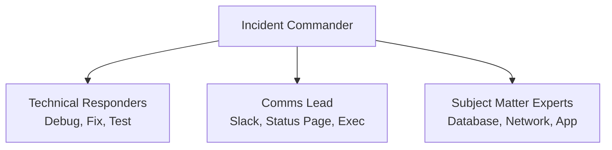

Incident response adalah salah satu kemampuan paling kritis yang harus dimiliki oleh setiap engineering team. Ketika production system mengalami masalah — downtime total, degradasi performa, atau data inconsistency — cara tim merespons menentukan seberapa besar dampak yang dirasakan user. Dalam konteks SRE, incident response bukan sekadar "fix the problem as fast as possible," melainkan proses terstruktur yang mencakup deteksi, triase, komunikasi, mitigasi, dan pembelajaran.

> Jika Anda belum membaca artikel sebelumnya, mulai dari [Foundation SRE: Apa Itu Site Reliability Engineering](/posts/foundation-sre-apa-itu-site-reliability-engineering/).

## Prerequisites

- Pemahaman dasar SRE, reliability mindset, dan konsep toil — baca: [Foundation SRE: Apa Itu Site Reliability Engineering](/posts/foundation-sre-apa-itu-site-reliability-engineering/)
- Pemahaman dasar monitoring, four golden signals, dan alerting — baca: [Foundation SRE: Monitoring Basics](/posts/foundation-sre-monitoring-basics/)
- Familiar dengan Linux command line
- Tidak memerlukan pengalaman incident management sebelumnya — artikel ini adalah starting point

## Apa Itu Incident?

Dalam konteks SRE, incident adalah event yang menyebabkan atau berpotensi menyebabkan degradasi atau gangguan pada service yang berdampak pada user. Incident bukan hanya "server down" — bisa juga berupa peningkatan latency yang signifikan, error rate yang melonjak, atau data corruption.

**✅ Yang termasuk incident:**
- Service completely down (HTTP 500 untuk semua request)
- Latency meningkat 10x dari normal (200ms → 2s)
- Error rate melonjak dari 0.1% ke 5%
- Data loss atau data corruption
- Degradasi yang melanggar SLO

**❌ Bukan incident** (tapi perlu perhatian):
- Planned maintenance window
- Bug yang tidak mempengaruhi user experience
- Performance issue di staging environment
- Cosmetic issue yang tidak mempengaruhi functionality

### Mengapa Incident Response Penting?

Incident response yang baik bukan hanya tentang memperbaiki masalah — ini tentang meminimalkan dampak, berkomunikasi dengan jelas, dan belajar dari setiap kejadian.

| Tanpa Incident Response | Dengan Incident Response |
|------------------------|--------------------------|
| Panic dan chaos saat incident | Respons terstruktur dan tenang |
| Tidak jelas siapa yang bertanggung jawab | Roles dan responsibilities jelas |
| Komunikasi kacau, stakeholder tidak tahu status | Update regular ke semua pihak |
| Waktu pemulihan lama (MTTR tinggi) | MTTR lebih rendah karena proses jelas |
| Masalah yang sama terulang | Postmortem menghasilkan improvement |
| Blame culture setelah incident | Blameless culture, fokus pada learning |

### Konsep Kunci

| Term | Definisi | Contoh |
|------|----------|--------|
| **Incident** | Event yang menyebabkan degradasi service | API return 500 errors untuk 30% requests |
| **Severity** | Tingkat keparahan incident | SEV-1 (critical), SEV-2 (major), SEV-3 (minor) |
| **Incident Commander (IC)** | Orang yang memimpin respons incident | Senior engineer yang koordinasi semua aktivitas |
| **Comms Lead** | Orang yang mengelola komunikasi | Engineer yang update stakeholders dan status page |
| **MTTD** | Mean Time to Detect | Alert fire 5 menit setelah error rate naik |
| **MTTR** | Mean Time to Recovery | Service recovered 30 menit setelah alert |
| **Runbook** | Dokumentasi langkah-langkah penanganan | "Jika database connection timeout, lakukan X, Y, Z" |
| **Postmortem** | Analisis setelah incident untuk learning | Dokumen yang menjelaskan apa yang terjadi dan action items |

## Severity Levels

Tidak semua incidents sama. Severity levels membantu tim memprioritaskan respons dan mengalokasikan resources yang tepat.

### Severity Matrix

| | Semua User | Mayoritas (>50%) | Sebagian (10-50%) | Sedikit (<10%) |
|---|---|---|---|---|
| **Service Down** | SEV-1 | SEV-1 | SEV-2 | SEV-3 |
| **Major Degradation** | SEV-1 | SEV-2 | SEV-2 | SEV-3 |
| **Minor Degradation** | SEV-2 | SEV-3 | SEV-3 | SEV-4 |
| **Cosmetic/Minor** | SEV-3 | SEV-4 | SEV-4 | SEV-4 |

### Response Requirements per Severity

| Aspek | SEV-1 | SEV-2 | SEV-3 | SEV-4 |
|-------|----------|----------|----------|----------|
| **Response Time** | < 15 menit | < 30 menit | < 4 jam | Next business day |
| **Notification** | Page on-call + escalate | Page on-call | Slack notification | Ticket/backlog |
| **War Room** | Ya, dedicated channel | Ya, jika perlu | Tidak | Tidak |
| **Status Page Update** | Ya, setiap 30 menit | Ya, setiap 1 jam | Tidak | Tidak |
| **Postmortem Required** | Ya, wajib | Ya, wajib | Optional | Tidak |
| **Target MTTR** | < 1 jam | < 4 jam | < 24 jam | < 1 minggu |

## Incident Lifecycle

Setiap incident melewati lifecycle yang terdiri dari beberapa fase. Memahami lifecycle ini membantu tim tahu apa yang harus dilakukan di setiap tahap.



### Fase 1: Detection (Deteksi)

Semakin cepat mendeteksi incident, semakin kecil dampaknya.

| Metode Deteksi | Kecepatan | Reliability | Contoh |
|---------------|-----------|-------------|--------|
| **Automated Monitoring** | Tercepat (detik-menit) | Tinggi | Prometheus alert: error rate > 1% |
| **Synthetic Monitoring** | Cepat (menit) | Tinggi | Health check endpoint gagal |
| **Internal Report** | Sedang (menit-jam) | Sedang | Engineer notice anomaly di dashboard |
| **Customer Report** | Lambat (jam) | Rendah | User complain di social media |

```bash
#!/bin/bash
# health-check-detector.sh — Simple backup monitoring via cron

ENDPOINT="http://api.example.com/health"
SLACK_WEBHOOK="https://hooks.slack.com/services/YOUR/WEBHOOK/URL"
THRESHOLD_MS=2000

RESPONSE=$(curl -s -o /dev/null -w "%{http_code}|%{time_total}" \
  --max-time 10 "$ENDPOINT" 2>/dev/null)

HTTP_CODE=$(echo "$RESPONSE" | cut -d'|' -f1)
RESPONSE_TIME=$(echo "$RESPONSE" | cut -d'|' -f2)
RESPONSE_MS=$(echo "$RESPONSE_TIME * 1000" | bc | cut -d'.' -f1)

if [ "$HTTP_CODE" != "200" ]; then
    curl -s -X POST "$SLACK_WEBHOOK" \
      -H 'Content-type: application/json' \
      -d "{\"text\":\"INCIDENT: Health check failed - HTTP $HTTP_CODE\"}"
elif [ "$RESPONSE_MS" -gt "$THRESHOLD_MS" ]; then
    curl -s -X POST "$SLACK_WEBHOOK" \
      -H 'Content-type: application/json' \
      -d "{\"text\":\"WARNING: Slow response - ${RESPONSE_MS}ms\"}"
fi
```

### Fase 2: Triage (Triase)

Setelah incident terdeteksi, langkah selanjutnya adalah menilai severity, scope, dan menentukan siapa yang harus merespons.



### Fase 3: Response (Respons)

Fase response adalah inti dari incident handling. Prinsip utama:

1. **Mitigate first, debug later** — Prioritas pertama adalah mengurangi dampak ke user
2. **Communicate early and often** — Stakeholders harus tahu apa yang terjadi
3. **Document as you go** — Catat timeline dan actions secara real-time
4. **Escalate when needed** — Jangan ragu untuk minta bantuan

```bash
# Quick mitigation actions — "Stop the bleeding first"

# 1. Rollback deployment terakhir (jika deployment-related)
kubectl rollout undo deployment/api-server -n production

# 2. Scale up jika traffic-related
kubectl scale deployment/api-server --replicas=5 -n production

# 3. Restart service jika stuck/hung
kubectl rollout restart deployment/api-server -n production

# 4. Enable maintenance mode jika perlu waktu lebih lama
kubectl apply -f maintenance-mode.yaml
```

### Fase 4: Recovery (Pemulihan)

| Step | Action | Verification |
|------|--------|-------------|
| 1 | Apply fix/mitigation | Deployment berhasil tanpa error |
| 2 | Verify service health | Health check endpoint return 200 |
| 3 | Check error rate | Error rate kembali ke baseline |
| 4 | Check latency | Response time kembali normal |
| 5 | Monitor closely (30 min) | Tidak ada re-occurrence |
| 6 | Confirm with stakeholders | User experience kembali normal |
| 7 | Close incident | Update status page, notify team |

### Fase 5: Learning (Pembelajaran)

Fase terakhir — dan sering kali yang paling diabaikan — adalah learning melalui postmortem:

- **Timeline:** Apa yang terjadi, kapan, dan oleh siapa?
- **Root Cause:** Mengapa ini terjadi? (5 Whys analysis)
- **Impact:** Berapa user terdampak? Berapa lama?
- **What Went Well:** Apa yang berjalan baik dalam response?
- **What Went Wrong:** Apa yang bisa diperbaiki?
- **Action Items:** Langkah konkret untuk mencegah recurrence

> **Prinsip Blameless:** Fokus pada SISTEM, bukan INDIVIDU. "X yang deploy code buggy" menjadi "Deployment process tidak memiliki automated testing"

## Komunikasi Selama Incident

Komunikasi yang kurang baik selama incident bisa memperpanjang downtime secara signifikan. SRE menekankan bahwa komunikasi adalah skill yang sama pentingnya dengan debugging.



### Template Komunikasi

#### Initial Notification

```
INCIDENT DECLARED — [Severity Level]

What: [Deskripsi singkat masalah]
Impact: [Siapa yang terdampak dan bagaimana]
Status: Investigating
IC: [Nama Incident Commander]
War Room: #incident-YYYY-MM-DD
Next Update: [Waktu update berikutnya]
```

#### Status Update (setiap 30 menit SEV-1, 1 jam SEV-2)

```
INCIDENT UPDATE — [Severity Level]

Current Status: [Investigating/Identified/Mitigating/Monitoring]
What We Know: [Findings terbaru]
What We're Doing: [Actions yang sedang dilakukan]
ETA to Resolution: [Estimasi jika ada]
Next Update: [Waktu update berikutnya]
```

#### Resolution Notification

```
INCIDENT RESOLVED — [Severity Level]

Duration: [Total waktu incident]
Root Cause: [Ringkasan singkat]
Resolution: [Apa yang dilakukan untuk fix]
Impact Summary: [Ringkasan dampak]
Postmortem: [Jadwal postmortem]
```

### Communication Anti-Patterns

| Anti-Pattern | Alternatif yang Benar |
|-------------|----------------------|
| "Sedang di-fix" tanpa detail | Jelaskan apa yang sedang dilakukan |
| Tidak ada update selama 1+ jam | Update regular meskipun belum ada progress |
| Blame dalam komunikasi | Fokus pada fakta dan timeline |
| Terlalu teknis untuk stakeholder | Gunakan bahasa bisnis untuk non-technical audience |
| Panic language ("EVERYTHING IS DOWN!!!") | Tenang, faktual, dan terstruktur |

## Pengenalan Runbook

Runbook adalah dokumentasi langkah-demi-langkah untuk menangani incident atau operational task tertentu. Runbook mengurangi ketergantungan pada "tribal knowledge" — pengetahuan yang hanya ada di kepala satu atau dua orang.

### Anatomi Runbook yang Baik

| Komponen | Deskripsi | Contoh |
|----------|-----------|--------|
| **Title** | Nama yang jelas dan deskriptif | "Database Connection Pool Exhausted" |
| **Severity** | Default severity | SEV-2 (Major) |
| **Symptoms** | Bagaimana masalah terdeteksi | Alert: `db_connections > 90%` |
| **Prerequisites** | Akses dan tools yang dibutuhkan | SSH access ke DB server, `psql` client |
| **Steps** | Langkah-langkah penanganan | 1. Verify, 2. Check, 3. Fix, 4. Verify |
| **Verification** | Cara memastikan fix berhasil | Connection count < 80%, response time normal |
| **Escalation** | Siapa yang dihubungi jika gagal | DBA Team → VP Engineering |

### Contoh Runbook: High Error Rate

```yaml
# runbook-high-error-rate.yaml
runbook:
  title: "API High Error Rate"
  id: "RB-001"
  severity: "SEV-2"
  owner: "Platform Team"
  
  symptoms:
    - "Alert: api_error_rate > 1% for 5 minutes"
    - "Grafana dashboard menunjukkan spike di error panel"
  
  steps:
    - step: 1
      title: "Verify the issue"
      commands:
        - "kubectl get pods -n production -l app=api-server"
        - "curl -s 'http://prometheus:9090/api/v1/query?query=rate(http_requests_total{status=~\"5..\"}[5m])'"
    
    - step: 2
      title: "Check recent deployments"
      commands:
        - "kubectl rollout history deployment/api-server -n production"
      decision: "Jika ada deployment dalam 30 menit → Rollback. Jika tidak → Investigate"
    
    - step: 3
      title: "Rollback atau investigate"
      commands:
        - "kubectl rollout undo deployment/api-server -n production"
        - "kubectl logs -l app=api-server -n production --tail=100 | grep ERROR"
    
    - step: 4
      title: "Verify recovery"
      commands:
        - "curl -s http://api.example.com/health | jq ."
      expected: "Error rate < 0.1%, health check returns 200"
  
  escalation:
    - level: 1
      contact: "On-call DevOps Engineer"
      method: "PagerDuty / Grafana OnCall"
    - level: 2
      contact: "DevOps Team Lead"
      method: "Phone call"
    - level: 3
      contact: "VP Engineering"
      method: "Phone call + Slack DM"
```

## On-Call Rotation

> **Catatan:** Tools seperti **Grafana OnCall** (open source), **PagerDuty** (enterprise-grade dengan AIOps), dan **incident.io** (developer-friendly) menyediakan fitur rotation, escalation, dan notification yang jauh lebih baik dari manual scheduling.

```yaml
# grafana-oncall-rotation-example.yaml
oncall_schedule:
  name: "Platform Team On-Call"
  timezone: "Asia/Jakarta"
  rotation_type: "weekly"
  
  members:
    - name: "Andi"
      slack: "@andi"
    - name: "Budi"
      slack: "@budi"
    - name: "Citra"
      slack: "@citra"
  
  escalation_policy:
    - level: 1
      target: "current_oncall"
      timeout_minutes: 10
      notification: ["push", "sms"]
    - level: 2
      target: "next_oncall"
      timeout_minutes: 15
      notification: ["push", "sms", "phone"]
    - level: 3
      target: "team_lead"
      timeout_minutes: 5
      notification: ["phone"]
  
  handoff:
    day: "Monday"
    time: "09:00"
    handoff_channel: "#on-call"
```

## Studi Kasus: TechStartup Indonesia

### Konteks

TSI di awal 2020 menghadapi major outage pertama mereka — "Valentine's Day Outage" — yang berlangsung 6 jam.

Kondisi saat itu:
- 50K DAU dengan arsitektur monolith
- Promo Valentine's Day menarik traffic 3x lipat
- Database connection pool exhausted
- Tidak ada proses incident response sama sekali

Masalah selama outage:
- Deteksi memakan waktu 45 menit (dari marketing, bukan monitoring)
- 5 DevOps engineers SSH bersamaan tanpa koordinasi
- Trial-and-error selama 3 jam sebelum fix ditemukan
- Komunikasi kacau, stakeholder tidak tahu status

### Apa yang Dilakukan

Setelah outage, CTO memberikan 3 minggu untuk membangun fondasi incident response:

1. **Minggu 1: Severity Levels** — Definisikan SEV-1 sampai SEV-4 dengan response requirements yang jelas
2. **Minggu 2: Runbooks & Communication Templates** — Dokumentasi langkah penanganan dan template notifikasi
3. **Minggu 3: On-call Rotation & Alerting Rules** — Setup jadwal on-call dan konfigurasi alert di Prometheus

Hasilnya diuji saat incident serupa terjadi di bulan Maret — flash sale yang menyebabkan DB connection pool issue yang sama.

### Metrics Improvement

| Metric | Sebelum (Feb 2020) | Sesudah (Mar 2020) | Perubahan |
|--------|-------------------|-------------------|-----------|
| MTTD (Mean Time to Detect) | 45 menit | 3 menit | -93% |
| MTTR (Mean Time to Recovery) | 5 jam | 43 menit | -86% |
| Revenue loss per incident | Rp 50 juta | Rp 7 juta | -86% |
| Incidents tanpa postmortem | 100% | 0% (SEV-1/2) | -100% |

Perbedaan utama saat incident Maret:
- Alert fired dalam 3 menit (bukan 45 menit dari marketing)
- On-call yang sedang jaga merespon dalam 5 menit
- Langsung buka runbook RB-001 dan ikuti langkah yang sudah terdokumentasi
- Total investasi: ~Rp 2 juta/bulan (on-call compensation) vs Rp 50 juta revenue loss per incident sebelumnya

### Lessons Learned

**Yang Berhasil:**
- Runbooks save lives (and revenue) — Engineer on-call bisa handle incident sendiri karena runbook sudah ada
- Alerting yang tepat = detection yang cepat — 3 menit vs 45 menit detection time
- Clear roles prevent chaos — satu IC, satu responder, tidak ada 5 orang SSH bersamaan
- Communication templates reduce cognitive load — saat stress, template membantu tetap terstruktur

**Yang Perlu Dihindari:**
- Notification masih manual — perlu automated paging (Grafana OnCall atau PagerDuty)
- Runbook masih sedikit (baru 3) — perlu lebih banyak untuk common scenarios
- Postmortem process masih informal — perlu template dan tracking system

## Best Practices

- **Definisikan severity levels sebelum incident terjadi** — saat incident bukan waktu yang tepat untuk debat severity
- **Buat runbook untuk top 3 incidents** — mulai dari yang paling sering terjadi, tambahkan gradually
- **Assign Incident Commander (IC) di awal** — satu orang yang koordinasi, bukan semua orang coba fix
- **Komunikasikan early and often** — update stakeholders meskipun belum ada progress
- **Mitigate first, debug later** — kurangi impact ke user dulu, cari root cause setelah service pulih
- **Lakukan postmortem untuk SEV-1 dan SEV-2** — tanpa postmortem, masalah yang sama akan terulang
- **Test runbooks secara berkala** — runbook yang tidak pernah ditest mungkin sudah outdated

## Selanjutnya

Artikel berikutnya: [Intermediate SRE: Incident Management](/posts/intermediate-sre-incident-management/) — setelah memahami fondasi incident response, langkah selanjutnya adalah membangun incident management yang lebih terstruktur dengan roles formal, war room procedures, dan escalation policies.

Topik terkait yang bisa Anda eksplorasi:
- Alerting Strategy — mengurangi alert fatigue dan membangun actionable alerts
- Service Ownership — siapa yang bertanggung jawab ketika alert berbunyi?
- Postmortem Culture — membangun budaya blameless learning dari incidents

## References

- [Google SRE Book — Managing Incidents](https://sre.google/sre-book/managing-incidents/)
- [Google SRE Book — Effective Troubleshooting](https://sre.google/sre-book/effective-troubleshooting/)
- [PagerDuty Incident Response Documentation](https://response.pagerduty.com/)
- [Grafana OnCall Documentation](https://grafana.com/docs/oncall/latest/)
- [incident.io — Practical Guide to Incident Management](https://incident.io/guide)

---

## Navigasi Series

⬅️ **Sebelumnya:** [Foundation SRE: Monitoring Basics](/posts/foundation-sre-monitoring-basics/)

➡️ **Selanjutnya:** [Intermediate SRE: Incident Management](/posts/intermediate-sre-incident-management/)