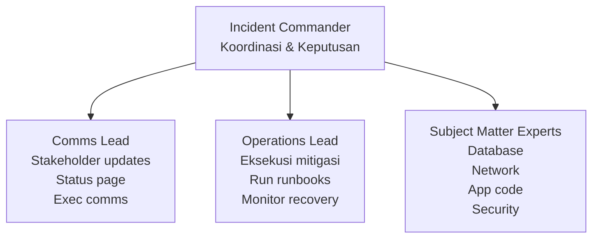
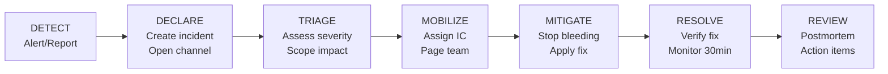
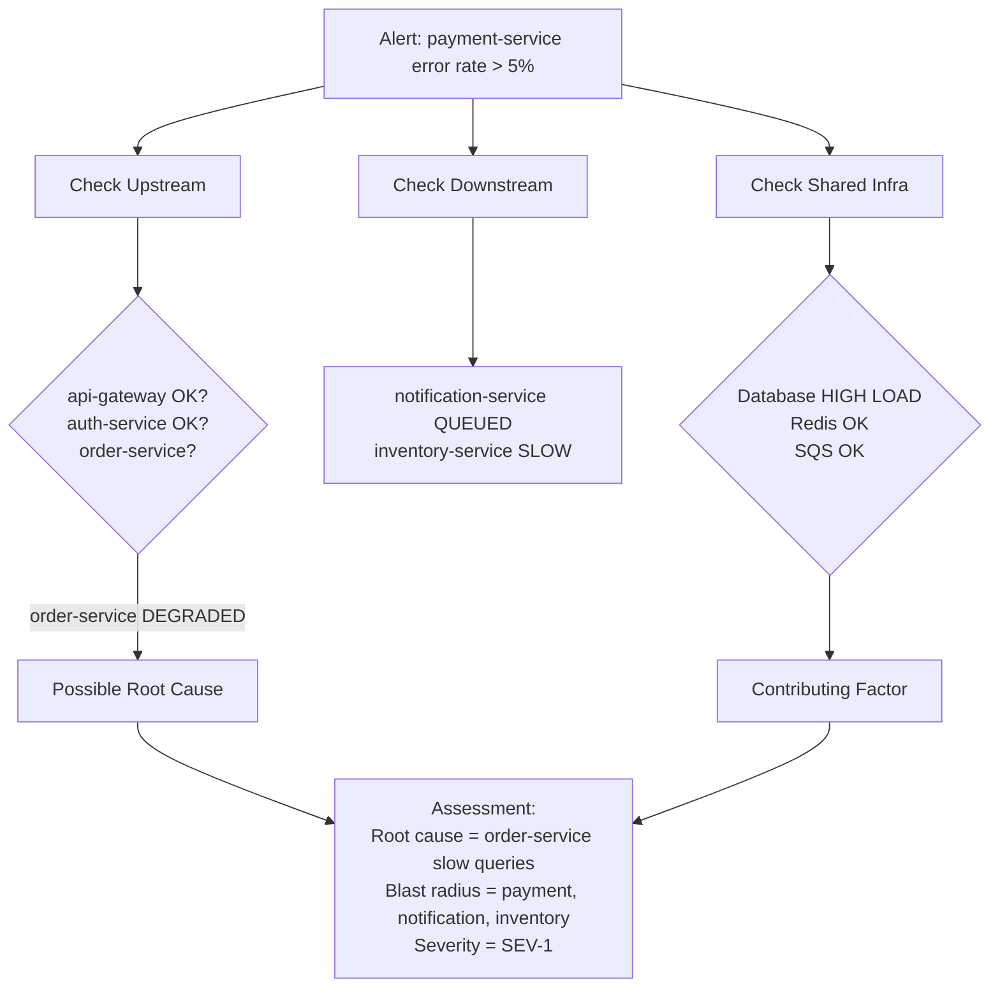

Incident management terstruktur adalah evolusi natural dari incident response dasar. Jika di level Foundation kita belajar "apa itu incident dan bagaimana merespons secara basic," sekarang kita membangun sistem yang memastikan setiap incident ditangani dengan koordinasi yang jelas, roles yang terdefinisi, dan proses yang repeatable. Artikel ini membahas bagaimana membangun incident management framework, mulai dari mendefinisikan roles, merancang workflow, melakukan post-incident review, hingga setup war room yang produktif.

> Jika Anda belum membaca artikel sebelumnya, mulai dari [Foundation SRE: Pengantar Incident Response](/posts/foundation-sre-pengantar-incident-response/).

## Prerequisites

- Pemahaman dasar SRE, reliability mindset, dan konsep toil — baca: [Foundation SRE: Apa Itu Site Reliability Engineering](/posts/foundation-sre-apa-itu-site-reliability-engineering/)
- Pemahaman dasar incident response: severity levels, incident lifecycle, komunikasi — baca: [Foundation SRE: Pengantar Incident Response](/posts/foundation-sre-pengantar-incident-response/)
- Familiar dengan monitoring basics dan four golden signals — baca: [Foundation SRE: Monitoring Basics](/posts/foundation-sre-monitoring-basics/)
- Pengalaman dasar dengan Kubernetes dan microservices architecture

## Mengapa Incident Management Terstruktur?

Ketika organisasi bertumbuh dari satu monolith menjadi belasan microservices, incident response ad-hoc yang "cukup" di fase awal menjadi bottleneck yang berbahaya. Masalah yang dulunya bisa di-debug oleh satu orang di satu server sekarang melibatkan multiple services, multiple teams, dan multiple failure modes yang saling berkaitan.

Incident management terstruktur terdiri dari empat komponen utama:

| Komponen | Deskripsi | Mengapa Penting |
|----------|-----------|-----------------|
| **Roles & Responsibilities** | Siapa melakukan apa saat incident | Menghilangkan ambiguitas dan duplikasi effort |
| **Incident Workflow** | Langkah-langkah dari deteksi hingga resolusi | Memastikan tidak ada step yang terlewat |
| **Post-Incident Review** | Proses belajar setelah incident selesai | Mencegah incident yang sama terulang |
| **War Room & Communication** | Tempat dan cara koordinasi selama incident | Memastikan informasi mengalir dengan benar |

> **Catatan:** Tools seperti **Rootly**, **incident.io**, dan **Grafana OnCall** menyediakan incident management platform yang mengintegrasikan keempat komponen ini. **PagerDuty** dengan fitur AIOps-nya bisa meng-cluster related alerts dan menyarankan responders berdasarkan historical data.

## Incident Commander & Roles

### Incident Commander (IC)

Incident Commander adalah orang yang bertanggung jawab atas keseluruhan respons incident. IC bukan orang yang paling senior atau paling teknis, IC adalah orang yang mengkoordinasi semua aktivitas, membuat keputusan, dan memastikan incident bergerak menuju resolusi.


**Tanggung jawab IC:**
- Memimpin war room dan menjaga fokus diskusi
- Mendelegasikan tugas ke responders
- Memastikan Comms Lead mengirim update regular
- Menentukan severity level (dan upgrade/downgrade)
- Memutuskan strategi mitigasi (rollback vs hotfix)
- Menentukan kapan incident dinyatakan resolved

**Yang BUKAN tugas IC:**
- Debugging code secara langsung
- Menulis fix atau hotfix
- Menjawab pertanyaan customer secara langsung

### Incident Response Team Structure



### Role Assignment Matrix

> **SME** = Subject Matter Expert — engineer yang punya keahlian spesifik di area tertentu. Saat incident, IC memanggil SME yang relevan untuk bantu diagnosa masalah.

| Role | Siapa | Kapan Dibutuhkan | Backup |
|------|-------|------------------|--------|
| **Incident Commander** | On-call senior engineer atau rotation | Semua SEV-1 dan SEV-2 | Secondary on-call |
| **Communications Lead** | Designated comms person atau rotation | SEV-1 dan SEV-2 | IC doubles as Comms |
| **Operations Lead** | On-call engineer untuk service terdampak | Semua severity | Peer engineer |
| **SME — Database** | DBA atau database-savvy engineer | Jika database terlibat | Senior backend engineer |
| **SME — Network** | Network/infra engineer | Jika network terlibat | Cloud platform engineer |
| **Scribe** | Junior engineer atau volunteer | SEV-1 (recommended) | IC atau Comms Lead |

IC bukan role permanen — ini adalah rotation yang harus dilatih. Requirements untuk menjadi IC:
- Completed incident response training module
- Shadowed minimal 2 real incidents sebagai observer
- Led minimal 1 incident drill/game day
- Familiar dengan semua critical service runbooks

## Incident Workflow

### End-to-End Structured Workflow



**Timeline targets:**

| Phase | Target | Notes |
|-------|--------|-------|
| Detect → Declare | < 5 min | Automated |
| Declare → Triage | < 5 min | IC assesses |
| Triage → Mobilize | < 10 min | Page responders |
| Mobilize → Mitigate | < 30 min (SEV-1) | Varies by complexity |
| Mitigate → Resolve | < 30 min | Monitoring period |
| Resolve → Review | 24-48 hours | Schedule postmortem |

### Automated Alert Routing

Deteksi harus se-otomatis mungkin. Dengan tools modern, alert bisa langsung di-route ke on-call engineer yang tepat:

```yaml
# grafana-oncall-integration.yml
routes:
  - name: "critical-alerts"
    filter:
      severity: "critical"
    escalation_chain: "sev1-chain"
    notify:
      - type: "slack"
        channel: "#incidents-critical"
      - type: "phone_call"
        to: "on-call-primary"

  - name: "warning-alerts"
    filter:
      severity: "warning"
    escalation_chain: "sev2-chain"
    notify:
      - type: "slack"
        channel: "#incidents-warning"
      - type: "sms"
        to: "on-call-primary"

escalation_chains:
  sev1-chain:
    - step: 1
      action: "notify"
      target: "on-call-primary"
      wait: "5m"
    - step: 2
      action: "notify"
      target: "on-call-secondary"
      wait: "10m"
    - step: 3
      action: "notify"
      target: "engineering-manager"
      wait: "15m"
    - step: 4
      action: "notify"
      target: "vp-engineering"

  sev2-chain:
    - step: 1
      action: "notify"
      target: "on-call-primary"
      wait: "15m"
    - step: 2
      action: "notify"
      target: "on-call-secondary"
      wait: "30m"
    - step: 3
      action: "notify"
      target: "engineering-manager"
```

### Microservices Triage dengan Dependency Correlation

Di environment microservices, triage harus mempertimbangkan dependency chain. Ketika satu alert fire, periksa upstream dependencies, downstream dependencies, dan shared infrastructure untuk menemukan root cause yang sebenarnya.



> **Tip:** **OpenTelemetry (OTel)** traces sangat membantu dalam triage microservices incidents. Dengan distributed tracing, Anda bisa melihat seluruh request path dan mengidentifikasi service mana yang menjadi bottleneck.


### Mitigate, Resolve, Review

Setelah triage, IC mengarahkan tim untuk mitigasi. Prinsip utama: **stop the bleeding first, debug later**.

| Phase | Actions | Tools |
|-------|---------|-------|
| **Mitigate** | Rollback, scale up, circuit break, redirect traffic | kubectl, Istio, Envoy, feature flags |
| **Resolve** | Verify fix, monitor 30 min, confirm stable | Grafana dashboards, OTel traces, synthetic checks |
| **Review** | Schedule postmortem, collect timeline, assign action items | incident.io, Rootly, Google Docs |

## Post-Incident Review

Post-incident review (PIR) — sering disebut postmortem — adalah proses terstruktur untuk belajar dari incident. Tujuannya bukan mencari siapa yang salah, tapi memahami apa yang terjadi dan bagaimana mencegah kejadian serupa.

### Prinsip Blameless

Fokus pada sistem, bukan individu:

| Blame (salah) | Blameless (benar) |
|----------------|-------------------|
| "X deploy tanpa testing" | "Deployment pipeline tidak memiliki automated tests" |
| "Y tidak monitor dashboard" | "Alert tidak ter-configure untuk scenario ini" |
| "Tim lambat merespons" | "Escalation path tidak jelas, on-call tidak paged" |

### PIR Timeline

| Waktu | Aktivitas |
|-------|-----------|
| Incident resolved + 24 jam | IC draft timeline |
| 24-48 jam | PIR meeting (30-60 menit) |
| 48-72 jam | PIR document finalized |
| 1 minggu | Action items assigned dan tracked |
| 2-4 minggu | Action items completed dan verified |

### 5 Whys Analysis

Teknik 5 Whys membantu menemukan root cause yang sebenarnya:

```
INCIDENT: Payment service down selama 2 jam

Why 1: Mengapa payment service down?
→ Database connection pool exhausted

Why 2: Mengapa connection pool exhausted?
→ Slow query pada order-service menghold connections

Why 3: Mengapa ada slow query di order-service?
→ New feature deploy menambah query tanpa index

Why 4: Mengapa query tanpa index lolos ke production?
→ Tidak ada query performance review di CI/CD pipeline

Why 5: Mengapa tidak ada query performance review?
→ Belum ada automated database migration testing

ROOT CAUSE: Tidak ada automated testing untuk database
query performance di CI/CD pipeline

ACTION ITEMS:
1. Add query explain plan check di CI/CD (Owner: X)
2. Set connection pool monitoring alert (Owner: Y)
3. Add database load testing ke staging (Owner: Z)
```

### PIR Meeting Agenda

| Waktu | Agenda | Facilitator |
|-------|--------|-------------|
| 0-5 min | Opening: ground rules (blameless, fokus pada sistem) | IC |
| 5-15 min | Timeline review: apa yang terjadi, kapan | IC + Scribe |
| 15-25 min | Root cause analysis: 5 Whys | IC + SMEs |
| 25-35 min | What went well / what went wrong | Semua peserta |
| 35-50 min | Action items: apa yang harus dilakukan, siapa, kapan | IC |
| 50-60 min | Wrap-up: review action items, next steps | IC |

## War Room Setup

Di era remote work, war room hampir selalu virtual. Tapi prinsipnya tetap sama: satu tempat terpusat untuk koordinasi incident.

### Virtual War Room Structure

```
#incident-2025-01-15-payment-down
├── Pinned: Incident summary, severity, IC
├── Thread: Technical debugging
├── Thread: Communication updates
├── Thread: Timeline/scribe notes
└── Bot: Auto-updates dari monitoring

#incident-updates (public, read-mostly)
├── Status updates setiap 30 menit
└── Resolution notification

#incidents-log (archive)
└── Historical record semua incidents
```

### War Room Etiquette

| Rule | Mengapa |
|------|---------|
| **IC memimpin diskusi** | Menghindari chaos dan multiple conversations |
| **Satu orang bicara pada satu waktu** | Menghindari informasi yang terlewat |
| **Gunakan threads untuk detail teknis** | Menjaga main channel tetap clean |
| **Update status setiap 15-30 menit** | Stakeholders tahu progress tanpa bertanya |
| **Semua keputusan di-announce di main channel** | Single source of truth |
| **Scribe mencatat semua keputusan** | Untuk postmortem dan audit trail |

## Hands-on: Incident Role Configuration

Contoh konfigurasi roles untuk incident management:

```yaml
# incident-roles-config.yaml
organization:
  name: "Your Company"
  timezone: "Asia/Jakarta"

roles:
  incident_commander:
    description: "Koordinasi keseluruhan incident response"
    rotation: "weekly"
    roster:
      - name: "Engineer A"
        slack: "@engineer-a"
        phone: "+62-xxx-xxx-001"
      - name: "Engineer B"
        slack: "@engineer-b"
        phone: "+62-xxx-xxx-002"
      - name: "Engineer C"
        slack: "@engineer-c"
        phone: "+62-xxx-xxx-003"
    requirements:
      - "Completed IC training module"
      - "Shadowed 2+ real incidents"
      - "Led 1+ incident drill"
      - "Familiar with critical service runbooks"

  communications_lead:
    description: "Mengelola komunikasi ke stakeholders"
    rotation: "weekly"
    roster:
      - name: "Engineer D"
        slack: "@engineer-d"
      - name: "Engineer E"
        slack: "@engineer-e"

  operations_lead:
    description: "Eksekusi teknis mitigasi dan fix"
    assignment: "per-service-on-call"
    services:
      - service: "api-gateway"
        primary: "Engineer F"
        secondary: "Engineer G"
      - service: "payment-service"
        primary: "Engineer H"
        secondary: "Engineer I"

escalation_policy:
  sev1:
    - step: "IC + Ops Lead + Comms Lead"
      timeout: "immediate"
    - step: "Engineering Manager"
      timeout: "15 minutes"
    - step: "VP Engineering"
      timeout: "30 minutes"
    - step: "CTO"
      timeout: "1 hour"
  sev2:
    - step: "IC + Ops Lead"
      timeout: "immediate"
    - step: "Engineering Manager"
      timeout: "30 minutes"
```

### Communication Templates

```
TEMPLATE 1: INCIDENT DECLARATION
INCIDENT DECLARED — [SEV-1/SEV-2/SEV-3]

ID: INC-YYYYMMDD-XXX
What: [Deskripsi singkat — 1 kalimat]
Impact: [Siapa terdampak, berapa banyak]
Status: Investigating
IC: [Nama] (@slack-handle)
War Room: #incident-YYYY-MM-DD-desc
Next Update: [Waktu]

TEMPLATE 2: STATUS UPDATE
INCIDENT UPDATE — [SEV-X] — [INC-ID]

Status: [Investigating | Identified | Mitigating | Monitoring]
What We Know: [Findings terbaru]
What We're Doing: [Current actions]
ETA: [Estimasi resolusi atau "Assessing"]
Next Update: [Waktu]

TEMPLATE 3: RESOLUTION
INCIDENT RESOLVED — [SEV-X] — [INC-ID]

Duration: [Total waktu]
Root Cause: [1-2 kalimat]
Resolution: [Apa yang dilakukan]
Impact: [User terdampak, duration]
Postmortem: [Jadwal]
```


## Studi Kasus: TechStartup Indonesia

### Konteks

TSI di fase Growth (2021 Q1) telah bermigrasi dari monolith ke 15 microservices di Amazon EKS. Dengan 35 developers dan 5 DevOps engineers, incident response ad-hoc yang dulu "cukup" menjadi sumber chaos.

Kondisi sebelumnya:
- Cascading failures antar services membuat debugging menjadi nightmare
- Tanpa roles yang jelas, setiap incident menjadi "semua orang panik bersama"
- Tidak ada formal IC rotation atau escalation policy

Titik balik — "The Cascading Monday" (15 Maret 2021):
- Inventory-service memory leak menyebabkan cascading failure ke 5 services lain
- 2.5 jam downtime dan Rp 85 juta revenue loss
- 5 engineers bekerja tanpa koordinasi

### Apa yang Dilakukan

TSI membangun incident management terstruktur dalam 4-6 minggu:

1. **Definisi Roles & IC Training** — Melatih 8 IC candidates dari berbagai tim (bukan hanya DevOps)
2. **Alert Routing** — Implementasi Grafana OnCall + PagerDuty AIOps untuk automated routing
3. **Automated Incident Declaration** — Slack bot untuk declare incident tanpa ambiguity
4. **Service Dependency Map** — Mempercepat triage dengan visualisasi dependency antar services

### Metrics Improvement

| Metric | Sebelum | Sesudah | Perubahan |
|--------|---------|---------|-----------|
| Incidents/month | 18 | 12 | -33% |
| MTTD (detect) | 15 min | 3 min | -80% |
| MTTR (recover) | 2.5 hrs | 45 min | -70% |
| Cascading failures | 40% | 15% | -25pp |
| Repeat incidents | 35% | 10% | -25pp |
| PIR completion rate | 20% | 95% | +75pp |

Hasil tambahan:
- Revenue loss dari incidents turun 65% (Rp 85jt → Rp 30jt/bulan)
- Customer complaints during incidents turun 70%
- Engineer burnout (self-reported) turun 40%

### Lessons Learned

**Yang Berhasil:**
- IC rotation across teams — melatih backend engineers sebagai IC mengurangi bottleneck di DevOps team
- Service dependency map — mempercepat triage dari 30 menit menjadi 5 menit
- Automated incident declaration — menghilangkan "siapa yang declare?" ambiguity
- PIR with action item tracking — 85% action items completed, repeat incidents turun 25pp
- Grafana OnCall + PagerDuty AIOps — alert noise reduction 60%, grouping mengurangi volume 45%

**Yang Perlu Dihindari:**
- Jangan buat IC role terlalu exclusive — TSI awalnya hanya DevOps, sekarang 8 orang dari berbagai tim
- Jangan skip PIR karena "terlalu sibuk" — tanpa PIR, masalah yang sama akan terulang
- Jangan over-engineer workflow — mulai simple, iterate berdasarkan feedback
- Jangan lupa latihan — incident drills sama pentingnya dengan proses tertulis

## Best Practices

- **Assign IC untuk setiap SEV-1/SEV-2** — IC memastikan koordinasi dan menghindari chaos
- **Train IC dari berbagai tim** — mengurangi bottleneck dan meningkatkan cross-team understanding
- **Gunakan communication templates** — konsistensi mengurangi cognitive load saat incident
- **Buat service dependency map** — mempercepat triage dan mengidentifikasi blast radius
- **Lakukan PIR untuk setiap SEV-1/SEV-2** — learning dari incident mencegah recurrence
- **Run incident drills minimal 1x/quarter** — practice makes perfect
- **Automate incident declaration** — menghilangkan ambiguity dan mempercepat response

## Selanjutnya

Artikel berikutnya: [Intermediate SRE: Alerting Strategy](/posts/intermediate-sre-alerting-strategy/) — setelah membangun incident management terstruktur, langkah selanjutnya adalah mengurangi alert noise dan membangun alerting yang actionable.

Topik terkait yang bisa dieksplorasi:
- Service Ownership — siapa yang bertanggung jawab ketika alert berbunyi?
- Error Budget — menyeimbangkan reliability dan feature velocity
- On-Call Best Practices — membangun sustainable on-call rotation

## References

- [Google SRE Book — Managing Incidents](https://sre.google/sre-book/managing-incidents/)
- [Google SRE Book — Postmortem Culture](https://sre.google/sre-book/postmortem-culture/)
- [Google SRE Workbook — Incident Response](https://sre.google/workbook/incident-response/)
- [PagerDuty Incident Response Guide](https://response.pagerduty.com/)
- [Grafana OnCall Documentation](https://grafana.com/docs/oncall/latest/)
- [PagerDuty AIOps Documentation](https://www.pagerduty.com/platform/aiops/)
- [OpenTelemetry Documentation](https://opentelemetry.io/docs/)

---

## Navigasi Series

⬅️ **Sebelumnya:** [Foundation SRE: Pengantar Incident Response](/posts/foundation-sre-pengantar-incident-response/)

➡️ **Selanjutnya:** [Intermediate SRE: Alerting Strategy](/posts/intermediate-sre-alerting-strategy/)