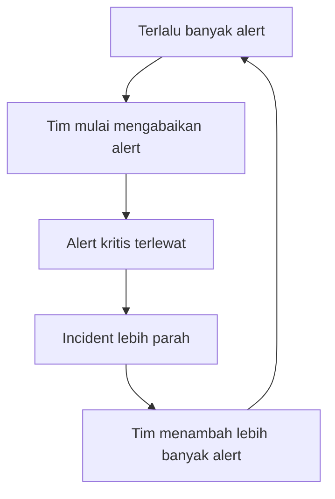
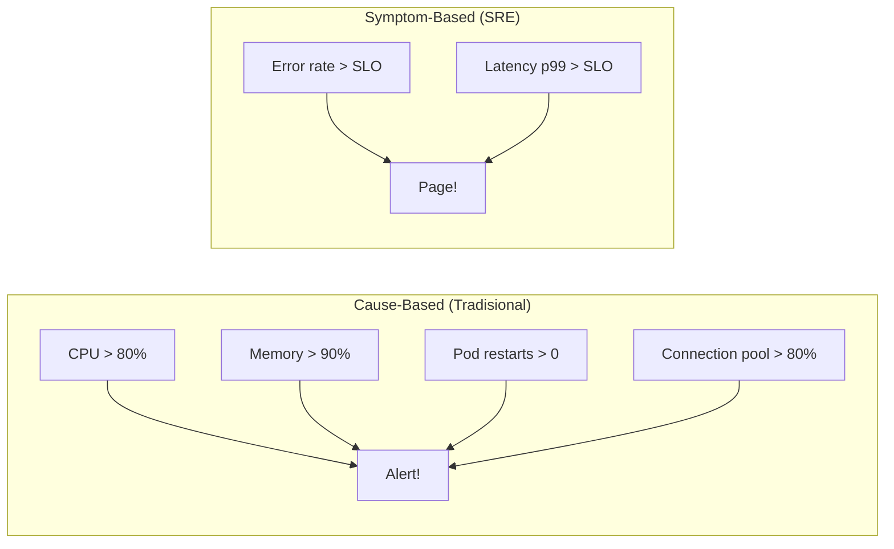
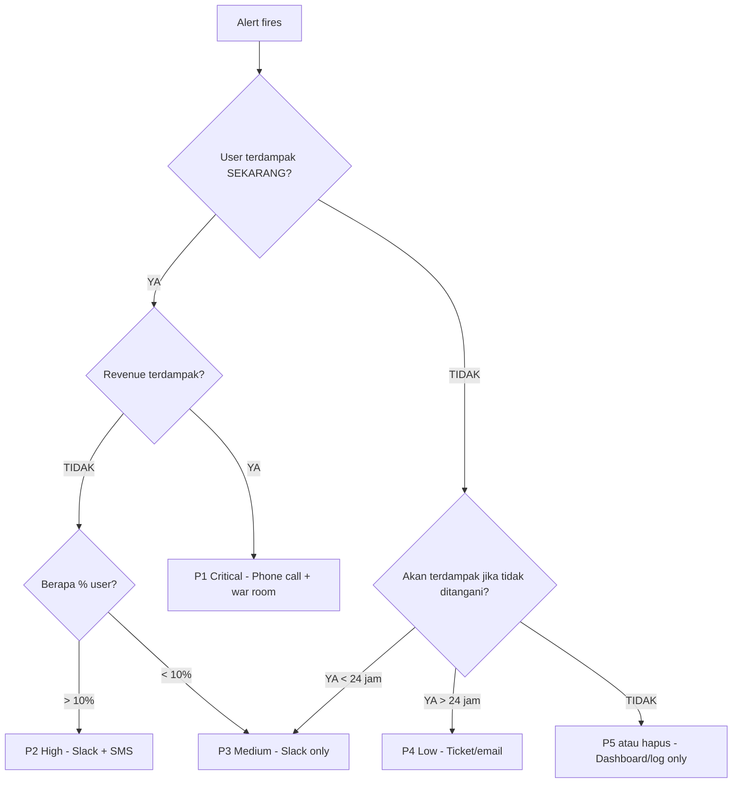
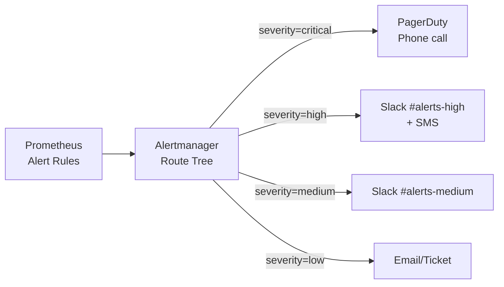

Alert fatigue adalah salah satu masalah paling umum dan berbahaya dalam operasi sistem modern. Ketika tim menerima ratusan alert setiap hari, sebagian besar tidak actionable, mereka mulai mengabaikan alert, termasuk yang benar-benar kritis. Artikel ini membahas bagaimana merancang alerting strategy yang mengurangi noise, meningkatkan signal-to-noise ratio, dan memastikan tim hanya di-page untuk hal yang benar-benar membutuhkan perhatian.

> Jika Anda belum membaca artikel sebelumnya, mulai dari [Intermediate SRE: Incident Management](/posts/intermediate-sre-incident-management/).

## Prerequisites

- Pemahaman dasar monitoring, four golden signals, dan observability — baca: [Foundation SRE: Monitoring Basics](/posts/foundation-sre-monitoring-basics/)
- Pemahaman dasar incident response dan severity levels — baca: [Foundation SRE: Pengantar Incident Response](/posts/foundation-sre-pengantar-incident-response/)
- Pemahaman incident management terstruktur — baca: [Intermediate SRE: Incident Management](/posts/intermediate-sre-incident-management/)
- Familiar dengan Prometheus dan PromQL dasar
- Pengalaman dasar dengan Kubernetes dan microservices architecture

## Alert Fatigue dan Prinsip Alerting

Alert fatigue terjadi ketika volume alert yang tinggi menyebabkan responders menjadi desensitized — mereka mulai mengabaikan, mute, atau menghapus alert tanpa investigasi. Dalam praktik SRE, alerting strategy yang efektif dibangun di atas prinsip: **setiap alert harus membutuhkan tindakan manusia**.



### Lima Prinsip Alerting Efektif

| Prinsip | Deskripsi | Contoh Baik | Contoh Buruk |
|---------|-----------|-------------|--------------|
| **Actionable** | Setiap alert harus membutuhkan tindakan manusia | "Error rate > 5% selama 5 menit" | "CPU usage > 50%" |
| **Urgent** | Alert menunjukkan masalah yang perlu ditangani segera | "SLO burn rate 10x dalam 1 jam" | "Disk usage > 60%" |
| **Symptomatic** | Alert berdasarkan gejala yang dirasakan user | "Latency p99 > 2s" | "Pod restart count > 0" |
| **Contextual** | Alert menyertakan informasi untuk debugging | "Payment error rate 8% — dashboard: [link]" | "Alert: payment-service" |
| **Tunable** | Threshold bisa di-adjust berdasarkan data historis | "Based on 30-day baseline + 3σ" | "Hardcoded threshold 100ms" |

### Piramida Alert: Dari Noise ke Signal

Tidak semua kondisi abnormal membutuhkan respons yang sama:

| Level | Respons | Contoh |
|-------|---------|--------|
| **P1** | PAGE (wake someone up) | SLO burn rate critical, revenue-impacting outage |
| **P2** | NOTIFY (Slack/email) | Elevated error rate, degraded performance |
| **P3** | TICKET (next business day) | Disk approaching limit, certificate expiring |
| **P4** | DASHBOARD (informasi) | CPU/memory trends, pod restart count |
| **P5** | LOG ONLY (no action) | Debug info, verbose metrics |

> **Target:** < 5 pages/minggu per on-call engineer. Semakin ke atas piramida, semakin sedikit alert-nya.

## Symptom-Based vs Cause-Based Alerting

Perubahan mindset terpenting dalam alerting strategy modern adalah beralih dari cause-based ke symptom-based alerting:



**Contoh perbandingan:** Ketika database slow query menyebabkan latency:
- **Cause-based:** 5 alerts fire (DB query time, connection pool, thread pool, CPU, memory)
- **Symptom-based:** 1 alert fires (Latency p99 > 2s — SLO violation). Dashboard menunjukkan root cause.

> **Catatan:** Tools seperti **OpenSLO** memungkinkan definisi SLO sebagai code (YAML) yang di-generate menjadi Prometheus alerting rules. **Pyrra** dan **Sloth** meng-generate multi-window, multi-burn-rate alerts dari definisi SLO. **Grafana 11+** menyediakan built-in SLO tracking dan alerting.

## Severity Levels dan Classification

### Alert Severity Matrix

| Severity | Nama | User Impact | Response Time | Notification |
|----------|------|-------------|---------------|-------------|
| **P1** | Critical | Service down, revenue loss aktif | < 5 menit | Phone call + Slack + war room |
| **P2** | High | Degradasi signifikan, sebagian user terdampak | < 15 menit | Slack + SMS |
| **P3** | Medium | Degradasi minor, workaround tersedia | < 4 jam | Slack notification |
| **P4** | Low | Tidak ada user impact langsung | Next business day | Email/ticket |
| **P5** | Info | Informational, no action needed | No response needed | Dashboard only |

### Classification Decision Tree



### Alert Labeling Convention

```yaml
# alert-labeling-convention.yaml
labels:
  # REQUIRED labels
  severity: "critical|high|medium|low|info"
  team: "platform|backend|frontend|data"
  service: "payment-service|order-service|..."
  environment: "production|staging|development"

  # RECOMMENDED labels
  category: "availability|latency|error|saturation"
  slo: "true|false"
  runbook_url: "https://wiki.internal/runbooks/..."
  dashboard_url: "https://grafana.internal/d/..."
```

## Alert Routing dan Escalation

### Routing Architecture

Alert routing menentukan siapa yang menerima alert, melalui channel apa, dan kapan escalation terjadi.



### Escalation Policy

| Level | Trigger | Target | Timeout |
|-------|---------|--------|---------|
| **L1** | Alert fires | Primary on-call | 5 menit |
| **L2** | L1 tidak acknowledge | Secondary on-call | 10 menit |
| **L3** | L2 tidak acknowledge | Team lead / EM | 15 menit |
| **L4** | P1 belum resolved > 30 min | VP Engineering | 30 menit |
| **L5** | P1 belum resolved > 1 jam | CTO | 60 menit |

### Alert Grouping dan Inhibition

Alert grouping mengurangi noise dengan menggabungkan alert yang related. Tanpa grouping, 1 service down bisa menghasilkan 7+ individual notifications. Dengan grouping, menjadi 1-2 grouped alerts.

**Konfigurasi grouping:**
- `group_by: [service, severity]`
- `group_wait: 30s` — tunggu 30s sebelum kirim group pertama
- `group_interval: 5m` — interval antar group updates
- `repeat_interval: 4h` — jangan repeat alert yang sama < 4h

**Inhibition** mencegah alert "child" fire ketika alert "parent" sudah aktif:

```yaml
inhibit_rules:
  - source_matchers:
      - alertname = "ClusterDown"
    target_matchers:
      - severity =~ "medium|low"
    equal: ["cluster"]

  - source_matchers:
      - alertname = "ServiceDown"
        severity = "critical"
    target_matchers:
      - severity =~ "high|medium"
    equal: ["service"]
```

## SLO-Based Alerting dengan Burn Rate

### Mengapa Alert Berdasarkan SLO?

Pendekatan tradisional (alert pada setiap metric threshold) menghasilkan terlalu banyak noise. SLO-based alerting hanya meng-alert ketika reliability target benar-benar terancam.

**Burn rate** mengukur seberapa cepat error budget dikonsumsi:

```
burn_rate = error_rate_actual / error_rate_allowed

Contoh: SLO 99.9% → error budget 0.1%
├── Actual error rate 0.1% → burn rate = 1x (normal)
├── Actual error rate 1.0% → burn rate = 10x (alert!)
└── Actual error rate 5.0% → burn rate = 50x (page!)
```

### Multi-Window Burn Rate Alerts

| Window | Burn Rate | Action | Detects |
|--------|-----------|--------|---------|
| 1 jam | > 14.4x | Page | Severe, fast burn |
| 6 jam | > 6x | Page | Significant burn |
| 1 hari | > 3x | Ticket | Slow, steady burn |
| 3 hari | > 1x | Ticket | Gradual degradation |

### OpenSLO: SLO as Code

```yaml
# openslo-payment-service.yaml
apiVersion: openslo/v1
kind: SLO
metadata:
  name: payment-service-availability
  displayName: "Payment Service Availability"
spec:
  service: payment-service
  description: "Payment service harus available 99.9% dalam 30 hari"
  budgetingMethod: Occurrences
  objectives:
    - displayName: "Availability"
      target: 0.999
      ratioMetrics:
        good:
          source: prometheus
          queryType: promql
          query: |
            sum(rate(http_requests_total{
              service="payment-service",
              code!~"5.."
            }[5m]))
        total:
          source: prometheus
          queryType: promql
          query: |
            sum(rate(http_requests_total{
              service="payment-service"
            }[5m]))
  timeWindow:
    - duration: 30d
      isRolling: true
```

## Hands-on: Alertmanager Configuration

Berikut konfigurasi Alertmanager yang mengimplementasikan routing, grouping, dan inhibition:

```yaml
# alertmanager.yml
global:
  resolve_timeout: 5m
  slack_api_url: "https://hooks.slack.com/services/T00/B00/XXXX"
  pagerduty_url: "https://events.pagerduty.com/v2/enqueue"

route:
  receiver: "slack-default"
  group_by: ["alertname", "service", "severity"]
  group_wait: 30s
  group_interval: 5m
  repeat_interval: 4h

  routes:
    # P1 Critical — Page via PagerDuty + Slack
    - matchers:
        - severity = "critical"
      receiver: "pagerduty-critical"
      group_wait: 10s
      repeat_interval: 1h
      continue: true

    - matchers:
        - severity = "critical"
      receiver: "slack-critical"
      group_wait: 10s

    # P2 High — Slack + SMS
    - matchers:
        - severity = "high"
      receiver: "slack-high"
      group_wait: 30s
      repeat_interval: 2h

    # P3 Medium — Slack only
    - matchers:
        - severity = "medium"
      receiver: "slack-medium"
      group_wait: 1m
      repeat_interval: 8h

    # P4 Low — Email/ticket
    - matchers:
        - severity = "low"
      receiver: "email-ticket"
      group_wait: 5m
      repeat_interval: 24h

inhibit_rules:
  - source_matchers:
      - severity = "critical"
        alertname = "ServiceDown"
    target_matchers:
      - severity =~ "high|medium"
    equal: ["service"]

  - source_matchers:
      - alertname = "KubeClusterUnreachable"
    target_matchers:
      - severity =~ "high|medium|low"
    equal: ["cluster"]

receivers:
  - name: "pagerduty-critical"
    pagerduty_configs:
      - routing_key: "<pagerduty-integration-key>"
        severity: "critical"
        description: '{{ .GroupLabels.alertname }} - {{ .GroupLabels.service }}'

  - name: "slack-critical"
    slack_configs:
      - channel: "#incidents-critical"
        color: "danger"
        title: 'CRITICAL: {{ .GroupLabels.alertname }}'
        text: >-
          *Service:* {{ .GroupLabels.service }}
          *Firing:* {{ .Alerts.Firing | len }} alert(s)
          {{ range .Alerts }}
          • {{ .Annotations.description }}
          {{ end }}

  - name: "slack-high"
    slack_configs:
      - channel: "#alerts-high"
        color: "warning"
        title: 'HIGH: {{ .GroupLabels.alertname }}'

  - name: "slack-medium"
    slack_configs:
      - channel: "#alerts-medium"
        title: 'MEDIUM: {{ .GroupLabels.alertname }}'

  - name: "slack-default"
    slack_configs:
      - channel: "#alerts-default"

  - name: "email-ticket"
    email_configs:
      - to: "sre-tickets@company.internal"
```

## Hands-on: SLO-Based Alerts dengan PromQL

### Recording Rules untuk Burn Rate

```yaml
# prometheus-slo-recording-rules.yml
groups:
  - name: slo_recording_rules
    interval: 30s
    rules:
      # Error rate pada berbagai windows
      - record: slo:payment_error_rate:1h
        expr: |
          1 - (
            sum(rate(http_requests_total{
              service="payment-service",
              code!~"5.."
            }[1h]))
            /
            sum(rate(http_requests_total{
              service="payment-service"
            }[1h]))
          )

      - record: slo:payment_error_rate:6h
        expr: |
          1 - (
            sum(rate(http_requests_total{
              service="payment-service",
              code!~"5.."
            }[6h]))
            /
            sum(rate(http_requests_total{
              service="payment-service"
            }[6h]))
          )

      # Burn rate calculations (SLO 99.9% → error budget 0.001)
      - record: slo:payment_burn_rate:1h
        expr: slo:payment_error_rate:1h / 0.001

      - record: slo:payment_burn_rate:6h
        expr: slo:payment_error_rate:6h / 0.001
```

### Multi-Window Alert Rules

```yaml
# prometheus-slo-alert-rules.yml
groups:
  - name: slo_alerts
    rules:
      # P1: Fast Burn — 1h window, burn rate > 14.4x
      - alert: PaymentSLOFastBurn
        expr: |
          slo:payment_burn_rate:1h > 14.4
          and
          slo:payment_burn_rate:5m > 14.4
        for: 2m
        labels:
          severity: critical
          team: payment
          service: payment-service
          slo: "true"
        annotations:
          summary: "Payment service SLO fast burn detected"
          description: >-
            Payment service error budget burning at
            {{ $value | printf "%.1f" }}x rate.
          runbook_url: "https://wiki.internal/runbooks/payment-slo-burn"
          dashboard_url: "https://grafana.internal/d/payment-slo"

      # P2: Slow Burn — 6h window, burn rate > 6x
      - alert: PaymentSLOSlowBurn
        expr: |
          slo:payment_burn_rate:6h > 6
          and
          slo:payment_burn_rate:30m > 6
        for: 5m
        labels:
          severity: high
          team: payment
          service: payment-service
          slo: "true"
        annotations:
          summary: "Payment service SLO slow burn detected"
          description: >-
            Payment service error budget burning at
            {{ $value | printf "%.1f" }}x rate over 6 hours.
          runbook_url: "https://wiki.internal/runbooks/payment-slo-burn"
```

### Sloth: Generate SLO Alerts Otomatis

Menulis multi-window burn rate alerts secara manual itu rumit. **Sloth** meng-generate semua rules dari definisi SLO sederhana:

```yaml
# sloth-payment-slo.yml
version: "prometheus/v1"
service: "payment-service"
labels:
  team: payment
  environment: production
slos:
  - name: "payment-availability"
    objective: 99.9
    description: "Payment service availability SLO"
    sli:
      events:
        error_query: |
          sum(rate(http_requests_total{
            service="payment-service",
            code=~"5.."
          }[{{.window}}]))
        total_query: |
          sum(rate(http_requests_total{
            service="payment-service"
          }[{{.window}}]))
    alerting:
      name: PaymentAvailability
      page_alert:
        labels:
          severity: critical
      ticket_alert:
        labels:
          severity: medium
```

```bash
# Generate Prometheus rules dari definisi Sloth
sloth generate -i sloth-payment-slo.yml -o prometheus-rules-generated.yml

# Validate generated rules
promtool check rules prometheus-rules-generated.yml
```

## Studi Kasus: TechStartup Indonesia

### Konteks

TSI (500K DAU, 15 microservices di EKS) menghadapi alert fatigue setelah bermigrasi ke microservices.

Kondisi sebelumnya:
- 150+ alert rules dan 500+ metrics
- On-call engineers menerima ~350 alerts/minggu
- Noise ratio 60%
- On-call satisfaction hanya 1.8/5

Titik balik — Maret 2021: seorang on-call engineer mengabaikan alert "PaymentErrorRate > 5%" karena mengira noise. Ternyata real incident yang menyebabkan 45 menit downtime dan Rp 25 juta revenue loss.

### Apa yang Dilakukan

1. **Alert audit** — review semua 150 alert rules, hapus yang redundant/noisy, sisakan 52 yang actionable
2. **Migrasi ke SLO-based alerting** — ganti threshold-based alerts (CPU > 80%) dengan burn rate alerts berbasis error budget
3. **Wajib runbook** — setiap alert harus punya runbook; alert tanpa runbook di-disable
4. **Routing yang benar** — alert dikirim ke tim yang tepat (bukan broadcast ke semua), severity menentukan channel (page vs ticket)
5. **Tuning iteratif** — 2 minggu pertama monitor false positive rate, adjust threshold yang masih noisy

### Metrics Improvement

| Metric | Sebelum | Sesudah | Perubahan |
|--------|---------|---------|-----------|
| Alert rules | 150 | 52 | -65% |
| Alerts/minggu | 350 | 87 | -75% |
| Noise ratio | 60% | 8% | -52pp |
| Alerts per on-call shift | 25 | 6 | -76% |
| Alerts with runbook | 10% | 100% | +90pp |
| Time to acknowledge | 15 min | 3 min | -80% |
| Missed critical alerts | 3/month | 0/month | -100% |
| On-call satisfaction | 1.8/5 | 4.2/5 | +134% |

### Lessons Learned

**Yang Berhasil:**
- Alert audit sebagai langkah pertama — memahami masalah sebelum redesign mencegah "redesign yang salah arah"
- SLO-based alerts untuk critical services — burn rate alerts mengurangi noise sambil mendeteksi real issues
- Sloth untuk generate alert rules — menghilangkan human error dalam menulis multi-window burn rate PromQL
- Severity-based routing — on-call hanya di-page untuk P1, mengurangi fatigue secara signifikan
- Runbook untuk setiap P1/P2 alert — mempercepat response karena on-call tahu apa yang harus dilakukan

**Yang Perlu Dihindari:**
- Jangan redesign tanpa audit dulu — TSI awalnya ingin "tambah alert baru" sebelum sadar masalahnya terlalu banyak alert
- Jangan convert semua alert ke SLO-based sekaligus — mulai dari 5 critical services, expand gradually
- Jangan lupa tuning period — alert rules baru perlu 1-2 minggu tuning berdasarkan real data
- Jangan hapus cause-based alerts sepenuhnya — beberapa (disk, certificate) tetap berguna sebagai P3/P4

## Best Practices

- **Mulai dengan alert audit** — review semua alert rules, classify actionable vs noise sebelum redesign
- **Gunakan SLO-based alerts untuk critical services** — burn rate alerts mengurangi noise sambil mendeteksi real user impact
- **Sertakan runbook di setiap P1/P2 alert** — on-call harus tahu apa yang harus dilakukan tanpa investigate dari nol
- **Implement alert grouping dan inhibition** — group by service/severity, suppress child alerts saat parent firing
- **Route berdasarkan severity** — P1 → phone call, P2 → Slack + Teams, P3 → Slack, P4 → ticket
- **Review alert quality mingguan** — track noise ratio, adjust thresholds, tune grouping
- **Gunakan tools SLO-as-code** — Sloth, Pyrra, atau OpenSLO untuk generate alert rules dari SLO definitions

## Selanjutnya

Artikel berikutnya: [Intermediate SRE: Service Ownership](/posts/intermediate-sre-service-ownership/) — membangun service catalog, ownership model, dan accountability yang jelas untuk setiap microservice.

Topik terkait yang bisa di eksplorasi:
- SLI, SLO, dan SLA — formal SLO framework dan implementasi mendalam
- Error Budget — menyeimbangkan reliability dan feature velocity
- On-Call Best Practices — membangun sustainable on-call rotation

## References

- [Google SRE Book — Monitoring Distributed Systems](https://sre.google/sre-book/monitoring-distributed-systems/)
- [Google SRE Workbook — Alerting on SLOs](https://sre.google/workbook/alerting-on-slos/)
- [Prometheus Alertmanager Documentation](https://prometheus.io/docs/alerting/latest/alertmanager/)
- [OpenSLO Specification](https://openslo.com/)
- [Sloth Documentation](https://sloth.dev/)
- [Pyrra Documentation](https://github.com/pyrra-dev/pyrra)
- [Rob Ewaschuk — My Philosophy on Alerting](https://docs.google.com/document/d/199PqyG3UsyXlwieHaqbGiWVa8eMWi8zzAn0YfcApr8Q/edit)

---

## Navigasi Series

⬅️ **Sebelumnya:** [Intermediate SRE: Incident Management](/posts/intermediate-sre-incident-management/)
➡️ **Selanjutnya:** [Intermediate SRE: Service Ownership](/posts/intermediate-sre-service-ownership/)