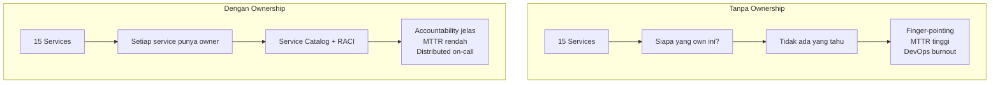
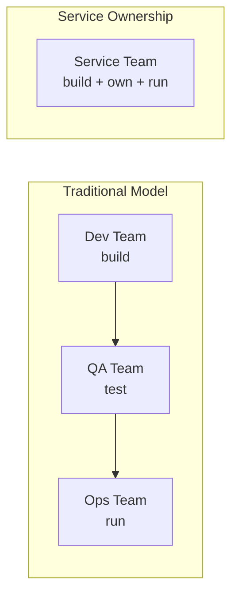
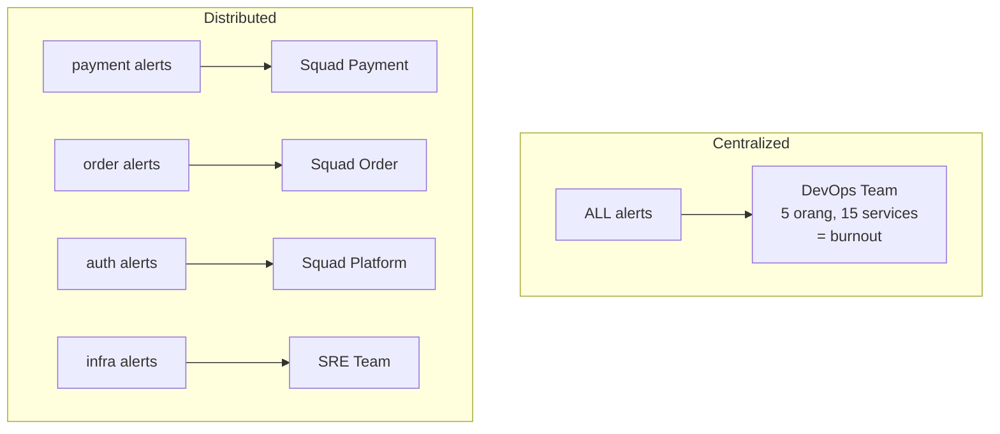

Service ownership adalah fondasi dari operasi microservices yang sehat. Ketika organisasi bermigrasi dari monolith ke microservices, pertanyaan "siapa yang bertanggung jawab atas service ini?" menjadi kritis. Tanpa ownership yang jelas, incidents berlangsung lebih lama, technical debt menumpuk, dan on-call menjadi beban yang tidak merata. Artikel ini membahas bagaimana membangun service ownership model yang jelas — mulai dari service catalog, RACI matrix, production readiness checklist (PRR), hingga on-call per service.

> Jika Anda belum membaca artikel sebelumnya, mulai dari [Intermediate SRE: Alerting Strategy](/posts/intermediate-sre-alerting-strategy/).

## Prerequisites

- Pemahaman dasar SRE, reliability mindset, dan konsep toil — baca: [Foundation SRE: Apa Itu Site Reliability Engineering](/posts/foundation-sre-apa-itu-site-reliability-engineering/)
- Pemahaman incident response dan severity levels — baca: [Foundation SRE: Pengantar Incident Response](/posts/foundation-sre-pengantar-incident-response/)
- Pemahaman incident management terstruktur — baca: [Intermediate SRE: Incident Management](/posts/intermediate-sre-incident-management/)
- Pemahaman alerting strategy dan severity routing — baca: [Intermediate SRE: Alerting Strategy](/posts/intermediate-sre-alerting-strategy/)
- Pengalaman dasar dengan Kubernetes dan microservices architecture

## Mengapa Service Ownership Penting?

Ketika organisasi bertumbuh dari monolith ke microservices, tanggung jawab yang dulunya jelas menjadi kabur. Dengan 15+ services, pertanyaan sederhana seperti "siapa yang fix bug ini?" menjadi sulit dijawab. Service ownership menyelesaikan ambiguitas ini.



### Pilar Service Ownership

| Pilar | Deskripsi | Artifact |
|-------|-----------|----------|
| **Service Catalog** | Registry terpusat semua services | YAML/Backstage catalog |
| **Ownership Model** | Definisi siapa bertanggung jawab atas apa | RACI matrix |
| **Production Readiness** | Standar minimum sebelum go-live | PRR checklist |
| **On-Call Rotation** | Tim yang build = tim yang run | Per-service schedule |


### "You Build It, You Run It"

Prinsip ini berasal dari Werner Vogels (CTO Amazon) dalam [interview ACM Queue tahun 2006](https://aws.amazon.com/blogs/aws/acm_queue_inter/). Intinya: tim yang membangun service juga bertanggung jawab menjalankannya di production — bukan lempar ke tim ops terpisah.



**Ownership Responsibilities:**
- **BUILD:** Design, implement, test, document
- **OWN:** Technical debt, roadmap, SLO definition
- **RUN:** Deploy, monitor, on-call, incident response
- **IMPROVE:** Postmortem actions, reliability improvements

## Service Catalog

Service catalog adalah registry terpusat yang mendokumentasikan semua services — "single source of truth" untuk menjawab: service apa saja yang ada, siapa yang memilikinya, dan bagaimana menghubungi tim yang bertanggung jawab.

**Tanpa service catalog:** 30 menit mencari owner saat incident (cek Slack, Git blame, tanya di #general).

**Dengan service catalog:** 30 detik — buka Backstage, lihat owner, Slack channel, runbook, dashboard.

### Backstage catalog-info.yaml

Setiap service memiliki file `catalog-info.yaml` di root repository-nya:

```yaml
# catalog-info.yaml — Backstage service catalog entry
apiVersion: backstage.io/v1alpha1
kind: Component
metadata:
  name: payment-service
  description: "Handles all payment processing"
  annotations:
    backstage.io/techdocs-ref: dir:.
    grafana/dashboard-selector: "payment-service"
    pagerduty.com/service-id: "PXXXXXX"
  tags:
    - java
    - spring-boot
    - tier-0
  links:
    - url: https://grafana.internal/d/payment-overview
      title: "Grafana Dashboard"
    - url: https://wiki.internal/runbooks/payment-service
      title: "Runbook"
spec:
  type: service
  lifecycle: production
  owner: team-payment
  system: e-commerce-platform
  dependsOn:
    - component:order-service
    - resource:postgresql-payment
    - resource:redis-cache
  providesApis:
    - payment-api
```

### Lightweight Service Catalog (YAML-based)

Jika Backstage belum di-adopt, mulai dengan file YAML sederhana yang di-version-control:

```yaml
# service-catalog.yaml — Lightweight alternative
services:
  - name: payment-service
    tier: 0
    lifecycle: production
    owner:
      team: squad-payment
      tech_lead: "XX YY"
    contact:
      slack_channel: "#squad-payment"
      oncall_schedule: "https://grafana.internal/oncall/payment"
    technical:
      language: "Java"
      framework: "Spring Boot 3.x"
      repository: "https://github.com/tsi-org/payment-service"
    operational:
      slo_availability: "99.99%"
      slo_latency_p99: "500ms"
      dashboard: "https://grafana.internal/d/payment-service"
      runbook: "https://wiki.internal/runbooks/payment-service"
    prr_status: "passed"
```

## Ownership Model & RACI Matrix

RACI (Responsible, Accountable, Consulted, Informed) mendefinisikan peran setiap stakeholder:

- **R (Responsible):** Tim yang melakukan pekerjaan
- **A (Accountable):** Tim yang bertanggung jawab atas hasil akhir (hanya satu per aktivitas)
- **C (Consulted):** Tim yang dimintai input sebelum keputusan
- **I (Informed):** Tim yang diberi tahu setelah keputusan

| Aktivitas | Service Team | Platform/SRE | Security | Product Owner |
|-----------|:---:|:---:|:---:|:---:|
| Code development | R, A | I | C | I |
| Deployment | R, A | C | I | I |
| Monitoring setup | R | A, C | I | - |
| SLO definition | R | A | - | C |
| On-call (L1) | R, A | I | - | I |
| On-call (L2 escalation) | C | R, A | - | I |
| Incident response | R | R, A | C | I |
| Postmortem | R | A | C | I |
| Security review | C | I | R, A | - |
| Capacity planning | R | A, C | - | C |
| Tech debt management | R, A | C | - | I |
| PRR checklist | R | A, C | C | I |

### Ownership Levels per Service Tier

| Service Tier | On-Call Requirement | PRR Required | SLO Required |
|-------------|---------------------|-------------|-------------|
| **Tier 0** (Critical) | 24/7 dedicated rotation | Ya, full checklist | Ya, formal SLO |
| **Tier 1** (High) | 24/7 shared rotation | Ya, full checklist | Ya, formal SLO |
| **Tier 2** (Medium) | Business hours + escalation | Ya, basic checklist | Ya, informal target |
| **Tier 3** (Low) | Best-effort | Optional | Optional |


## Production Readiness Checklist (PRR)

Production Readiness Review (PRR) memastikan sebuah service memenuhi standar minimum sebelum melayani traffic production. PRR bukan gate-keeping — ini adalah safety net yang melindungi tim dan users.

### Basic PRR Categories

| Kategori | Pertanyaan Kunci | Minimum Requirement |
|----------|-----------------|---------------------|
| **Observability** | Bisakah kita lihat apa yang terjadi? | Golden signals monitored, dashboard tersedia |
| **Alerting** | Apakah kita tahu jika bermasalah? | SLO-based alerts, severity routing configured |
| **Ownership** | Siapa yang bertanggung jawab? | Owner di catalog, on-call rotation aktif |
| **Documentation** | Bisa orang baru operate? | README, architecture doc, basic runbook |
| **Resilience** | Bagaimana jika dependency gagal? | Timeout configured, graceful degradation plan |
| **Deployment** | Bisa deploy dan rollback aman? | CI/CD pipeline, automated rollback |

### PRR Checklist Template

```yaml
# prr-checklist.yaml — Basic Production Readiness Review
prr_version: "1.0"
service_name: ""
reviewer: ""
review_date: ""

# Scoring: Tier 0/1 minimum 90%, Tier 2 minimum 80%, Tier 3 minimum 60%
checklist:
  observability:
    - id: "OBS-1"
      item: "Golden signals (latency, traffic, errors, saturation) di-monitor"
    - id: "OBS-2"
      item: "Grafana dashboard tersedia dengan key metrics"
    - id: "OBS-3"
      item: "Distributed tracing enabled (OpenTelemetry SDK)"
    - id: "OBS-4"
      item: "Structured logging dengan correlation ID"
    - id: "OBS-5"
      item: "Health check endpoint tersedia (/health atau /readyz)"

  alerting:
    - id: "ALT-1"
      item: "SLO-based alerts configured (burn rate)"
    - id: "ALT-2"
      item: "Alert severity levels sesuai routing policy"
    - id: "ALT-3"
      item: "Alert routing ke team yang tepat (PagerDuty/Grafana OnCall)"
    - id: "ALT-4"
      item: "Setiap P1/P2 alert memiliki runbook link"

  ownership:
    - id: "OWN-1"
      item: "Service terdaftar di service catalog"
    - id: "OWN-2"
      item: "Owner team dan tech lead terdefinisi"
    - id: "OWN-3"
      item: "On-call rotation aktif dengan minimal 2 orang"
    - id: "OWN-4"
      item: "Escalation policy terdefinisi dan tested"

  resilience:
    - id: "RES-1"
      item: "Timeout configured untuk semua external calls"
    - id: "RES-2"
      item: "Retry with exponential backoff untuk transient failures"
    - id: "RES-3"
      item: "Graceful degradation plan jika dependency gagal"
    - id: "RES-4"
      item: "PodDisruptionBudget (PDB) configured di Kubernetes"

  deployment:
    - id: "DEP-1"
      item: "CI/CD pipeline automated (build, test, deploy)"
    - id: "DEP-2"
      item: "Automated rollback mechanism tersedia"
    - id: "DEP-3"
      item: "Load testing dilakukan minimal 2x expected peak traffic"
```

## On-Call per Service

### Dari Centralized ke Distributed On-Call

Dalam model tradisional, satu tim operations menangani on-call untuk semua services. Dalam service ownership model, setiap service team bertanggung jawab atas on-call mereka sendiri.



**Escalation Path:**
1. **L1:** Service team on-call (primary)
2. **L2:** Service team on-call (secondary)
3. **L3:** Platform/SRE team (cross-service issues)
4. **L4:** Engineering Manager
5. **L5:** VP Engineering / CTO (P1 only)

### Service Dependency Topology

Memahami bagaimana services saling terhubung adalah prerequisite untuk ownership yang efektif:

| Tier | SLO Target | Contoh Services | Dependency Rule |
|------|-----------|-----------------|-----------------|
| **Tier 0** (Critical) | 99.99% | api-gateway, payment, order | Boleh depend on Tier 0/1 |
| **Tier 1** (High) | 99.9% | auth, inventory, search | Boleh depend on Tier 1/2 |
| **Tier 2** (Medium) | 99.5% | notification, analytics, reporting | Boleh depend on Tier 2/3 |
| **Tier 3** (Low) | 99% | email-worker, image-processor | Batch/async processing |

> **Catatan:** **OpenTelemetry** menyediakan automatic service topology discovery melalui distributed tracing.
**Backstage** mendukung dependency visualization terintegrasi dengan OTel data.
**Grafana OnCall** (open-source) menyediakan on-call management terintegrasi dengan Grafana stack.


## Studi Kasus: TechStartup Indonesia

### Konteks

TSI (500K DAU, 15 microservices di EKS, 35 developers) menghadapi masalah fundamental setelah membangun incident management dan alerting strategy: tidak ada yang jelas "memiliki" service-service mereka.

Kondisi sebelumnya:
- Hanya 3 dari 15 services punya owner jelas
- 4 services menjadi "orphan" tanpa owner sama sekali
- DevOps team (5 orang) menjadi default owner untuk 8 services — menyebabkan bottleneck dan burnout

Pemicu perubahan — "The Orphan Service Incident":
- Notification-service mengalami memory leak yang menyebabkan cascading failure
- Butuh 35 menit hanya untuk mencari siapa yang bertanggung jawab
- Incident 20 menit berubah menjadi 70 menit
- Postmortem menyimpulkan: "Ini bukan kegagalan teknis — ini kegagalan ownership"

### Apa yang Dilakukan

TSI mengimplementasikan service ownership model dalam 3 fase (4 minggu):

1. **Service Catalog Audit** — Inventarisasi semua 15 services, identifikasi owner berdasarkan Git history dan K8s metrics
2. **Ownership Summit** — Meeting dengan semua Tech Leads untuk assign ownership berdasarkan data
3. **PRR Rollout** — Implementasi Production Readiness Review checklist untuk Tier 0/1 services

### Metrics Improvement

| Metric | Sebelum | Sesudah | Perubahan |
|--------|---------|---------|-----------|
| Services with clear owner | 3/15 (20%) | 15/15 (100%) | +100% |
| Time to find owner (incident) | 20 menit | < 1 menit | -95% |
| Wrong-team escalations | 45% | 8% | -37pp |
| MTTR (all incidents) | 2.5 jam | 1.2 jam | -52% |
| Services with runbook | 2/15 | 9/15 | +350% |
| Orphan services | 4/15 | 0/15 | -100% |
| Avg PRR score (Tier 0/1) | 69% | 87% | +18pp |
| DevOps on-call satisfaction | 2.1/5 | 3.8/5 | +81% |

### Lessons Learned

**Yang Berhasil:**
- Service audit berbasis data (Git history, K8s metrics) sebagai langkah pertama — assign ownership berdasarkan fakta, bukan asumsi
- Backstage sebagai single source of truth — developer adopt cepat karena semua informasi di satu tempat
- PRR checklist membuat gaps visible — tim tidak tahu seberapa banyak yang "missing" sampai PRR dilakukan
- On-call per squad mengurangi DevOps bottleneck — MTTR turun 52%
- Ownership Summit dengan semua Tech Leads — keputusan dibuat bersama, buy-in lebih tinggi

**Yang Perlu Dihindari:**
- Jangan assign ownership tanpa audit dulu — data Git bisa menunjukkan realita berbeda dari asumsi
- Jangan overload satu squad — max 4-5 services per squad agar manageable
- Jangan skip PRR untuk "simple" services — notification-service dianggap simple tapi menyebabkan cascading incident
- Jangan expect 100% PRR pass di hari pertama — PRR adalah journey, mulai dengan baseline dan improve

## Best Practices

- **Mulai dengan service audit** — gunakan data (Git history, K8s metrics, incident history) untuk memahami current state sebelum assign ownership
- **Assign exactly 1 owner team per service** — shared ownership = no ownership; satu team harus accountable
- **Gunakan service catalog sebagai single source of truth** — Backstage atau YAML-based, yang penting terpusat dan up-to-date
- **Definisikan RACI matrix per squad** — hilangkan ambiguitas siapa yang R/A/C/I untuk setiap aktivitas
- **Implement PRR checklist sebelum go-live** — jangan biarkan service masuk production tanpa monitoring dan runbook minimum
- **Distribusikan on-call ke service teams** — tim yang build = tim yang run, mempersingkat feedback loop
- **Review ownership quarterly** — tim berubah, services berubah, ownership harus di-review berkala

## Selanjutnya

Artikel berikutnya: [Intermediate SRE: Simplicity in SRE](/posts/intermediate-sre-simplicity-in-sre/) — mengelola complexity untuk reliability, complexity budget, dan boring technology principle.

Topik terkait yang bisa di eksplorasi:
- On-Call Best Practices — sustainable on-call rotation tanpa burnout
- SLI, SLO, dan SLA — formal SLO framework untuk service ownership
- Capacity Planning — resource planning berdasarkan service tier

## References

- [Google SRE Book — Service Best Practices](https://sre.google/sre-book/service-best-practices/)
- [Google SRE Workbook — On-Call](https://sre.google/workbook/on-call/)
- [Backstage Documentation](https://backstage.io/docs/overview/what-is-backstage)
- [OpenTelemetry Documentation](https://opentelemetry.io/docs/)
- [Grafana OnCall Documentation](https://grafana.com/docs/oncall/latest/)
- [PagerDuty Service Ownership Guide](https://ownership.pagerduty.com/)

---

## Navigasi Series

⬅️ **Sebelumnya:** [Intermediate SRE: Alerting Strategy](/posts/intermediate-sre-alerting-strategy/)

➡️ **Selanjutnya:** [Intermediate SRE: Simplicity in SRE](/posts/intermediate-sre-simplicity-in-sre/)