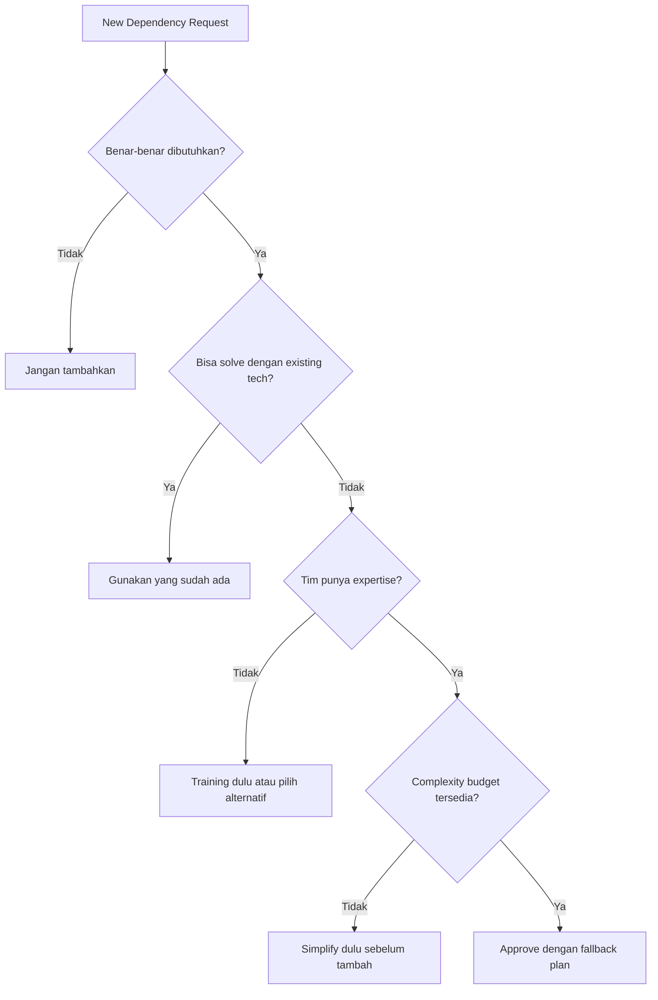

Simplicity adalah prerequisite untuk reliability. Sistem yang complex lebih sulit dipahami, lebih sulit di-debug, dan lebih rentan terhadap failure yang tidak terduga. Google SRE Book Chapter 9 menegaskan bahwa semakin complex sebuah sistem, semakin banyak failure modes yang mungkin terjadi. Artikel ini membahas bagaimana mengidentifikasi unnecessary complexity, menerapkan complexity budget, dan memilih boring technology yang proven.

> Jika Anda belum membaca artikel sebelumnya, mulai dari [Intermediate SRE: Service Ownership](/posts/intermediate-sre-service-ownership/).

## Prerequisites

- Pemahaman dasar SRE principles dan error budget — baca: [Foundation SRE: Apa Itu Site Reliability Engineering](/posts/foundation-sre-apa-itu-site-reliability-engineering/)
- Pemahaman service ownership dan service catalog — baca: [Intermediate SRE: Service Ownership](/posts/intermediate-sre-service-ownership/)
- Familiar dengan microservices architecture dan Kubernetes
- Pengalaman operasional mengelola production systems

## Mengapa Simplicity Penting untuk Reliability?

Complexity adalah musuh reliability. Setiap layer abstraksi, setiap dependency, setiap conditional path menambah surface area untuk failure:

- Semakin complex > semakin banyak failure modes
- Semakin complex > semakin lama MTTR (Mean Time to Repair)
- Semakin complex > semakin sulit on-call debug
- Semakin complex > semakin banyak toil

Sumber complexity yang umum: service sprawl, polyglot excess, terlalu banyak abstraction layers, dependency explosion, configuration sprawl, dan premature optimization.

### Google SRE on Simplicity

Google SRE Book Chapter 9 mengidentifikasi beberapa prinsip simplicity:

| Prinsip | Penjelasan | Contoh |
|---------|-----------|--------|
| **Minimal API surface** | Expose hanya yang dibutuhkan consumer | 5 endpoints vs 50 endpoints |
| **No hidden dependencies** | Semua dependency harus explicit dan documented | Service catalog yang akurat |
| **Predictable behavior** | Sistem harus berperilaku sesuai ekspektasi | Idempotent operations |
| **Modular design** | Komponen bisa dipahami secara independen | Loosely coupled services |
| **Dead code elimination** | Hapus code yang tidak digunakan | Regular code cleanup |

## Essential vs Accidental Complexity

Tidak semua complexity itu buruk. Penting membedakan antara dua jenis:

**Essential Complexity** (tidak bisa dihindari):
- Business logic yang memang complex (payment processing, fraud detection)
- Regulatory requirements (PCI-DSS compliance, data residency)
- Scale requirements (sharding, caching, CDN)
- Distributed system fundamentals (network partitions, eventual consistency)

**Accidental Complexity** (bisa dan harus dihilangkan):
- Service yang terlalu kecil (nano-services) → gabungkan ke service yang lebih besar
- 5 bahasa pemrograman untuk 10 services → standardize ke 2 bahasa
- Custom framework yang hanya 1 orang paham → gunakan well-known framework
- Configuration yang tersebar di 10 tempat → centralize configuration
- Dead code dan unused features → hapus secara regular
- Over-engineered abstractions → YAGNI (You Ain't Gonna Need It)

**Target:** Minimize accidental complexity, manage essential complexity dengan good abstractions.

## Complexity Budget

Sama seperti error budget memberikan framework untuk menyeimbangkan reliability vs velocity, **complexity budget** memberikan framework untuk menyeimbangkan capability vs maintainability.

Konsepnya sederhana:
- **Error Budget:** "Berapa banyak unreliability yang kita toleransi?" → Jika budget habis → freeze features, fokus reliability
- **Complexity Budget:** "Berapa banyak complexity yang kita toleransi?" → Jika budget habis → freeze new tech, simplify dulu

### Complexity Score Card

Gunakan scorecard berikut untuk mengukur complexity level sistem:

| Dimension | Low (1) | Medium (2) | High (3) |
|-----------|---------|-----------|----------|
| **Service count** | < 10 | 10-20 | > 20 |
| **Languages** | 1-2 | 3 | > 3 |
| **Data stores** | 1-2 | 3-4 | > 4 |
| **External dependencies** | < 5 | 5-10 | > 10 |
| **Deployment frequency** | Daily | Weekly | Monthly |
| **On-call pages/week** | < 3 | 3-10 | > 10 |
| **New engineer onboarding** | < 2 weeks | 2-4 weeks | > 4 weeks |
| **Avg incident MTTR** | < 30 min | 30-120 min | > 120 min |

**Scoring:**
- 8-12: Low complexity — maintain current state
- 13-18: Medium complexity — monitor and prevent growth
- 19-24: High complexity — active simplification needed

## Boring Technology Principle

"Boring technology" bukan berarti technology yang buruk — ini berarti technology yang **well-understood, battle-tested, dan predictable**. Konsep dari Dan McKinley: setiap organisasi memiliki limited "innovation tokens" (~3 per tim per tahun) yang bisa dibelanjakan untuk technology baru.

### Boring vs Exciting Technology

| Need | Boring  | Exciting  |
|------|----------|------------|
| Database | PostgreSQL | CockroachDB |
| Message queue | RabbitMQ/SQS | Custom Kafka |
| Web framework | Express/Flask | Bleeding-edge fw |
| Container runtime | Docker | Custom runtime |
| CI/CD | GitLab CI | Custom pipeline |
| Monitoring | Prometheus | Custom metrics |
| Language | Go/Python/Java | Zig/Gleam |

**Kapan boleh "exciting":**
- Business requirement yang tidak bisa dipenuhi boring tech
- Scale yang memang membutuhkan specialized solution
- Tim sudah punya expertise di technology tersebut
- Cost/benefit analysis jelas menunjukkan ROI positif

### Technology Radar

| Ring | Definisi | Contoh |
|------|----------|--------|
| **Adopt** | Default choice, gunakan untuk project baru | PostgreSQL, Go, Kubernetes, Terraform |
| **Trial** | Boleh digunakan untuk non-critical services | Redis Streams, Temporal |
| **Assess** | Evaluasi, perlu review di production | eBPF-based monitoring, Wasm |
| **Hold** | Jangan gunakan untuk project baru | MongoDB (sudah punya PostgreSQL), Jenkins (sudah punya GitLab CI) |

## Dependency Management

Setiap dependency (internal service, external API, library) menambah failure modes, cognitive load, operational burden, dan security surface.

### Klasifikasi Dependencies

**Hard Dependency** (service gagal jika dependency down):
- Database (PostgreSQL, Redis)
- Auth service (tanpa auth, semua request rejected)
- Payment gateway (tanpa gateway, payment gagal)

**Soft Dependency** (service degraded tapi tetap jalan):
- Notification service (payment sukses, notif menyusul)
- Analytics service (data collection bisa delayed)
- Recommendation engine (fallback ke default)

### Dependency Strategy



### Strategies

1. **Minimize** hard dependencies — setiap hard dependency = single point of failure
2. **Convert** hard → soft where possible — async messaging, circuit breaker, fallback
3. **Eliminate** unnecessary dependencies — "Do we really need this?"
4. **Isolate** remaining hard dependencies — connection pooling, timeout, retry
5. **Monitor** all dependencies — health checks, latency tracking, error rates

## Simplification Strategies

### Strategy 1: Service Consolidation

Menurut Google SRE Book ([Chapter 9: Simplicity](https://sre.google/sre-book/simplicity/)), setiap komponen tambahan dalam sistem menambah operational overhead — lebih banyak service berarti lebih banyak yang harus di-monitor, di-deploy, dan di-debug saat incident.

**Kapan consolidate:**
- Services selalu di-deploy bersamaan
- Services share database yang sama
- Services dimiliki oleh tim yang sama
- Service terlalu kecil (< 500 LOC)
- Inter-service communication > external communication

**Kapan tetap pisah:**
- Different scaling requirements
- Different deployment cadence
- Different team ownership
- Different technology requirements
- Clear bounded context (DDD)

### Strategy 2: Technology Standardization

Standardisasi mengurangi cognitive load dan operational burden:
- Engineer bisa move antar team tanpa learning curve besar
- Shared libraries dan tooling
- Consistent monitoring dan alerting
- Easier hiring (fokus ke 2 languages)
- Reduced operational burden (fewer things to patch/upgrade)

### Strategy 3: Configuration Simplification

```yaml
# SEBELUM: Configuration tersebar di banyak tempat
# ├── environment variables (12 files)
# ├── ConfigMaps (8 files)
# ├── Secrets (5 files)
# ├── Helm values (3 files)
# └── Application config (15 files)
# Total: 43 config files untuk 1 service

# SESUDAH: Centralized configuration
# ├── helm/values-{env}.yaml (1 file per environment)
# ├── k8s/configmap.yaml (1 file, generated from values)
# └── vault/ (secrets only, referenced by path)
# Total: 4-5 config files per service

# Prinsip:
# 1. Single source of truth untuk config
# 2. Environment-specific overrides (bukan copy-paste)
# 3. Secrets terpisah dari config (Vault/AWS Secrets Manager)
# 4. Config as code (version controlled, reviewable)
```

### Strategy 4: Dead Code & Feature Elimination

| Tanda Dead Code/Feature | Action |
|------------------------|--------|
| Feature flag OFF > 6 bulan | Hapus code dan flag |
| Endpoint dengan 0 traffic > 30 hari | Deprecate lalu hapus |
| Library imported tapi tidak digunakan | Remove dependency |
| Service dengan 0 requests | Decommission |
| A/B test yang sudah selesai | Remove losing variant code |
| Commented-out code | Hapus (ada di git history) |

## Studi Kasus: TechStartup Indonesia

### Konteks

TSI di Q2 2021 menyadari bahwa complexity mereka sudah out of control.

Kondisi sebelumnya:
- 25 microservices, 4 programming languages, 5 database technologies
- Complexity score: 21/24 (High Complexity)
- New engineer butuh 6 minggu untuk productive
- 3 services "nobody owns" karena tidak ada yang paham technology stack-nya
- On-call MTTR terus meningkat

Trigger — incident pada recommendation-service (Rust) tanggal 15 April 2021:
- MTTR 4 jam (biasanya Go/Python services hanya butuh 30 menit)
- Tidak ada engineer on-call yang bisa debug Rust code
- CTO memutuskan: "Kita punya technology yang nobody can maintain. This is a reliability risk."

### Apa yang Dilakukan

TSI menjalankan "Simplification Quarter" (Q3 2021) dengan 4 workstreams:

1. **Service Consolidation** — Merge nano-services (user-profile + user-preference + user-avatar → user-service)
2. **Language Standardization** — Go sebagai primary, Python sebagai secondary; deprecated Rust dan Node.js
3. **Database Consolidation** — Migrasi MongoDB dan MySQL ke PostgreSQL JSONB
4. **Tooling Standardization** — GitLab CI only, hapus Jenkins

### Metrics Improvement

| Metric | Sebelum | Sesudah | Perubahan |
|--------|---------|---------|-----------|
| Services | 25 | 15 | -40% |
| Languages | 4 | 2 | -50% |
| Data stores | 5 | 3 | -40% |
| Onboarding time | 6 weeks | 2 weeks | -67% |
| Avg MTTR | 90 min | 35 min | -61% |
| On-call pages/week | 8 | 4 | -50% |
| Complexity score | 21/24 | 12/24 | -43% |
| Developer experience | 2.1/5 | 4.0/5 | +90% |

### Lessons Learned

**Yang Berhasil:**
- Framing sebagai reliability initiative — bukan "tech debt cleanup" tapi "reducing failure modes"
- Complexity budget memberikan framework objektif untuk menolak new technology requests
- Gradual consolidation — merge services satu per satu, bukan big bang
- Boring technology choice — PostgreSQL JSONB menggantikan MongoDB tanpa kehilangan flexibility

**Yang Perlu Dihindari:**
- Jangan merge services yang punya different scaling needs — TSI awalnya ingin merge payment + order, tapi scaling pattern-nya berbeda
- Rewrite bukan selalu jawaban — kadang "strangler fig" pattern lebih safe daripada full rewrite
- Communicate "why" — developer yang service-nya di-merge perlu memahami alasannya, bukan merasa pekerjaan mereka "dihapus"

## Best Practices

- **Ukur complexity secara regular** — gunakan complexity scorecard, review quarterly
- **Enforce complexity budget** — setiap new technology harus di-justify dan di-approve
- **Pilih boring technology** — default ke proven tech, gunakan innovation tokens sparingly
- **Lakukan dead code cleanup** — schedule monthly/quarterly cleanup sprints
- **Consolidate nano-services** — services < 500 LOC yang selalu deploy bersama → merge
- **Standardize tooling** — 1 CI/CD, 1-2 languages, 1-2 databases sebagai default
- **Dokumentasikan decisions** — ADR (Architecture Decision Records) untuk setiap technology choice

## Selanjutnya

Artikel berikutnya: [Advanced SRE: SLI, SLO, dan SLA](/posts/advanced-sre-sli-slo-dan-sla/) — kita memasuki level Advanced! Setelah memahami simplicity sebagai fondasi reliability, langkah selanjutnya adalah membangun formal SLO framework untuk mengukur dan menjaga reliability secara objektif.

Topik terkait yang bisa di eksplorasi:
- Error Budget — menyeimbangkan reliability dan velocity dengan framework yang terukur
- Reliability Patterns — circuit breaker, retry, dan patterns untuk sistem yang resilient
- Toil Reduction — mengurangi repetitive work yang tidak memberikan lasting value

## References

- [Google SRE Book — Chapter 9: Simplicity](https://sre.google/sre-book/simplicity/)
- [Dan McKinley — Choose Boring Technology](https://mcfunley.com/choose-boring-technology)
- [Martin Fowler — Monolith First](https://martinfowler.com/bliki/MonolithFirst.html)
- [Sam Newman — Building Microservices](https://samnewman.io/books/building_microservices_2nd_edition/)
- [Fred Brooks — No Silver Bullet: Essence and Accident in Software Engineering](http://worrydream.com/refs/Brooks-NoSilverBullet.pdf)

---

## Navigasi Series

⬅️ **Sebelumnya:** [Intermediate SRE: Service Ownership](/posts/intermediate-sre-service-ownership/)

➡️ **Selanjutnya:** [Advanced SRE: SLI, SLO, dan SLA](/posts/advanced-sre-sli-slo-dan-sla/)