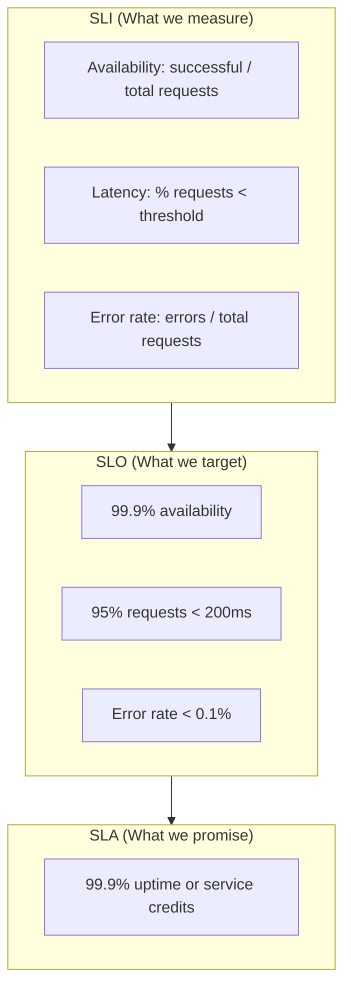

Service Level Indicators (SLI), Objectives (SLO), dan Agreements (SLA) adalah fondasi SRE practices yang memungkinkan tim engineering mengukur, menargetkan, dan menjanjikan reliability kepada stakeholders. Tanpa framework ini, diskusi tentang reliability menjadi subjektif dan tidak actionable. Artikel ini membahas definisi, implementasi dengan Prometheus dan Sloth, serta error budget policy yang data-driven.

> Jika Anda belum membaca artikel sebelumnya, mulai dari [Intermediate SRE: Simplicity in SRE](/posts/intermediate-sre-simplicity-in-sre/).

## Prerequisites

- Pemahaman dasar Prometheus dan PromQL
- Kubernetes cluster dengan monitoring stack
- Familiar dengan konsep observability — baca: [Foundation SRE: Monitoring Basics](/posts/foundation-sre-monitoring-basics/)
- Pemahaman SRE fundamentals — baca: [Foundation SRE: Apa Itu Site Reliability Engineering](/posts/foundation-sre-apa-itu-site-reliability-engineering/)

## Definisi SLI, SLO, dan SLA

| Term | Definition | Example |
|------|------------|---------|
| **SLI** | Metric yang mengukur service level | 99.5% requests < 200ms |
| **SLO** | Target untuk SLI | 99.9% availability per month |
| **SLA** | Kontrak dengan consequences | 99.9% uptime atau refund |

### Relationship SLI → SLO → SLA



## Common SLIs

### Availability

```promql
sum(rate(http_requests_total{status!~"5.."}[5m])) 
/ sum(rate(http_requests_total[5m]))
```

### Latency

```promql
histogram_quantile(0.95, 
  sum(rate(http_request_duration_seconds_bucket[5m])) by (le)
)
```

### Error Rate

```promql
sum(rate(http_requests_total{status=~"5.."}[5m])) 
/ sum(rate(http_requests_total[5m]))
```

## SLO Document

SLO document mendefinisikan target reliability untuk setiap service secara formal:

```yaml
service: payment-api
slos:
  - name: availability
    description: "Payment API should be available"
    sli:
      type: availability
      good_events: "successful HTTP responses (2xx, 3xx)"
      total_events: "all HTTP requests"
    objective: 99.9%
    window: 30d
    
  - name: latency
    description: "Payment API should be fast"
    sli:
      type: latency
      threshold: 200ms
      percentile: 95
    objective: 95%
    window: 30d
```

## Error Budget

Error budget adalah "budget" unreliability yang diperbolehkan berdasarkan SLO target:

```
Error Budget = 1 - SLO

Example:
- SLO: 99.9% availability
- Error Budget: 0.1% = 43.8 minutes/month

If error budget exhausted:
- Freeze feature releases
- Focus on reliability
```

## Alerting on SLOs

Multi-window burn rate alerting mendeteksi SLO breach lebih awal dibanding threshold-based alerts:

```yaml
groups:
- name: slo-alerts
  rules:
  - alert: HighErrorRate
    expr: |
      (1 - (
        sum(rate(http_requests_total{status!~"5.."}[1h]))
        / sum(rate(http_requests_total[1h]))
      )) > 0.001
    for: 5m
    labels:
      severity: critical
    annotations:
      summary: "Error budget burn rate too high"
```

## Implementasi dengan Sloth

Sloth adalah SLO generator yang menghasilkan Prometheus recording rules dan alerts dari SLO definition:

```yaml
apiVersion: sloth.slok.dev/v1
kind: PrometheusServiceLevel
metadata:
  name: payment-api-slo
  namespace: monitoring
spec:
  service: "payment-api"
  slos:
    - name: "availability"
      objective: 99.95
      description: "Payment API harus available"
      sli:
        events:
          errorQuery: |
            sum(rate(http_requests_total{
              service="payment-api",
              status=~"5.."
            }[{{.window}}]))
          totalQuery: |
            sum(rate(http_requests_total{
              service="payment-api"
            }[{{.window}}]))
      alerting:
        name: "PaymentAPIAvailability"
        labels:
          severity: critical
```

## Studi Kasus: TechStartup Indonesia

### Konteks

TSI pada Scale Phase (2022 Q1) membutuhkan formalisasi SRE practices untuk memenuhi SLA 99.9% uptime kepada enterprise customers.

Kondisi sebelumnya:
- Tidak ada definisi "availability" yang jelas — setiap tim punya interpretasi berbeda
- 50+ alerts/day yang 80% diabaikan
- 60% incidents terdeteksi dari customer complaints

### Apa yang Dilakukan

TSI mengimplementasikan SLI/SLO framework secara bertahap:

1. **Pilih 3 Critical Services** — payment-api, product-api, checkout-api sebagai pilot
2. **Define User-Centric SLIs** — availability dan latency dari perspektif user experience
3. **Setup Tooling** — Prometheus + Sloth + Grafana untuk SLO tracking dan burn rate alerts
4. **Error Budget Policy** — Definisikan action items ketika budget menipis

### Metrics Improvement

| Metric | Sebelum | Sesudah | Perubahan |
|--------|---------|---------|-----------|
| Availability | 99.2% | 99.91% | +0.71% |
| p99 Latency | 1.2s | 420ms | -65% |
| MTTR | 45 min | 12 min | -73% |
| Customer Incidents | 8/month | 2/month | -75% |
| Alert Noise | 50/day | 5/day | -90% |

### Lessons Learned

**Yang Berhasil:**
- Start with critical services first — fokus pada 3 services sebelum expand ke seluruh platform
- User-centric SLIs — mengukur dari perspektif user experience, bukan infrastructure metrics
- Error budget sebagai communication tool — menjadi "common language" antara Dev, Ops, dan Business
- Multi-window burn rate alerts — mendeteksi fast burns dan slow burns, mengurangi alert fatigue

**Yang Perlu Dihindari:**
- Jangan set SLO terlalu tinggi — 99.99% untuk semua services tidak justified secara cost
- Jangan define terlalu banyak SLIs — fokus 2-3 per service agar tetap actionable
- Jangan ignore dependencies — SLO breach bisa disebabkan dependency, bukan service itu sendiri

## Best Practices

- **Definisikan SLI dari perspektif user** — "Can users complete checkout?" lebih meaningful dari "Is CPU < 80%?"
- **Mulai dengan 2-3 SLIs per service** — terlalu banyak metrics membuat tidak ada yang actionable
- **Gunakan multi-window burn rate alerts** — lebih efektif dari threshold-based alerting
- **Review SLOs quarterly** — adjust target berdasarkan data historis dan business needs
- **Dokumentasikan rationale** — setiap SLO harus punya clear definition, owner, dan review schedule
- **Start conservative, then tighten** — mulai 99.5%, improve gradually ke 99.9%

## Selanjutnya

Artikel berikutnya: [Advanced SRE: Error Budget](/posts/advanced-sre-error-budget/) — deep dive ke error budget policy, burn rate calculation, dan bagaimana error budget menjadi framework untuk menyeimbangkan reliability dan feature velocity.

Topik terkait yang bisa di eksplorasi:
- Chaos Engineering — validasi SLOs dengan controlled experiments
- SLO Dashboard Design — visualisasi error budget dan burn rate
- Alerting Strategy — multi-window alerting berbasis SLO

## References

- [Google SRE Book - Service Level Objectives](https://sre.google/sre-book/service-level-objectives/)
- [Google SRE Workbook - Implementing SLOs](https://sre.google/workbook/implementing-slos/)
- [Sloth - SLO Generator](https://sloth.dev/)
- [Prometheus Alerting Best Practices](https://prometheus.io/docs/practices/alerting/)

---

## Navigasi Series

⬅️ **Sebelumnya:** [Intermediate SRE: Simplicity in SRE](/posts/intermediate-sre-simplicity-in-sre/)

➡️ **Selanjutnya:** [Advanced SRE: Error Budget](/posts/advanced-sre-error-budget/)