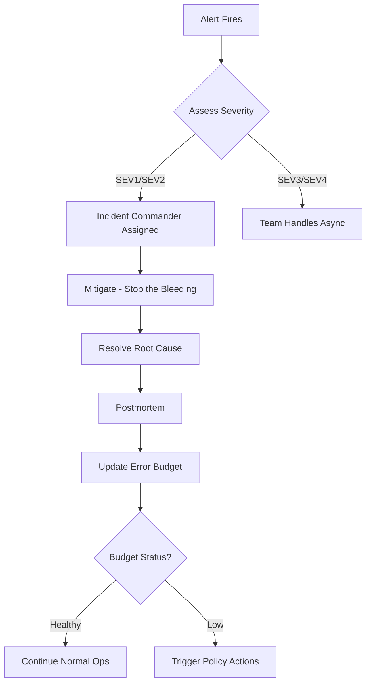

Error budget adalah konsep fundamental dalam SRE yang menyediakan framework kuantitatif untuk menyeimbangkan reliability dengan feature velocity. Dengan error budget, keputusan tentang kapan boleh deploy dan kapan harus freeze menjadi data-driven, bukan subjektif. Artikel ini membahas error budget calculation, policy framework, burn rate alerting, dan CI/CD integration.

> Jika Anda belum membaca artikel sebelumnya, mulai dari [Advanced SRE: SLI, SLO, dan SLA](/posts/advanced-sre-sli-slo-dan-sla/).

## Prerequisites

- Pemahaman SLI, SLO, dan SLA — baca: [Advanced SRE: SLI, SLO, dan SLA](/posts/advanced-sre-sli-slo-dan-sla/)
- Prometheus dan Grafana untuk monitoring
- Kubernetes cluster dengan observability stack
- Familiar dengan incident management concepts

## Apa itu Error Budget?

Error budget adalah jumlah unreliability yang "diizinkan" berdasarkan SLO target — inverse dari SLO:

```
Error Budget = 100% - SLO

Monthly Error Budget (in time):
- Minutes in month: 30 days × 24 hours × 60 min = 43,200
- Error Budget (99.9% SLO): 0.1% × 43,200 = 43.2 minutes
- Allowed downtime: 43.2 minutes per month
```

Error budget mengubah paradigma dari "zero downtime" menjadi "acceptable risk":

| Traditional Approach | Error Budget Approach |
|---------------------|----------------------|
| "Never fail" | "Fail within budget" |
| Blame when incidents occur | Learn from incidents |
| Reliability vs velocity conflict | Shared ownership |
| Subjective risk assessment | Data-driven decisions |

## Error Budget by SLO Level

| SLO Target | Error Budget | Monthly Downtime | Annual Downtime |
|------------|--------------|------------------|-----------------|
| 99% | 1% | 7.3 hours | 3.65 days |
| 99.5% | 0.5% | 3.65 hours | 1.83 days |
| 99.9% | 0.1% | 43.8 minutes | 8.76 hours |
| 99.95% | 0.05% | 21.9 minutes | 4.38 hours |
| 99.99% | 0.01% | 4.4 minutes | 52.6 minutes |

### PromQL untuk Error Budget Calculation

```promql
# Error Budget Remaining (percentage) for 99.9% SLO
(
  0.999 - (
    sum(rate(http_requests_total{status!~"5.."}[30d]))
    / sum(rate(http_requests_total[30d]))
  )
) / (1 - 0.999) * 100

# Error Budget Consumed (percentage)
100 - (
  (
    0.999 - (
      sum(rate(http_requests_total{status!~"5.."}[30d]))
      / sum(rate(http_requests_total[30d]))
    )
  ) / (1 - 0.999) * 100
)
```

## Error Budget Policy

Policy framework mendefinisikan actions berdasarkan sisa error budget:

| Budget Remaining | Status | Actions |
|------------------|--------|---------|
| > 50% |  GREEN | Normal development, standard releases |
| 25-50% |  YELLOW | Increase testing, slower releases |
| 10-25% |  ORANGE | Feature freeze non-critical, focus reliability |
| < 10% |  RED | Complete feature freeze, only reliability work |
| Exhausted | ⚫ EXHAUSTED | All deployments frozen, recovery mode |

### Policy Document

```yaml
# error-budget-policy.yaml
service: api-gateway
slo_target: 99.9%
monthly_budget_minutes: 43.2

thresholds:
  green:
    remaining: ">50%"
    actions:
      - "Normal feature development"
      - "Standard deployment cadence"
  yellow:
    remaining: "25-50%"
    actions:
      - "Increase testing coverage"
      - "No risky deployments on Friday"
  orange:
    remaining: "10-25%"
    actions:
      - "Feature freeze for non-critical"
      - "Mandatory rollback plan"
  red:
    remaining: "<10%"
    actions:
      - "Complete feature freeze"
      - "Only reliability and security fixes"
  exhausted:
    remaining: "0%"
    actions:
      - "All deployments frozen"
      - "Mandatory postmortem"
```

## Burn Rate Alerting

Burn rate mengukur seberapa cepat error budget dikonsumsi relatif terhadap rate normal:

```
Burn Rate = Actual Error Rate / Allowed Error Rate

Example:
- SLO: 99.9% (allowed error rate: 0.1%)
- Current error rate: 1%
- Burn Rate: 1% / 0.1% = 10x

At 10x burn rate, monthly budget exhausted in 3 days!
```

### Multi-Window Burn Rate Alerts

```yaml
groups:
- name: slo-burn-rate
  rules:
  # Fast burn - 2% budget in 1 hour (critical)
  - alert: HighBurnRate
    expr: |
      (
        (1 - (
          sum(rate(http_requests_total{status!~"5.."}[1h]))
          / sum(rate(http_requests_total[1h]))
        )) / (1 - 0.999)
      ) > 14.4
    for: 2m
    labels:
      severity: critical
    annotations:
      summary: "Error budget burning too fast"
  
  # Slow burn - 5% budget in 6 hours (warning)
  - alert: SlowBurnRate
    expr: |
      (
        (1 - (
          sum(rate(http_requests_total{status!~"5.."}[6h]))
          / sum(rate(http_requests_total[6h]))
        )) / (1 - 0.999)
      ) > 6
    for: 15m
    labels:
      severity: warning
    annotations:
      summary: "Error budget slow burn detected"
```

## Incident Management Integration

Error budget terintegrasi dengan incident management melalui severity levels:

| Level | Impact | Response Time | Error Budget Impact |
|-------|--------|---------------|---------------------|
| SEV1 | Complete outage | 15 min | High consumption |
| SEV2 | Partial outage | 30 min | Medium consumption |
| SEV3 | Degraded performance | 4 hours | Low consumption |
| SEV4 | Minor issue | 24 hours | Minimal |



## Studi Kasus: TechStartup Indonesia

### Konteks

TSI pada Scale Phase (2022 Q1) menghadapi dilema klasik: product team ingin deploy 3-4x per minggu, sementara 78% incidents disebabkan oleh deployment.

Kondisi sebelumnya:
- Tidak ada criteria jelas untuk "kapan harus stop deploying"
- Keputusan bersifat subjektif — menyebabkan konflik antara Product dan Engineering
- 35% deployments gagal
- Revenue loss $150,000/quarter dari incidents

### Apa yang Dilakukan

TSI mengimplementasikan error budget policy dengan CI/CD integration:

1. **Error Budget Policy** — Gradual thresholds (GREEN → YELLOW → ORANGE → RED → EXHAUSTED)
2. **CI/CD Gate** — Otomatis memblokir deployment ketika budget rendah
3. **Executive Sponsorship** — CTO menjadi champion, policy menjadi "company policy"
4. **Override Tracking** — Setiap override harus documented dan reviewed

### Metrics Improvement

| Metric | Sebelum | Sesudah | Perubahan |
|--------|---------|---------|-----------|
| Incidents/month | 23 | 8 | -65% |
| Deployment-related incidents | 78% | 12% | -85% |
| Deployments/week | 3-4 (chaotic) | 4-5 (controlled) | +25% |
| Failed deployments | 35% | 5% | -87% |
| MTTR | 45 min | 15 min | -67% |
| Revenue loss/quarter | $150,000 | $20,000 | -87% |

### Lessons Learned

**Yang Berhasil:**
- Executive sponsorship first — CTO menjadi champion, policy menjadi "company policy" bukan "DevOps policy"
- Automate enforcement via CI/CD — deployment blocked automatically when budget low, menghilangkan inconsistency
- Gradual thresholds — teams adjust behavior sebelum budget exhausted, bukan binary deploy/freeze
- Error budget enables velocity — ketika budget healthy, deploy with confidence tanpa debates

**Yang Perlu Dihindari:**
- Jangan enforce secara manual — inconsistent application dan bottleneck pada approvers
- Jangan gunakan binary threshold — terlalu restrictive atau terlalu permissive
- Jangan ignore override tracking — 3 dari 5 overrides di Q1 menyebabkan incidents

## Best Practices

- **Mulai dengan critical services** — implement error budget untuk 2-3 services dulu, learn dan iterate
- **Automate enforcement** — CI/CD integration untuk deployment gates, bukan manual approval
- **Gunakan multi-window burn rate** — fast burn (1h) untuk outages, slow burn (6h) untuk degradation
- **Communicate transparently** — daily/weekly error budget reports ke semua teams
- **Review quarterly** — adjust SLO targets berdasarkan data historis dan business needs
- **Track overrides** — setiap override harus documented, reviewed, dan learned from

## Selanjutnya

Artikel berikutnya: [Advanced SRE: Chaos Engineering](/posts/advanced-sre-chaos-engineering/) — setelah memiliki error budget framework, langkah selanjutnya adalah proactively test reliability dengan controlled chaos experiments untuk memvalidasi SLOs.

Topik terkait yang bisa di eksplorasi:
- Postmortem Culture — blameless postmortems dan continuous improvement
- On-Call Best Practices — sustainable on-call rotation dengan error budget awareness
- SLO Dashboard Design — visualisasi error budget dan burn rate untuk semua stakeholders

## References

- [Google SRE Book - Embracing Risk](https://sre.google/sre-book/embracing-risk/)
- [Google SRE Workbook - Implementing SLOs](https://sre.google/workbook/implementing-slos/)
- [Burn Rate Alerting - Google Cloud](https://cloud.google.com/stackdriver/docs/solutions/slo-monitoring/alerting-on-budget-burn-rate)
- [Sloth - SLO Generator](https://github.com/slok/sloth)

---

## Navigasi Series

⬅️ **Sebelumnya:** [Advanced SRE: SLI, SLO, dan SLA](/posts/advanced-sre-sli-slo-dan-sla/)

➡️ **Selanjutnya:** [Advanced SRE: Chaos Engineering](/posts/advanced-sre-chaos-engineering/)