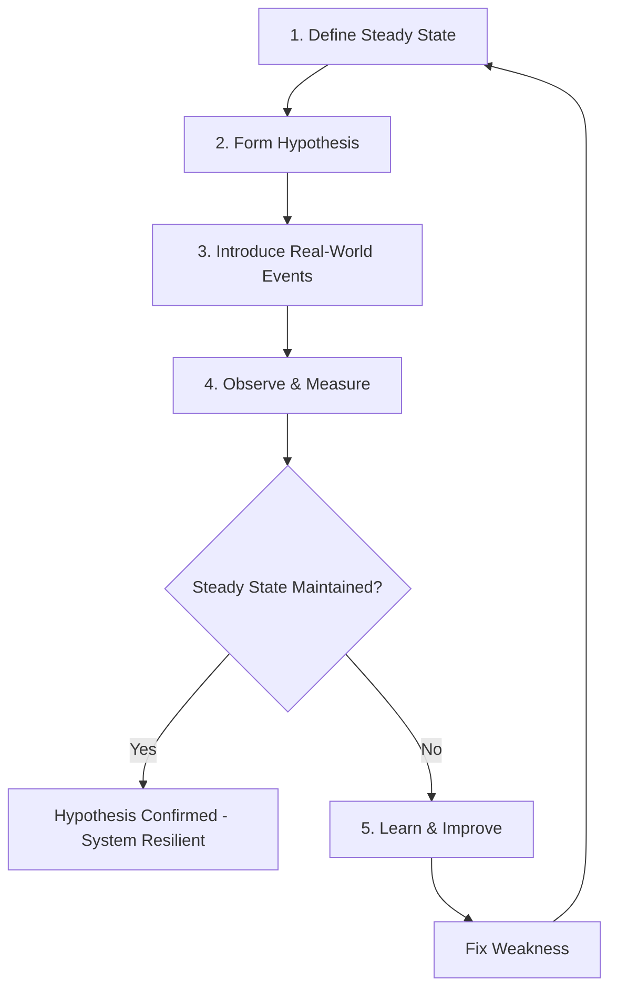

Chaos Engineering adalah disiplin untuk membangun kepercayaan terhadap kemampuan sistem dalam menghadapi kondisi turbulent di production. Dengan melakukan controlled experiments, tim dapat menemukan kelemahan sistem sebelum menjadi incident yang berdampak pada pengguna. Artikel ini membahas implementasi chaos engineering menggunakan Chaos Mesh dan AWS FIS, termasuk GameDay planning.

> Jika Anda belum membaca artikel sebelumnya, mulai dari [Advanced SRE: Error Budget](/posts/advanced-sre-error-budget/).

## Prerequisites

- Pemahaman SLI/SLO/SLA — baca: [Advanced SRE: SLI, SLO, dan SLA](/posts/advanced-sre-sli-slo-dan-sla/)
- Error Budget Policy — baca: [Advanced SRE: Error Budget](/posts/advanced-sre-error-budget/)
- Kubernetes cluster dengan observability stack
- AWS account dengan EKS cluster

## Mengapa Chaos Engineering?

| Aspect | Without Chaos Engineering | With Chaos Engineering |
|--------|---------------------------|------------------------|
| Failure Discovery | Discovered in production incidents | Discovered in controlled experiments |
| Recovery Time | Unknown until incident occurs | Validated and documented |
| Team Confidence | "Hope it works" | "We know it works" |
| Runbook Quality | Theoretical, untested | Battle-tested, validated |
| Architecture Gaps | Hidden until failure | Proactively identified |

## Chaos Engineering Scientific Method



Prinsip utama: define steady state (normal behavior), form hypothesis ("system maintains 99.9% availability when 1 pod terminated"), inject failure, observe apakah steady state terjaga, lalu learn dari hasilnya.

## Chaos Mesh Setup

```bash
# Add Chaos Mesh Helm repository
helm repo add chaos-mesh https://charts.chaos-mesh.org
helm repo update

# Install Chaos Mesh
helm install chaos-mesh chaos-mesh/chaos-mesh \
  --namespace chaos-mesh --create-namespace \
  --set chaosDaemon.runtime=containerd \
  --set chaosDaemon.socketPath=/run/containerd/containerd.sock
```

### Pod Chaos Experiment

```yaml
apiVersion: chaos-mesh.org/v1alpha1
kind: PodChaos
metadata:
  name: pod-failure-test
  namespace: chaos-mesh
spec:
  action: pod-kill
  mode: one
  selector:
    namespaces:
      - production
    labelSelectors:
      app: api-gateway
  duration: "30s"
```

### Network Chaos Experiment

```yaml
apiVersion: chaos-mesh.org/v1alpha1
kind: NetworkChaos
metadata:
  name: network-latency-test
  namespace: chaos-mesh
spec:
  action: delay
  mode: all
  selector:
    namespaces:
      - production
    labelSelectors:
      app: payment-service
  delay:
    latency: "200ms"
    jitter: "50ms"
  duration: "5m"
  direction: to
  target:
    selector:
      labelSelectors:
        app: database
    mode: all
```

## AWS Fault Injection Simulator

### EC2 Instance Stop Experiment

```hcl
resource "aws_fis_experiment_template" "ec2_stop" {
  description = "Stop EC2 instances to test auto-recovery"
  role_arn    = aws_iam_role.fis_role.arn

  action {
    name      = "stop-instances"
    action_id = "aws:ec2:stop-instances"
    parameter {
      key   = "startInstancesAfterDuration"
      value = "PT5M"
    }
    target {
      key   = "Instances"
      value = "ec2-targets"
    }
  }

  target {
    name           = "ec2-targets"
    resource_type  = "aws:ec2:instance"
    selection_mode = "COUNT(1)"
    resource_tag {
      key   = "ChaosEnabled"
      value = "true"
    }
  }

  stop_condition {
    source = "aws:cloudwatch:alarm"
    value  = aws_cloudwatch_metric_alarm.high_error_rate.arn
  }
}
```

## Experiment Types

| Experiment | What it Tests | Blast Radius | Complexity |
|------------|---------------|--------------|------------|
| Pod Delete | Auto-recovery, replicas | Low | Easy |
| Network Latency | Timeout handling, retries | Medium | Medium |
| CPU Stress | Autoscaling, throttling | Medium | Easy |
| Memory Stress | OOM handling, limits | Medium | Easy |
| DNS Failure | Service discovery resilience | High | Medium |
| AZ Failure | Multi-AZ resilience | High | Complex |

## GameDay Planning

GameDay adalah scheduled event di mana tim menjalankan chaos experiments secara terstruktur:

**Pre-GameDay:**
- Define experiment scope dan objectives
- Identify participants dan roles
- Prepare rollback procedures
- Notify stakeholders
- Ensure monitoring in place

**Execution:**
- Brief all participants
- Verify steady state baseline
- Execute experiments in order (low → high blast radius)
- Document observations real-time
- Execute rollback if needed

**Post-GameDay:**
- Conduct retrospective
- Document findings dan create action items
- Update runbooks
- Schedule follow-up experiments

## Studi Kasus: TechStartup Indonesia

### Konteks

TSI pada Scale Phase (2022 Q1) membutuhkan confidence bahwa sistem dapat handle failures gracefully, terutama menjelang flash sale events.

Pengalaman 2021 — 12 flash sale incidents dengan $190K revenue loss:
- Autoscaling too slow (40% of incidents)
- Database connection exhaustion (25%)
- Payment timeout cascade (20%)
- Cache invalidation storms (15%)

### Apa yang Dilakukan

TSI mengimplementasikan chaos engineering program bertahap:

1. **Single Pod Failure di Staging** — Mulai dari experiment paling sederhana untuk build confidence
2. **Network Chaos** — Inject latency dan packet loss untuk test timeout handling
3. **AZ Failure Simulation** — Menggunakan AWS FIS untuk simulate availability zone failure
4. **Automatic Stop Conditions** — Experiments auto-abort jika SLO breached, berbasis Chaos Mesh + AWS FIS

### Metrics Improvement

| Metric | Sebelum | Sesudah | Perubahan |
|--------|---------|---------|-----------|
| Flash Sale Incidents | 12/year | 2/year | -83% |
| Revenue Loss | $190,000 | $15,000 | -92% |
| MTTR | 45 min | 8 min | -82% |
| Runbook Accuracy | Unknown | 95% | Validated |
| AZ Failover Time | Unknown | < 2 min | Documented |
| Weaknesses Discovered | 0 | 8 | Proactive |

### Lessons Learned

**Yang Berhasil:**
- Start small, scale gradually — mulai single pod failure di staging, bangun confidence sebelum production chaos
- Observability is prerequisite — tidak bisa chaos tanpa proper monitoring, SLI/SLO harus established
- Automatic stop conditions — experiments auto-abort jika SLO breached, mencegah customer impact
- Quarterly GameDay — membangun team muscle memory dan cross-functional collaboration

**Yang Perlu Dihindari:**
- Jangan run chaos tanpa proper monitoring — hasilnya tidak measurable dan bisa berbahaya
- Jangan mulai dengan high blast radius — build trust gradually dengan stakeholders
- Jangan skip stakeholder communication — management perlu tahu dan approve
- Jangan treat chaos sebagai one-time activity — harus continuous dan scheduled

## Best Practices

- **Mulai di staging** — prove safety di non-production first, lalu gradually move ke production
- **Define clear hypotheses** — setiap experiment harus punya expected outcome yang measurable
- **Implement automatic abort** — stop conditions berbasis SLO untuk mencegah customer impact
- **Document everything** — setiap experiment, finding, dan fix harus tracked dan shared
- **Fix discovered issues promptly** — chaos tanpa follow-up action adalah waste of time
- **Schedule regular GameDays** — quarterly exercises membangun team readiness dan confidence

## Selanjutnya

Artikel berikutnya: [Advanced SRE: Capacity Planning](/posts/advanced-sre-capacity-planning/) — setelah memvalidasi resilience dengan chaos engineering, langkah selanjutnya adalah memastikan sistem memiliki capacity yang cukup untuk handle expected dan unexpected load.

Topik terkait yang bisa Anda eksplorasi:
- Capacity Planning — load testing dan autoscaling untuk flash sale preparation
- On-Call Best Practices — incident response yang teruji melalui chaos experiments
- Reliability Patterns — circuit breaker, retry, dan patterns yang divalidasi chaos testing

## References

- [Chaos Mesh Documentation](https://chaos-mesh.org/docs/)
- [AWS Fault Injection Simulator](https://docs.aws.amazon.com/fis/)
- [Principles of Chaos Engineering](https://principlesofchaos.org/)
- [Netflix Chaos Engineering](https://netflixtechblog.com/tagged/chaos-engineering)
- [Google SRE Book - Testing for Reliability](https://sre.google/sre-book/testing-reliability/)

---

## Navigasi Series

⬅️ **Sebelumnya:** [Advanced SRE: Error Budget](/posts/advanced-sre-error-budget/)

➡️ **Selanjutnya:** [Advanced SRE: Capacity Planning](/posts/advanced-sre-capacity-planning/)