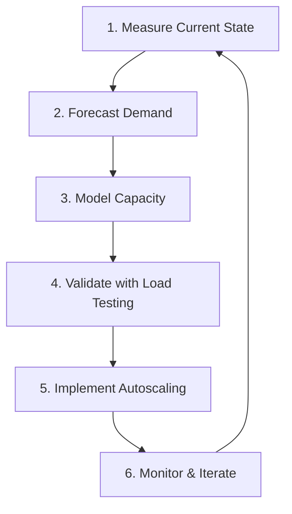

Capacity planning adalah proses sistematis untuk memastikan sistem memiliki resources yang cukup untuk handle expected dan unexpected load. Untuk e-commerce, capacity planning menjadi critical terutama menjelang flash sale events yang bisa menghasilkan 10x traffic spike. Artikel ini membahas demand forecasting, capacity modeling, load testing dengan k6, dan autoscaling strategies.

> Jika Anda belum membaca artikel sebelumnya, mulai dari [Advanced SRE: Chaos Engineering](/posts/advanced-sre-chaos-engineering/).

## Prerequisites

- Pemahaman SLI/SLO/SLA — baca: [Advanced SRE: SLI, SLO, dan SLA](/posts/advanced-sre-sli-slo-dan-sla/)
- Error Budget Policy — baca: [Advanced SRE: Error Budget](/posts/advanced-sre-error-budget/)
- Chaos Engineering — baca: [Advanced SRE: Chaos Engineering](/posts/advanced-sre-chaos-engineering/)
- Kubernetes cluster dengan HPA/VPA configured
- Monitoring stack (Prometheus, Grafana)

## Capacity Planning Process



| Aspect | Without Capacity Planning | With Capacity Planning |
|--------|---------------------------|------------------------|
| Flash Sale | System crash, revenue loss | Smooth handling |
| Cost | Over-provisioning waste | Right-sized resources |
| Growth | Surprised by scaling issues | Proactive preparation |
| SLO | Frequent breaches | Consistent performance |

## Capacity Metrics

| Metric | Formula | Description |
|--------|---------|-------------|
| Headroom | (Capacity - Current) / Capacity | Buffer sebelum saturation |
| Time to Saturation | Headroom / Growth Rate | Waktu sampai capacity habis |
| Required Capacity | Current × (1 + Growth + Buffer) | Target capacity |
| Utilization | Current / Capacity | Persentase penggunaan |

## Load Testing dengan k6

```javascript
import http from 'k6/http';
import { check, sleep } from 'k6';
import { Rate, Trend } from 'k6/metrics';

const errorRate = new Rate('errors');
const responseTime = new Trend('response_time');

export const options = {
  stages: [
    { duration: '2m', target: 100 },   // Ramp up
    { duration: '5m', target: 100 },   // Steady state
    { duration: '2m', target: 200 },   // Increase load
    { duration: '5m', target: 200 },   // Steady state
    { duration: '2m', target: 0 },     // Ramp down
  ],
  thresholds: {
    http_req_duration: ['p(95)<500', 'p(99)<1000'],
    http_req_failed: ['rate<0.01'],
  },
};

export default function () {
  const res = http.get('https://api.example.com/products');
  check(res, {
    'status is 200': (r) => r.status === 200,
    'response time < 500ms': (r) => r.timings.duration < 500,
  });
  errorRate.add(res.status !== 200);
  responseTime.add(res.timings.duration);
  sleep(1);
}
```

## Capacity Model

```yaml
service:
  name: "api-gateway"
baseline:
  requests_per_second: 1000
  cpu_per_request_ms: 2
current_resources:
  replicas: 3
  cpu_per_pod: 2
capacity:
  max_rps_per_pod: 500
  total_capacity: 1500
  current_utilization: 66%
  headroom: 34%
flash_sale_config:
  expected_peak_rps: 50000
  pre_scale_replicas: 50
  pre_scale_time_minutes: 30
```

## Autoscaling Strategies

### Horizontal Pod Autoscaler (HPA)

```yaml
apiVersion: autoscaling/v2
kind: HorizontalPodAutoscaler
metadata:
  name: api-gateway-hpa
spec:
  scaleTargetRef:
    apiVersion: apps/v1
    kind: Deployment
    name: api-gateway
  minReplicas: 3
  maxReplicas: 50
  metrics:
    - type: Resource
      resource:
        name: cpu
        target:
          type: Utilization
          averageUtilization: 70
  behavior:
    scaleUp:
      stabilizationWindowSeconds: 60
      policies:
        - type: Percent
          value: 100
          periodSeconds: 60
    scaleDown:
      stabilizationWindowSeconds: 300
      policies:
        - type: Percent
          value: 10
          periodSeconds: 60
```

### Pre-Scaling untuk Flash Sale

Karena autoscaling tidak cukup cepat untuk sudden traffic spike (5-10 menit), pre-scaling diperlukan:

```bash
# Pre-scale 30 menit sebelum flash sale
kubectl scale deployment api-gateway --replicas=50
kubectl scale deployment product-api --replicas=100
kubectl scale deployment checkout-api --replicas=30

# Verify scaling complete
kubectl get pods -l app=api-gateway | grep Running | wc -l
```

## 🏢 Studi Kasus: TechStartup Indonesia

### Konteks

TSI pada Scale Phase (2022 Q1) menghadapi tantangan besar: mempersiapkan infrastructure untuk flash sale events yang menghasilkan 10x traffic spike.

Pengalaman 2021 — pendekatan reactive ("scale 3x seminggu sebelum flash sale") menghasilkan 12 incidents dan $190K revenue loss:
- Database connection exhaustion (35% of incidents)
- Autoscaling too slow (25%)
- Redis memory exhaustion (20%)
- API Gateway rate limiting (15%)

### Apa yang Dilakukan

TSI mengimplementasikan systematic capacity planning:

1. **Capacity Model per Service** — Mapping traffic ke resource requirements berdasarkan load testing data
2. **Load Testing dengan k6** — Validasi capacity model sebelum setiap flash sale event
3. **Pre-Scaling Automation** — Scheduled scale-up 30 menit sebelum flash sale
4. **Karpenter untuk Node Autoscaling** — Provisioning nodes dalam 2 menit vs 10 menit dengan Cluster Autoscaler

### Metrics Improvement

| Metric | Sebelum | Sesudah | Perubahan |
|--------|---------|---------|-----------|
| Flash Sale Incidents | 12/year | 1/year | -92% |
| Revenue Loss per Sale | $63K avg | $5K avg | -92% |
| Scaling Time | 5-10 min | < 2 min | -80% |
| Cost Waste | $50K/quarter | $10K/quarter | -80% |
| Capacity Accuracy | Guesswork | 95% accurate | Data-driven |
| Pre-sale Prep Time | 1 week manual | 30 min automated | -99% |

### Lessons Learned

**Yang Berhasil:**
- Data-driven capacity model — mapping traffic ke resource requirements berdasarkan load testing, bukan guesswork
- Pre-scaling automation — scheduled scale-up 30 menit sebelum flash sale, menghilangkan autoscaling lag
- Load testing sebelum setiap flash sale — validasi capacity model dan discover bottlenecks sebelum event
- Karpenter untuk node autoscaling — provisioning nodes dalam 2 menit vs 10 menit dengan Cluster Autoscaler

**Yang Perlu Dihindari:**
- Jangan rely hanya pada HPA — autoscaling terlalu lambat untuk sudden 10x spike, pre-scaling wajib
- Jangan lupa database capacity — application pods bisa scale, tapi database connections terbatas
- Jangan skip post-sale scale-down — TSI pernah lupa scale down, cloud bill membengkak $50K

## Best Practices

- **Buat capacity model per service** — mapping traffic ke CPU, memory, dan connections yang dibutuhkan
- **Load test sebelum setiap major event** — validasi model dan discover bottlenecks
- **Pre-scale untuk predictable spikes** — jangan rely pada autoscaling untuk sudden traffic
- **Monitor bottlenecks end-to-end** — database, cache, dan network sering jadi bottleneck sebelum compute
- **Automate scale-up dan scale-down** — scheduled scaling untuk predictable events
- **Review capacity quarterly** — growth rate berubah, model harus di-update

## Selanjutnya

Artikel berikutnya: [Advanced SRE: On-Call Best Practices](/posts/advanced-sre-on-call-best-practices/) — setelah memastikan capacity cukup, langkah selanjutnya adalah membangun sustainable on-call rotation untuk merespons incidents dengan cepat.

Topik terkait yang bisa Anda eksplorasi:
- On-Call Best Practices — sustainable on-call rotation dan runbook creation
- Reliability Patterns — circuit breaker dan graceful degradation saat overload
- Overload Handling — load shedding dan rate limiting untuk extreme traffic

## References

- [Google SRE Book - Software Engineering in SRE](https://sre.google/sre-book/software-engineering-in-sre/)
- [k6 Documentation](https://k6.io/docs/)
- [Kubernetes HPA Documentation](https://kubernetes.io/docs/tasks/run-application/horizontal-pod-autoscale/)
- [Karpenter Documentation](https://karpenter.sh/docs/)

---

## Navigasi Series

⬅️ **Sebelumnya:** [Advanced SRE: Chaos Engineering](/posts/advanced-sre-chaos-engineering/)

➡️ **Selanjutnya:** [Advanced SRE: On-Call Best Practices](/posts/advanced-sre-on-call-best-practices/)

📚 [Kembali ke Series Index](/posts/sre-learning-series-index/)
