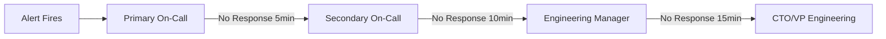

On-call adalah komponen kritis dalam SRE yang memastikan sistem production mendapat respons cepat saat terjadi incident. Effective on-call practices bukan hanya tentang "siapa yang menjawab alert", tetapi juga tentang membangun sustainable system yang menjaga keseimbangan antara reliability dan kesejahteraan tim. Artikel ini membahas rotation design, escalation policy, runbook creation, dan alert quality management.

> Jika Anda belum membaca artikel sebelumnya, mulai dari [Advanced SRE: Capacity Planning](/posts/advanced-sre-capacity-planning/).

## Prerequisites

- Pemahaman SLI/SLO/SLA — baca: [Advanced SRE: SLI, SLO, dan SLA](/posts/advanced-sre-sli-slo-dan-sla/)
- Error Budget Policy — baca: [Advanced SRE: Error Budget](/posts/advanced-sre-error-budget/)
- Chaos Engineering — baca: [Advanced SRE: Chaos Engineering](/posts/advanced-sre-chaos-engineering/)
- Monitoring stack (Prometheus, Grafana, Alertmanager)
- Incident management tool (PagerDuty atau equivalent)

## On-Call Rotation Design



### Rotation Principles

- **Duration:** 1 week per rotation (avoid > 2 weeks — burnout risk)
- **Coverage:** Primary + Secondary model untuk redundancy
- **Minimum team size:** 5 engineers untuk sustainable rotation (1 week on, 4 weeks off)
- **Handoff:** Formal handoff meeting setiap rotation change

### Rotation Schedule (5 Engineers)

| Week | Primary | Secondary |
|------|---------|-----------|
| Week 1 | Engineer A | Engineer B |
| Week 2 | Engineer B | Engineer C |
| Week 3 | Engineer C | Engineer D |
| Week 4 | Engineer D | Engineer E |
| Week 5 | Engineer E | Engineer A |

## Escalation Policy

```yaml
escalation_policy:
  name: "Production Services"
  tiers:
    - tier: 1
      name: "Primary On-Call"
      timeout_minutes: 5
      notification: [push_notification, sms]
    - tier: 2
      name: "Secondary On-Call"
      timeout_minutes: 10
      notification: [push_notification, sms, phone_call]
    - tier: 3
      name: "Engineering Manager"
      timeout_minutes: 15
      notification: [phone_call, sms]
    - tier: 4
      name: "CTO / VP Engineering"
      timeout_minutes: 30
      notification: [phone_call]
```

## Runbook Creation

Setiap alert harus memiliki runbook yang actionable. Template:

```markdown
# Runbook: [Alert Name]

## Alert Information
- **Alert Name:** HighCPUUtilization
- **Severity:** Critical
- **Threshold:** CPU > 80% for 5 minutes
- **Service:** api-gateway
- **Dashboard:** [Link to Grafana]

## Impact Assessment
- User Impact: API response times increase
- Business Impact: Checkout flow affected

## Investigation Steps

### Step 1: Verify Alert
kubectl top pods -n production -l app=api-gateway

### Step 2: Check Traffic
# Prometheus query for traffic spike
sum(rate(http_requests_total{app="api-gateway"}[5m]))

### Step 3: Mitigation
# Scale up if traffic spike
kubectl scale deployment api-gateway --replicas=10

# Rollback if recent deployment
kubectl rollout undo deployment/api-gateway

## Escalation Criteria
- Escalate to Secondary if not resolved in 15 minutes
- Escalate to Manager if customer-facing impact > 30 minutes
```

## Alert Quality Management

| Metric | Target | Description |
|--------|--------|-------------|
| Actionable Rate | > 80% | Setiap alert harus memerlukan action |
| Noise Ratio | < 20% | False positives harus minimal |
| MTTA | < 5 min | Mean Time to Acknowledge |
| Runbook Coverage | > 80% | Alerts dengan runbook |

### Alert Quality Review Process

Lakukan weekly alert review:
1. Review semua alerts yang fired minggu ini
2. Classify: actionable vs noise
3. Tune thresholds untuk noisy alerts
4. Create runbooks untuk alerts tanpa runbook
5. Delete alerts yang tidak pernah actionable

## On-Call Compensation

| Model | Description | Pros | Cons |
|-------|-------------|------|------|
| Flat rate | Fixed amount per on-call week | Simple, predictable | Unfair jika incident-heavy |
| Per-incident | Bonus per incident handled | Fair distribution | Complex tracking |
| Hybrid | Base + per-incident bonus | Balanced | Moderate complexity |
| Time-off | Comp day after on-call week | Good work-life balance | Scheduling challenges |

## Studi Kasus: TechStartup Indonesia

### Konteks

TSI pada Scale Phase (2022 Q1) memiliki 5 DevOps engineers yang harus cover 24/7 on-call untuk 15+ microservices.

Kondisi sebelumnya:
- On-call bersifat ad-hoc — tidak ada rotation formal
- Alert fatigue parah (50+ alerts/day)
- Runbooks tidak ada atau outdated
- MTTA rata-rata 18 menit karena unclear ownership
- Satu engineer resign karena burnout

### Apa yang Dilakukan

TSI mengimplementasikan structured on-call:

1. **Formal Weekly Rotation** — Primary/secondary model dengan minimum 5 engineers
2. **PagerDuty Integration** — Clear escalation path dan automatic notification
3. **Runbook Requirement** — Setiap alert wajib punya runbook sebelum di-enable
4. **Weekly Alert Quality Review** — Tune thresholds, delete noise, improve signal
5. **Fair Compensation** — Hybrid model (base + per-incident bonus)

### Metrics Improvement

| Metric | Sebelum | Sesudah | Perubahan |
|--------|---------|---------|-----------|
| MTTA | 18 min | 3 min | -83% |
| MTTR | 95 min | 25 min | -74% |
| Alerts/day | 50+ | 8 | -84% |
| Actionable Rate | 20% | 85% | +325% |
| Revenue Loss/month | $45K | $8K | -82% |
| Team Satisfaction | 3.2/5 | 4.1/5 | +28% |
| Runbook Coverage | 15% | 85% | +467% |

### Lessons Learned

**Yang Berhasil:**
- Formal rotation dengan PagerDuty — clear ownership menghilangkan "bukan tanggung jawab saya" mindset
- Weekly alert review — secara konsisten mengurangi noise dari 50+ ke 8 alerts/day dalam 3 bulan
- Runbook requirement — setiap alert baru wajib punya runbook sebelum di-enable di production
- Fair compensation — hybrid model (base + per-incident) mengubah on-call dari beban menjadi tanggung jawab yang dihargai

**Yang Perlu Dihindari:**
- Jangan biarkan on-call tanpa rotation formal — leads to burnout dan attrition
- Jangan ignore alert fatigue — 50+ alerts/day berarti semua alerts diabaikan
- Jangan buat runbooks yang terlalu panjang — on-call engineer butuh quick actionable steps, bukan documentation
- Jangan skip handoff meeting — context transfer penting untuk continuity

## Best Practices

- **Implementasikan formal rotation** — minimum 5 engineers, 1 week on / 4 weeks off
- **Require runbooks untuk setiap alert** — no runbook = no alert in production
- **Review alert quality weekly** — tune thresholds, delete noise, improve signal
- **Compensate fairly** — on-call adalah extra responsibility yang harus dihargai
- **Validate runbooks dengan chaos engineering** — untested runbooks adalah false confidence
- **Track on-call health metrics** — MTTA, MTTR, pages/week, satisfaction score
- **Automate common mitigations** — jika runbook step selalu sama, automate it

## Selanjutnya

Artikel berikutnya: [Advanced SRE: Postmortem Culture](/posts/advanced-sre-postmortem-culture/) — setelah membangun on-call yang sustainable, langkah selanjutnya adalah membangun budaya blameless postmortem untuk belajar dari setiap incident.

Topik terkait yang bisa Anda eksplorasi:
- Postmortem Culture — blameless postmortems dan continuous learning
- Toil Reduction — mengurangi repetitive on-call tasks melalui automation
- On-Call Automation & Runbook — advanced automation untuk incident response

## References

- [Google SRE Book - Being On-Call](https://sre.google/sre-book/being-on-call/)
- [Google SRE Book - Effective Troubleshooting](https://sre.google/sre-book/effective-troubleshooting/)
- [PagerDuty Incident Response Guide](https://response.pagerduty.com/)
- [On-Call Compensation Best Practices](https://increment.com/on-call/)

---

## Navigasi Series

⬅️ **Sebelumnya:** [Advanced SRE: Capacity Planning](/posts/advanced-sre-capacity-planning/)

➡️ **Selanjutnya:** [Advanced SRE: Postmortem Culture](/posts/advanced-sre-postmortem-culture/)