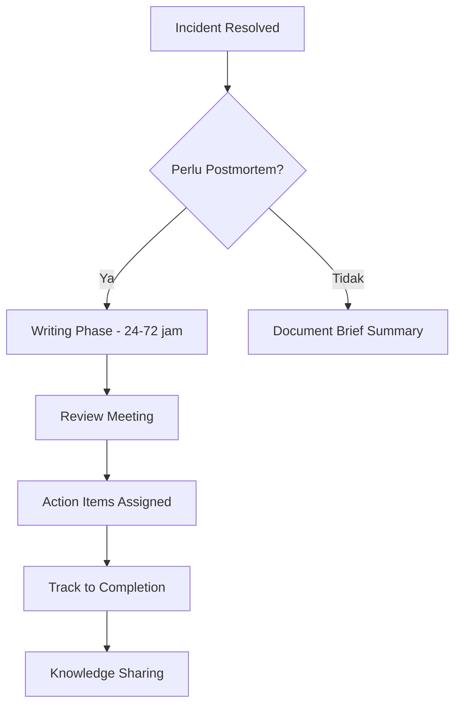

Postmortem adalah proses terstruktur untuk menganalisis incident setelah terjadi, dengan tujuan utama belajar dari kegagalan dan mencegah kejadian serupa di masa depan. Konsep blameless postmortem adalah pilar fundamental dalam budaya SRE — alih-alih mencari siapa yang salah, fokus pada apa yang salah dalam sistem. Artikel ini membahas cara membangun blameless culture, template postmortem, root cause analysis, dan action item tracking.

> Jika Anda belum membaca artikel sebelumnya, mulai dari [Advanced SRE: On-Call Best Practices](/posts/advanced-sre-on-call-best-practices/).

## Prerequisites

- Pemahaman incident management — baca: [Intermediate SRE: Incident Management](/posts/intermediate-sre-incident-management/)
- On-Call practices — baca: [Advanced SRE: On-Call Best Practices](/posts/advanced-sre-on-call-best-practices/)
- Familiar dengan SLI/SLO/SLA — baca: [Advanced SRE: SLI, SLO, dan SLA](/posts/advanced-sre-sli-slo-dan-sla/)
- Pengalaman menangani production incidents

## Blameless vs Blame Culture

| Blame Culture | Blameless Culture |
|-----------------|---------------------|
| "Siapa yang deploy code buggy?" | "Apa yang memungkinkan error ini?" |
| Engineer takut mengakui kesalahan | Engineer merasa aman untuk transparan |
| Incident di-hide atau di-minimize | Incident menjadi learning opportunity |
| Organisasi tidak belajar | Organisasi terus improve |

**Key Principle:** "We assume people acted with the best information available to them at the time."

## Kapan Postmortem Diperlukan?

| Kriteria | Contoh | Postmortem? |
|----------|--------|-------------|
| SEV1 (Critical) | Service down > 30 menit | **Wajib** |
| SEV2 (Major) | SLO breach | **Wajib** |
| SEV3 (Minor) | Partial degradation | Opsional |
| Error budget exhausted | Monthly budget habis | **Wajib** |
| Near-miss | Hampir terjadi outage besar | **Sangat direkomendasikan** |
| Novel failure mode | Tipe kegagalan baru | **Sangat direkomendasikan** |

## Postmortem Lifecycle



## Postmortem Template

```markdown
# Incident: [Title]
Date: YYYY-MM-DD
Duration: X hours
Severity: SEV1/SEV2
Incident Commander: [Name]

## Summary
Brief description of what happened (2-3 sentences).

## Impact
- Users affected: X
- Revenue impact: $X
- Error budget consumed: X%
- SLO breach: Yes/No

## Timeline
- HH:MM - Alert fired / Issue detected
- HH:MM - IC assigned, team engaged
- HH:MM - Root cause identified
- HH:MM - Mitigation applied
- HH:MM - Incident resolved
- HH:MM - All-clear communicated

## Root Cause
What actually caused the incident. Use Five Whys or
Contributing Factors Analysis.

## Contributing Factors
- Factor 1: [description]
- Factor 2: [description]

## Action Items
| # | Action | Owner | Priority | Due Date | Status |
|---|--------|-------|----------|----------|--------|
| 1 | [action] | [name] | P1 | YYYY-MM-DD | Open |
| 2 | [action] | [name] | P2 | YYYY-MM-DD | Open |

## Lessons Learned
### What went well?
- [positive observation]

### What can we improve?
- [improvement opportunity]
```

## Five Whys Root Cause Analysis

```
Incident: Payment API timeout selama flash sale

Why 1: Kenapa payment API timeout?
  → Database connection pool exhausted

Why 2: Kenapa connection pool exhausted?
  → Concurrent requests melebihi pool size

Why 3: Kenapa concurrent requests melebihi pool size?
  → Tidak ada rate limiting di API gateway

Why 4: Kenapa tidak ada rate limiting?
  → Tidak termasuk dalam production readiness checklist

Why 5: Kenapa tidak termasuk dalam checklist?
  → Checklist belum di-update sejak migrasi ke microservices

ROOT CAUSE: Production readiness checklist tidak mencakup
            rate limiting requirements
```

## Language Guide

| Hindari | Gunakan |
|-----------|-----------|
| "Developer X melakukan kesalahan" | "Perubahan pada config Y menyebabkan..." |
| "Tim A gagal mendeteksi" | "Monitoring gap pada area X berarti..." |
| "Seharusnya sudah di-test" | "Test coverage untuk scenario ini belum ada" |
| "Human error" | "Sistem memungkinkan konfigurasi yang menyebabkan..." |

## Action Item Tracking

Action items tanpa tracking adalah postmortem yang sia-sia. Best practices:

- **SMART criteria:** Specific, Measurable, Assignable, Realistic, Time-bound
- **Priority levels:** P1 (fix within 1 week), P2 (fix within 1 month), P3 (next quarter)
- **Single owner:** Setiap action item harus punya 1 owner yang accountable
- **Track completion rate:** Target > 80% completion within deadline
- **Link ke sprint planning:** Action items masuk ke backlog, bukan terpisah

## Postmortem Meeting Facilitation

**Duration:** 45-60 menit

**Agenda:**
1. (5 min) Context setting — facilitator recap incident
2. (15 min) Timeline review — walk through events chronologically
3. (15 min) Root cause discussion — Five Whys atau Contributing Factors
4. (10 min) Action items — identify, prioritize, assign owners
5. (5 min) Lessons learned — what went well, what to improve

**Facilitator tips:**
- Redirect blame language ke system language
- Ensure semua voices heard, bukan hanya senior engineers
- Keep discussion focused dan time-boxed
- Document decisions real-time

## Studi Kasus: TechStartup Indonesia

### Konteks

TSI pada Scale Phase (2022 Q1) mengalami flash sale incident besar: payment service down 47 menit, $85K revenue loss, 15,000 users affected.

Kondisi sebelumnya:
- Post-incident review bersifat informal — "meeting 10 menit, blame developer yang deploy, move on"
- Tidak ada action items yang di-track
- Incident serupa berulang 3x dalam 6 bulan
- Team psychological safety rendah (2.8/5)

### Apa yang Dilakukan

Setelah incident besar ini, CTO memutuskan mengadopsi blameless postmortem culture:

1. **Formal Template** — Standardized postmortem document dengan timeline, root cause, dan action items
2. **Trained Facilitators** — 2 engineers dilatih khusus sebagai postmortem facilitators
3. **Mandatory untuk SEV1/SEV2** — Tidak ada exception, postmortem harus selesai dalam 48 jam
4. **Action Items di Jira** — Tracked dengan weekly review, linked ke sprint planning
5. **Monthly Sharing Session** — Postmortem di-share ke seluruh engineering org

### Metrics Improvement

| Metric | Sebelum | Sesudah | Perubahan |
|--------|---------|---------|-----------|
| Recurring Incidents | 45% | 12% | -73% |
| Action Item Completion | 20% | 82% | +310% |
| MTTR | 45 min | 18 min | -60% |
| Time to Postmortem | 2 weeks | 48 hours | -86% |
| Team Psychological Safety | 2.8/5 | 4.2/5 | +50% |
| Incidents/quarter | 15 | 5 | -67% |

### Lessons Learned

**Yang Berhasil:**
- CTO sebagai champion — leadership modeling blameless behavior di meeting pertama sets the tone
- Trained facilitators — 2 engineers dilatih sebagai postmortem facilitators, kualitas diskusi meningkat drastis
- Action items linked ke sprint — bukan dokumen terpisah yang dilupakan, tapi masuk backlog dengan deadline
- Monthly sharing session — postmortem di-share ke seluruh engineering, patterns teridentifikasi cross-team

**Yang Perlu Dihindari:**
- Jangan skip postmortem karena "terlalu sibuk" — recurring incidents lebih mahal dari 1 jam meeting
- Jangan buat postmortem terlalu panjang — 3-5 halaman cukup, fokus key findings dan action items
- Jangan biarkan blame muncul kembali saat stress — regular reinforcement dari leadership diperlukan
- Jangan track action items tanpa review — weekly review memastikan items tidak stuck

## Best Practices

- **Conduct postmortem dalam 48 jam** — memory masih fresh, timeline lebih akurat
- **Train dedicated facilitators** — good facilitation membuat perbedaan besar dalam kualitas output
- **Use blameless language consistently** — redirect "who" questions ke "what" questions
- **Track action items to completion** — target > 80% completion rate within deadline
- **Share postmortems widely** — organisasi belajar dari setiap incident, bukan hanya tim yang terlibat
- **Review patterns quarterly** — identify systemic issues yang muncul berulang across postmortems
- **Celebrate transparency** — publicly appreciate engineers yang jujur tentang mistakes

## Selanjutnya

Artikel berikutnya: [Advanced SRE: Toil Reduction](/posts/advanced-sre-toil-reduction/) — setelah membangun culture belajar dari kegagalan, langkah selanjutnya adalah mengidentifikasi dan mengeliminasi toil yang menghabiskan engineering time.

Topik terkait yang bisa Anda eksplorasi:
- Toil Reduction — mengurangi repetitive work yang sering muncul dari postmortem action items
- Error Budget — postmortem wajib ketika error budget exhausted
- Incident Management — postmortem adalah tahap akhir dari incident lifecycle

## References

- [Google SRE Book - Postmortem Culture](https://sre.google/sre-book/postmortem-culture/)
- [Google SRE Workbook - Postmortem Culture](https://sre.google/workbook/postmortem-culture/)
- [Etsy Debriefing Facilitation Guide](https://extfiles.etsy.com/tests/DebriefingFacilitationGuide.pdf)
- [John Allspaw - Blameless PostMortems](https://www.etsy.com/codeascraft/blameless-postmortems/)

---

## Navigasi Series

⬅️ **Sebelumnya:** [Advanced SRE: On-Call Best Practices](/posts/advanced-sre-on-call-best-practices/)

➡️ **Selanjutnya:** [Advanced SRE: Toil Reduction](/posts/advanced-sre-toil-reduction/)