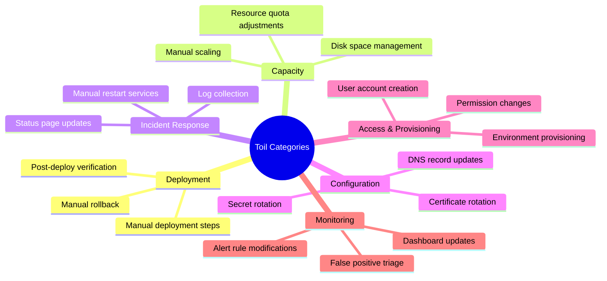

Toil adalah pekerjaan manual, repetitif, automatable, tactical, tanpa enduring value, dan yang skalanya linear dengan pertumbuhan service. Google SRE mendefinisikan target bahwa SRE engineer seharusnya menghabiskan maksimal 50% waktu untuk toil dan sisanya untuk engineering work. Artikel ini membahas cara mengidentifikasi toil, memprioritaskan automation menggunakan ROI matrix, dan mengukur dampak toil reduction.

> Jika Anda belum membaca artikel sebelumnya, mulai dari [Advanced SRE: Postmortem Culture](/posts/advanced-sre-postmortem-culture/).

## Prerequisites

- Pemahaman SRE fundamentals — baca: [Foundation SRE: Apa Itu Site Reliability Engineering](/posts/foundation-sre-apa-itu-site-reliability-engineering/)
- On-Call practices — baca: [Advanced SRE: On-Call Best Practices](/posts/advanced-sre-on-call-best-practices/)
- Postmortem culture — baca: [Advanced SRE: Postmortem Culture](/posts/advanced-sre-postmortem-culture/)
- Pengalaman operasional di environment Kubernetes

## Definisi Toil

Toil memenuhi SEMUA kriteria berikut:

| Kriteria | Definisi | Contoh |
|----------|----------|--------|
| **Manual** | Membutuhkan intervensi manusia | Manually restart crashed pod |
| **Repetitive** | Dilakukan berulang-ulang | Rotate certificate setiap 90 hari |
| **Automatable** | Bisa diotomasi dengan software | Script bisa handle cert rotation |
| **Tactical** | Reactive, bukan strategic | Respond to "tambah disk space" ticket |
| **No Enduring Value** | Tidak meningkatkan service permanen | Service kembali ke state sebelumnya |
| **Scales Linearly** | Bertambah seiring growth | Lebih banyak service = lebih banyak manual config |

> **Penting:** Jika pekerjaan TIDAK automatable atau memberikan enduring value, itu BUKAN toil — itu engineering work.

## Toil vs Engineering Work vs Overhead

| Kategori | Definisi | Contoh | Value |
|----------|----------|--------|-------|
| **Toil** | Manual, repetitif, automatable | Restart pods, manual scaling, cert rotation | Tidak ada lasting value |
| **Engineering Work** | Kreatif, strategic, lasting value | Build automation tools, improve architecture | Permanent improvement |
| **Overhead** | Administratif, tidak bisa dihindari | Meetings, email, planning | Necessary but not productive |

**Google SRE Target:** Toil ≤ 50%, Engineering ≥ 50%

## Toil Taxonomy



## Toil Identification Checklist

| # | Pertanyaan | Ya = Toil Indicator |
|---|-----------|-------------------|
| 1 | Apakah dilakukan secara manual? | Ya |
| 2 | Apakah dilakukan > 1x per minggu? | Ya |
| 3 | Apakah bisa diotomasi dengan script/tool? | Ya |
| 4 | Apakah reactive (dipicu oleh event/ticket)? | Ya |
| 5 | Apakah setelah selesai, service kembali ke state sebelumnya? | Ya |

Jika jawaban "Ya" untuk 4+ pertanyaan → **ini adalah toil yang harus diotomasi.**

## Automation Prioritization Matrix

Prioritaskan automation berdasarkan ROI:

| | High Frequency | Low Frequency |
|---|---|---|
| **Easy to Automate** |  DO FIRST |  Quick wins |
| **Hard to Automate** |  Plan carefully |  Deprioritize |

### ROI Calculation

```
Automation ROI = (Time saved per occurrence × Frequency per month × 12)
                 / Time to build automation

Example:
- Manual cert rotation: 2 hours × 4 times/month × 12 = 96 hours/year saved
- Time to build automation: 16 hours
- ROI: 96 / 16 = 6x return in first year
```

## Automation Examples

### Certificate Rotation (Before/After)

```bash
# BEFORE: Manual (2 hours setiap 90 hari)
# 1. Generate new cert
# 2. Update secret in each namespace
# 3. Restart affected pods
# 4. Verify connectivity
# 5. Update documentation

# AFTER: Automated with cert-manager
```

```yaml
# cert-manager automation
apiVersion: cert-manager.io/v1
kind: Certificate
metadata:
  name: api-tls
  namespace: production
spec:
  secretName: api-tls-secret
  issuerRef:
    name: letsencrypt-prod
    kind: ClusterIssuer
  dnsNames:
    - api.example.com
  renewBefore: 720h  # Auto-renew 30 days before expiry
```

### Manual Scaling (Before/After)

```yaml
# BEFORE: Ticket-driven manual scaling
# "Please scale product-api to 10 replicas for flash sale"

# AFTER: Scheduled autoscaling with CronHPA
apiVersion: autoscaling.k8s.io/v1
kind: CronHPA
metadata:
  name: flash-sale-scaling
spec:
  scaleTargetRef:
    apiVersion: apps/v1
    kind: Deployment
    name: product-api
  jobs:
    - name: "pre-flash-sale"
      schedule: "0 23 * * *"  # Night before flash sale
      targetSize: 50
    - name: "post-flash-sale"
      schedule: "0 6 * * *"   # Morning after
      targetSize: 10
```

## Studi Kasus: TechStartup Indonesia

### Konteks

TSI pada Optimization Phase (2023 Q1) mengidentifikasi bahwa 65% waktu DevOps team (5 engineers) dihabiskan untuk toil — jauh di atas target 50% Google SRE.

Top 5 toil sources:
- Manual deployment verification — 8 hours/week
- Certificate rotation — 4 hours/month
- Manual scaling for events — 6 hours/month
- Log collection for debugging — 5 hours/week
- User access provisioning — 3 hours/week

### Apa yang Dilakukan

TSI menjalankan "Automation Quarter" dengan fokus mengotomasi 5 sumber toil terbesar:

1. **cert-manager** — Automated certificate rotation, zero manual intervention
2. **ArgoCD Automated Verification** — Post-deploy health checks tanpa manual verification
3. **Scheduled Autoscaling** — CronHPA untuk predictable events (flash sale)
4. **Centralized Logging** — Loki + Grafana menggantikan manual log collection
5. **Self-Service Access Portal** — Backstage-based portal untuk user provisioning

### Metrics Improvement

| Metric | Sebelum | Sesudah | Perubahan |
|--------|---------|---------|-----------|
| Toil Percentage | 65% | 35% | -46% |
| Engineering Time | 20% | 50% | +150% |
| Manual Tasks/week | 45 | 12 | -73% |
| Time to Deploy | 45 min (manual) | 8 min (automated) | -82% |
| Cert-related Incidents | 3/quarter | 0 | -100% |
| Team Satisfaction | 3.0/5 | 4.3/5 | +43% |

### Lessons Learned

**Yang Berhasil:**
- Track toil systematically — time tracking selama 2 minggu mengidentifikasi top 5 toil sources dengan data
- Prioritize by ROI — cert-manager (16 hours to build, saves 96 hours/year) adalah quick win terbaik
- Dedicate 20% time untuk automation — tanpa dedicated time, automation selalu deprioritized
- Celebrate automation wins — share savings metrics ke leadership, build momentum untuk next automation

**Yang Perlu Dihindari:**
- Jangan automate everything sekaligus — fokus top 3-5 toil sources, iterate
- Jangan build custom tools jika open-source exists — cert-manager, ArgoCD, Backstage sudah solve common toil
- Jangan lupa maintenance cost — automation juga butuh maintenance, factor into ROI calculation
- Jangan skip documentation — automated process tanpa docs menjadi "magic" yang nobody understands

## Best Practices

- **Track toil systematically** — measure sebelum improve, gunakan time tracking selama 2 minggu
- **Dedicate 20% time untuk automation** — tanpa dedicated time, toil reduction tidak akan terjadi
- **Prioritize by ROI** — automate high-frequency, easy-to-automate tasks first
- **Use existing tools** — cert-manager, ArgoCD, Backstage, Crossplane sebelum build custom
- **Set toil budget** — target ≤ 50%, review monthly, escalate jika trending up
- **Automate incrementally** — mulai dengan script, evolve ke self-service platform
- **Measure impact** — track hours saved, incidents prevented, team satisfaction

## Selanjutnya

Artikel berikutnya: [Advanced SRE: Reliability Patterns](/posts/advanced-sre-reliability-patterns/) — setelah mengurangi toil, langkah selanjutnya adalah mengimplementasikan reliability patterns (circuit breaker, retry, bulkhead) untuk membuat sistem lebih resilient.

Topik terkait yang bisa Anda eksplorasi:
- Reliability Patterns — circuit breaker dan graceful degradation
- On-Call Automation & Runbook — automated incident response
- Automation Evolution — dari scripts ke self-healing systems

## References

- [Google SRE Book - Eliminating Toil](https://sre.google/sre-book/eliminating-toil/)
- [Google SRE Workbook - Eliminating Toil](https://sre.google/workbook/eliminating-toil/)
- [cert-manager Documentation](https://cert-manager.io/docs/)
- [ArgoCD Documentation](https://argo-cd.readthedocs.io/)

---

## Navigasi Series

⬅️ **Sebelumnya:** [Advanced SRE: Postmortem Culture](/posts/advanced-sre-postmortem-culture/)

➡️ **Selanjutnya:** [Advanced SRE: Reliability Patterns](/posts/advanced-sre-reliability-patterns/)