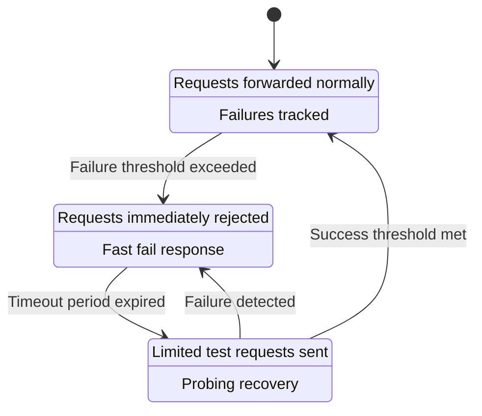
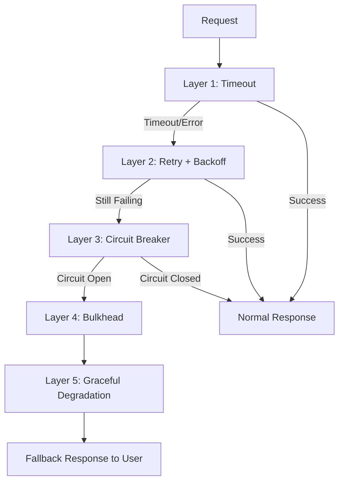

Reliability patterns adalah kumpulan design patterns yang dirancang untuk membuat distributed systems lebih resilient terhadap failure. Dalam dunia microservices, failure bukan pertanyaan "apakah" melainkan "kapan" — dan reliability patterns memastikan bahwa ketika satu komponen gagal, seluruh sistem tidak ikut runtuh. Artikel ini membahas circuit breaker, retry with exponential backoff, bulkhead, timeout, graceful degradation, dan PodDisruptionBudget.

> Jika Anda belum membaca artikel sebelumnya, mulai dari [Advanced SRE: Toil Reduction](/posts/advanced-sre-toil-reduction/).

## Prerequisites

- Pemahaman SLI/SLO/SLA — baca: [Advanced SRE: SLI, SLO, dan SLA](/posts/advanced-sre-sli-slo-dan-sla/)
- Chaos Engineering — baca: [Advanced SRE: Chaos Engineering](/posts/advanced-sre-chaos-engineering/)
- Familiar dengan microservices architecture dan Kubernetes
- Pengalaman dengan service mesh (Istio/Envoy)

## Mengapa Reliability Patterns Diperlukan?

Tanpa reliability patterns, satu service yang lambat bisa menyebabkan **cascading failure**:

```
Tanpa Patterns:
  Payment Service (slow) → Order Service blocked
  → Thread pool exhausted → API Gateway timeout
  → SEMUA users affected → Total system outage

Dengan Patterns:
  Payment Service (slow) → Circuit Breaker OPEN
  → Fallback response → Sistem tetap berjalan
  → Hanya payment feature degraded
```

## Overview Reliability Patterns

| Pattern | Tujuan | Analogi |
|---------|--------|---------|
| **Circuit Breaker** | Mencegah request ke service gagal | Sekring listrik |
| **Retry + Backoff** | Handle transient failures | Telepon ulang setelah nada sibuk |
| **Bulkhead** | Isolasi failure ke satu compartment | Sekat kapal |
| **Timeout** | Batasi waktu tunggu | Batas waktu antrian |
| **Graceful Degradation** | Reduced functionality saat partial failure | Pesawat terbang dengan 1 mesin |
| **PDB** | Jaga minimum availability saat maintenance | Minimum crew requirement |

## Circuit Breaker Pattern

Circuit breaker memiliki tiga state:



### Circuit Breaker Parameters

| Parameter | Description | Typical Value |
|-----------|-------------|---------------|
| Failure Threshold | Failures before OPEN | 5-10 |
| Success Threshold | Successes in HALF-OPEN before CLOSED | 3-5 |
| Timeout Period | Time in OPEN before HALF-OPEN | 30-60s |
| Failure Rate Threshold | % failure that triggers OPEN | 50-80% |

### Istio Circuit Breaker Configuration

```yaml
apiVersion: networking.istio.io/v1
kind: DestinationRule
metadata:
  name: payment-service-cb
spec:
  host: payment-service
  trafficPolicy:
    connectionPool:
      tcp:
        maxConnections: 100
      http:
        h2UpgradePolicy: DEFAULT
        http1MaxPendingRequests: 100
        http2MaxRequests: 1000
    outlierDetection:
      consecutive5xxErrors: 5
      interval: 10s
      baseEjectionTime: 30s
      maxEjectionPercent: 50
```

## Retry with Exponential Backoff

```yaml
apiVersion: networking.istio.io/v1
kind: VirtualService
metadata:
  name: payment-service-retry
spec:
  hosts:
    - payment-service
  http:
    - route:
        - destination:
            host: payment-service
      retries:
        attempts: 3
        perTryTimeout: 2s
        retryOn: "5xx,reset,connect-failure,retriable-4xx"
      timeout: 10s
```

**Backoff formula:** `delay = base_delay × 2^attempt + random_jitter`

> **Warning:** Retry tanpa backoff dan jitter bisa menyebabkan thundering herd — semua clients retry bersamaan dan overload service yang sedang recovery.

## Bulkhead Pattern

Bulkhead mengisolasi resource pools sehingga failure di satu dependency tidak menghabiskan semua resources:

```yaml
# Separate connection pools per dependency
apiVersion: networking.istio.io/v1
kind: DestinationRule
metadata:
  name: bulkhead-config
spec:
  host: payment-gateway
  trafficPolicy:
    connectionPool:
      tcp:
        maxConnections: 50  # Isolated pool
      http:
        http1MaxPendingRequests: 50
        http2MaxRequests: 100
```

## Timeout Pattern

Setiap network call harus memiliki timeout. Tanpa timeout, thread blocked indefinitely:

```yaml
apiVersion: networking.istio.io/v1
kind: VirtualService
metadata:
  name: service-timeouts
spec:
  hosts:
    - product-service
  http:
    - route:
        - destination:
            host: product-service
      timeout: 3s  # Hard timeout
```

**Timeout hierarchy:** Client timeout > Gateway timeout > Service timeout > Database timeout

## Graceful Degradation

Saat dependency down, berikan reduced functionality daripada complete failure:

```python
def get_product_recommendations(user_id):
    try:
        # Try personalized recommendations
        return recommendation_service.get(user_id, timeout=2)
    except (TimeoutError, CircuitBreakerOpen):
        # Fallback: return popular products (cached)
        return cache.get("popular_products")
    except Exception:
        # Last resort: return empty list
        return []
```

## PodDisruptionBudget (PDB)

PDB menjaga minimum availability selama voluntary disruptions (rolling updates, node drains):

```yaml
apiVersion: policy/v1
kind: PodDisruptionBudget
metadata:
  name: payment-api-pdb
spec:
  minAvailable: 2  # Minimum 2 pods always running
  selector:
    matchLabels:
      app: payment-api
```

## Defense in Depth

Reliability patterns bekerja bersama sebagai layered defense:



## Studi Kasus: TechStartup Indonesia

### Konteks

TSI pada Scale Phase (2022 Q2) mengalami cascading failure saat flash sale.

Incident detail:
- Payment service timeout menyebabkan thread pool exhaustion di order service
- Order service failure menyebabkan API gateway timeout
- Total system outage 23 menit, $45K revenue loss
- Root cause: tidak ada circuit breaker antara order service dan payment service

### Apa yang Dilakukan

TSI mengimplementasikan full reliability patterns stack menggunakan Istio service mesh:

1. **Circuit Breaker** — Pada semua inter-service calls, prevent cascading failures
2. **Retry with Exponential Backoff** — Handle transient failures tanpa thundering herd
3. **Bulkhead** — Isolasi connection pools per dependency
4. **Timeout Hierarchy** — Client > Gateway > Service > Database
5. **Graceful Degradation** — Fallback ke cached data saat dependency down
6. **PDB** — PodDisruptionBudget untuk semua critical services

### Metrics Improvement

| Metric | Sebelum | Sesudah | Perubahan |
|--------|---------|---------|-----------|
| Cascading Failures | 5/quarter | 0 | -100% |
| Flash Sale Downtime | 23 min avg | 0 min | -100% |
| Single Service Impact | Total outage | Isolated degradation | Contained |
| Recovery Time | 15 min (manual) | 30 sec (auto) | -97% |
| User Error Rate during incidents | 100% | 5% (degraded) | -95% |
| Revenue Loss per incident | $45K | $2K | -96% |

### Lessons Learned

**Yang Berhasil:**
- Istio service mesh — circuit breaker, retry, dan timeout configured declaratively tanpa code changes
- Graceful degradation design — setiap service punya fallback response, users tetap bisa browse meski payment down
- PDB untuk semua critical services — rolling updates tidak pernah lagi menyebabkan availability drop
- Chaos testing validates patterns — GameDay membuktikan circuit breaker bekerja sesuai expectation

**Yang Perlu Dihindari:**
- Jangan retry tanpa backoff dan jitter — thundering herd membuat recovery lebih lama
- Jangan set timeout terlalu tinggi — timeout 30s berarti thread blocked 30s, pool cepat habis
- Jangan lupa test circuit breaker — untested circuit breaker bisa tidak trigger saat dibutuhkan
- Jangan apply patterns tanpa monitoring — harus bisa observe circuit state dan retry rates

## Best Practices

- **Implement timeout pada setiap network call** — no call should wait indefinitely
- **Use exponential backoff with jitter** — mencegah thundering herd saat recovery
- **Configure circuit breaker per dependency** — different services need different thresholds
- **Design graceful degradation upfront** — setiap service harus punya fallback behavior
- **Set PDB untuk semua critical services** — protect availability during maintenance
- **Monitor pattern behavior** — track circuit state, retry rates, timeout rates di dashboard
- **Test patterns dengan chaos engineering** — validate patterns work before real incidents

## Selanjutnya

Artikel berikutnya: [Advanced SRE: SLO Dashboard Design](/posts/advanced-sre-slo-dashboard-design/) — setelah mengimplementasikan reliability patterns, langkah selanjutnya adalah membangun dashboard untuk memvisualisasikan SLO compliance, error budget, dan system health.

Topik terkait yang bisa dieksplorasi:
- SLO Dashboard Design — visualisasi error budget dan burn rate
- Overload Handling — load shedding dan rate limiting untuk extreme traffic
- Chaos Engineering — validasi reliability patterns dengan controlled experiments

## References

- [Michael Nygard - Release It! (2nd Edition)](https://pragprog.com/titles/mnee2/release-it-second-edition/)
- [Istio Traffic Management](https://istio.io/latest/docs/concepts/traffic-management/)
- [Google SRE Book - Handling Overload](https://sre.google/sre-book/handling-overload/)
- [Martin Fowler - Circuit Breaker](https://martinfowler.com/bliki/CircuitBreaker.html)
- [AWS Architecture Blog - Reliability Patterns](https://aws.amazon.com/blogs/architecture/)

---

## Navigasi Series

⬅️ **Sebelumnya:** [Advanced SRE: Toil Reduction](/posts/advanced-sre-toil-reduction/)

➡️ **Selanjutnya:** [Advanced SRE: SLO Dashboard Design](/posts/advanced-sre-slo-dashboard-design/)