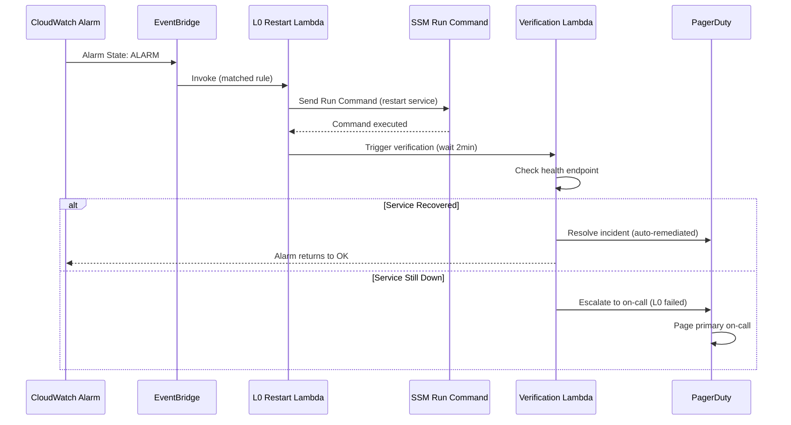

On-call automation dan runbook engineering adalah dua pilar fundamental dalam operasi SRE modern yang bertujuan mengurangi Mean Time to Recovery (MTTR). Manual runbook yang tersimpan di wiki sering outdated, sulit ditemukan saat panik, dan tidak bisa dieksekusi secara otomatis. Pendekatan runbook-as-code mentransformasi runbook dari dokumen pasif menjadi executable code yang bisa di-test, di-review melalui pull request, dan dieksekusi secara otomatis. Dikombinasikan dengan auto-remediation dan escalation automation, pendekatan ini memungkinkan tim SRE untuk fokus pada masalah yang membutuhkan human judgment.

> Jika Anda belum membaca artikel sebelumnya, mulai dari [Advanced SRE: SLO Dashboard Design](/posts/advanced-sre-slo-dashboard-design/).

## Prerequisites

- Pemahaman on-call practices — baca: [Advanced SRE: On-Call Best Practices](/posts/advanced-sre-on-call-best-practices/)
- Pemahaman toil reduction — baca: [Advanced SRE: Toil Reduction](/posts/advanced-sre-toil-reduction/)
- Pemahaman SLI/SLO/SLA — baca: [Advanced SRE: SLI, SLO, dan SLA](/posts/advanced-sre-sli-slo-dan-sla/)
- Familiar dengan AWS CloudWatch, Lambda, dan Systems Manager (SSM)
- Kubernetes cluster dengan monitoring stack (Prometheus + Alertmanager)

## Manual vs Automated On-Call

**Manual on-call flow:**
1. Alert fires → engineer bangun
2. Buka laptop → cari runbook di wiki
3. Baca runbook → jalankan diagnostic commands
4. Identifikasi masalah → eksekusi remediation
5. Verifikasi fix → update incident ticket
6. Total MTTR: 25-45 menit

**Automated on-call flow:**
1. Alert fires → auto-diagnosis langsung jalan
2. L0 auto-remediation dicoba (restart/scale)
3. Kalau resolved → auto-close + notify engineer
4. Kalau gagal → escalate ke engineer dengan full context (diagnosis results, related alerts, runbook link)
5. Total MTTR: 3-10 menit

Insight utama: 60-80% on-call incidents itu repetitif dan bisa diotomasi. Fokuskan perhatian manusia ke 20-40% sisanya yang butuh judgment.

## Empat Pilar On-Call Automation

| Pilar | Deskripsi | Impact on MTTR |
|-------|-----------|----------------|
| **Runbook-as-Code** | Runbook yang executable dan version-controlled | Eliminasi waktu mencari runbook |
| **Auto-Remediation** | Automated fix untuk incident yang sudah dikenal | Eliminasi waktu diagnosis + fix |
| **Escalation Automation** | Routing otomatis ke responder yang tepat | Eliminasi waktu eskalasi manual |
| **Incident Classification** | Severity assignment dan routing otomatis | Eliminasi waktu triaging |

## Graduated Auto-Remediation Model

Auto-remediation menggunakan pendekatan graduated yang dimulai dari tindakan paling aman:

**L0: Restart** (paling aman, paling sering berhasil)
- Pod restart via `kubectl rollout restart`
- Service restart via SSM Run Command
- Risk: Low | Success rate: ~70%

**L1: Scale** (risiko sedang)
- HPA target adjustment
- Tambah replicas ke deployment
- Risk: Medium | Success rate: ~60%

**L2: Failover** (risiko tinggi)
- Route53 failover ke secondary region
- Database failover ke read replica
- Risk: High | Success rate: ~50%

**L3: Human Escalation** (masalah kompleks)
- Page on-call engineer dengan full context
- Include auto-diagnosis results
- Dibutuhkan untuk novel incidents yang belum pernah terjadi

Flow: L0 gagal → tunggu 2 menit → L1 gagal → tunggu 5 menit → L2 gagal → langsung L3 escalation.

## Auto-Remediation Architecture



## Runbook-as-Code

Runbook-as-code menyimpan runbook di Git repository dengan format YAML yang machine-readable sekaligus human-readable:

```yaml
# runbooks/payment-service/high-error-rate.yaml
apiVersion: runbook/v1
kind: Runbook
metadata:
  name: payment-service-high-error-rate
  service: payment-service
  severity: SEV2
  owner: payment-team
  last_tested: "2024-11-15"

trigger:
  type: prometheus_alert
  alert_rule: PaymentServiceHighErrorRate
  threshold: "error_rate > 5% for 5 minutes"

diagnosis:
  auto_checks:
    - name: "Check recent deployments"
      command: |
        kubectl rollout history deployment/payment-service -n production \
          --revision=0 | tail -5

    - name: "Check pod health"
      command: |
        kubectl get pods -n production -l app=payment-service \
          -o wide --no-headers

    - name: "Check dependency health"
      command: |
        kubectl exec -n production deploy/payment-service -- \
          curl -s http://localhost:8080/health/dependencies | jq .

remediation:
  auto:
    l0_restart:
      enabled: true
      command: |
        kubectl rollout restart deployment/payment-service -n production
      wait_seconds: 120
      verification: "health_check"

    l1_scale:
      enabled: true
      command: |
        kubectl scale deployment/payment-service -n production --replicas=6
      wait_seconds: 300

verification:
  health_check:
    command: |
      curl -s https://api.tsi.internal/payment/health | jq .status
    expected: "healthy"
    timeout_seconds: 30
```

### Runbook Testing Strategies

| Testing Type | Deskripsi | Frequency |
|-------------|-----------|-----------|
| **Syntax Validation** | YAML lint, schema validation | Every PR |
| **Dry Run** | Execute diagnosis steps tanpa remediation | Weekly |
| **Game Day** | Full runbook execution dalam staging | Monthly |
| **Chaos Testing** | Inject failure, verify runbook triggers | Quarterly |

## Escalation Automation

### Escalation Policy Design

Contoh escalation timeline untuk SEV1:

| Waktu | Aksi |
|-------|------|
| T+0 min | Primary on-call di-page |
| T+5 min | Jika tidak di-ACK → secondary on-call di-page |
| T+10 min | Jika tidak di-ACK → Engineering Manager di-page |
| T+15 min | Jika tidak di-ACK → VP Engineering di-page |
| T+30 min | Incident Commander di-assign otomatis |

### Automated Context Enrichment

Ketika incident di-escalate ke engineer, context enrichment otomatis menambahkan:

- **Recent deployments** — list deployment dalam 2 jam terakhir
- **Related alerts** — alert lain yang firing bersamaan
- **Runbook link** — link ke runbook yang relevan
- **Dashboard link** — link ke Grafana dashboard
- **SLO status** — error budget remaining dan burn rate
- **Previous incidents** — incident serupa dalam 30 hari terakhir

## Incident Classification

### Automated Severity Assignment

Severity ditentukan otomatis berdasarkan 3 rules:

**Rule 1: Error Budget Burn Rate**

| Burn Rate | Window | Severity |
|-----------|--------|----------|
| > 14.4x | 1h | SEV1 |
| > 6x | 6h | SEV2 |
| > 3x | 1d | SEV3 |
| > 1x | 3d | SEV4 |

**Rule 2: Service Criticality** — adjust severity berdasarkan tier:
- Tier 1 (payment, auth): severity naik 1 level
- Tier 2 (search, catalog): tidak berubah
- Tier 3 (analytics, reporting): severity turun 1 level

**Rule 3: Blast Radius** — override minimum severity:
- \> 50% users affected → minimum SEV1
- \> 10% users affected → minimum SEV2
- < 10% users affected → berdasarkan burn rate

### Classification-Driven Routing

| Classification | Routing |
|---------------|---------|
| service:payment + severity:SEV1 | Payment team on-call + FinOps lead |
| component:database + cause:capacity | DBA on-call + Infrastructure team |
| cause:deployment | Deploying team + Release Manager |
| component:dns + region:all | Network team + Incident Commander |

## Auto-Remediation Lambda

```python
# lambda/auto_remediation/handler.py
import json
import boto3
import logging

logger = logging.getLogger()
logger.setLevel(logging.INFO)

ssm_client = boto3.client('ssm')
dynamodb = boto3.resource('dynamodb')

REMEDIATION_TABLE = 'oncall-remediation-log'
table = dynamodb.Table(REMEDIATION_TABLE)


def handler(event, context):
    """
    Auto-remediation Lambda — graduated response.
    Receives CloudWatch Alarm events via EventBridge.
    """
    alarm_name = event['detail']['alarmName']
    alarm_state = event['detail']['state']['value']
    service_name = extract_service_name(alarm_name)

    if alarm_state != 'ALARM':
        return {'statusCode': 200, 'body': 'Not in ALARM state'}

    current_level = get_current_level(service_name)
    logger.info(f"Service {service_name} at level: L{current_level}")

    if current_level == 0:
        result = execute_l0_restart(service_name)
    elif current_level == 1:
        result = execute_l1_scale(service_name)
    elif current_level == 2:
        result = execute_l2_failover(service_name)
    else:
        result = escalate_to_human(service_name, alarm_name)

    log_remediation(service_name, current_level, result)
    return {'statusCode': 200, 'body': json.dumps(result)}


def execute_l0_restart(service_name):
    """L0: Restart the service using SSM Run Command."""
    response = ssm_client.send_command(
        Targets=[{'Key': 'tag:Service', 'Values': [service_name]}],
        DocumentName='AWS-RunShellScript',
        Parameters={
            'commands': [
                f'kubectl rollout restart deployment/{service_name} -n production'
            ]
        },
        TimeoutSeconds=120
    )
    return {'action': 'restart', 'command_id': response['Command']['CommandId']}
```

## Studi Kasus: TechStartup Indonesia

### Konteks

TSI pada Optimization Phase (2023) menghadapi on-call yang tidak sustainable.

Kondisi sebelumnya:
- 5 SRE engineers menjaga 15+ services 24/7
- Rata-rata 12 alerts per shift (35% false positive)
- MTTR 30 menit
- On-call satisfaction score 3.2/10
- Dua senior engineer resign karena burnout

### Apa yang Dilakukan

TSI mengimplementasikan on-call automation secara bertahap (4 phase × 2-3 minggu):

1. **Phase 1: Runbook-as-Code** — Migrasi 45 runbook ke Git dengan PR review dan CI validation
2. **Phase 2: Auto-Remediation L0** — Automated restart untuk 8 services paling sering crash
3. **Phase 3: Context Enrichment** — Integrasi PagerDuty dengan recent deploys, related alerts, dan runbook links
4. **Phase 4: Automated Severity Assignment** — Berdasarkan SLO burn rate dan service criticality

### Metrics Improvement

| Metric | Sebelum | Sesudah | Perubahan |
|--------|---------|---------|-----------|
| MTTR | 30 min | 8 min | -73% |
| Alerts per shift | 12 | 4 (human-required) | -67% |
| Auto-remediated incidents | 0% | 60% | +60% |
| False positive rate | 35% | 8% | -77% |
| On-call satisfaction score | 3.2/10 | 7.8/10 | +144% |
| Runbook coverage | 40% services | 95% services | +55% |
| Escalation accuracy | 60% (right team) | 95% (right team) | +35% |

### Lessons Learned

**Yang Berhasil:**
- Migrasi runbook ke Git — version control, PR review, dan CI validation memastikan runbook selalu up-to-date
- Phased rollout (4 phase × 2-3 minggu) — mulai dari runbook standardization sebelum automation
- Auto-remediation L0 (restart) untuk 8 services paling sering crash — menghilangkan 60% alert yang butuh human intervention
- Context enrichment di PagerDuty alert — engineer langsung punya context tanpa buka 5 tools

**Yang Perlu Dihindari:**
- Auto-remediation terlalu agresif tanpa cooldown — satu service di-restart 15 kali dalam 10 menit; tambahkan max 3 restart per 30 menit
- Tidak test runbook secara regular — beberapa runbook reference resource yang sudah dihapus
- Escalation policy terlalu flat — semua P2 langsung ke senior engineer; tambahkan L1 triage layer

## Best Practices

- **Implement runbook-as-code** — simpan di Git, review via PR, validate di CI pipeline
- **Gunakan graduated auto-remediation** — L0 restart → L1 scale → L2 failover → L3 human
- **Enrich alerts dengan context** — recent deploys, related alerts, runbook links, SLO status
- **Test runbook secara regular** — monthly dry-run, quarterly game day
- **Implement cooldown pada auto-remediation** — max 3 restart per 30 menit per service
- **Track "Runbook Coverage Score"** — target 95%; service tanpa runbook tidak boleh deploy ke production
- **Automate severity assignment** — berdasarkan SLO burn rate dan service criticality

## Selanjutnya

Artikel berikutnya: [Advanced SRE: Overload Handling](/posts/advanced-sre-overload-handling/) — pelajari load shedding, rate limiting, dan graceful degradation untuk melindungi sistem saat traffic spike melebihi kapasitas.

Topik terkait yang bisa Anda eksplorasi:
- Overload Handling — load shedding dan rate limiting saat traffic spike
- Chaos Engineering — testing auto-remediation dengan controlled failure injection
- Postmortem Culture — review setelah incident untuk improve runbooks

## References

- [PagerDuty Incident Response Guide](https://response.pagerduty.com/)
- [Google SRE Book — Chapter 14: Managing Incidents](https://sre.google/sre-book/managing-incidents/)
- [AWS Systems Manager Run Command](https://docs.aws.amazon.com/systems-manager/latest/userguide/execute-remote-commands.html)
- [Kubernetes Liveness & Readiness Probes](https://kubernetes.io/docs/tasks/configure-pod-container/configure-liveness-readiness-startup-probes/)
- [Amazon EventBridge User Guide](https://docs.aws.amazon.com/eventbridge/latest/userguide/eb-what-is.html)

---

## Navigasi Series

⬅️ **Sebelumnya:** [Advanced SRE: SLO Dashboard Design](/posts/advanced-sre-slo-dashboard-design/)

➡️ **Selanjutnya:** [Advanced SRE: Overload Handling](/posts/advanced-sre-overload-handling/)