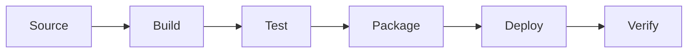
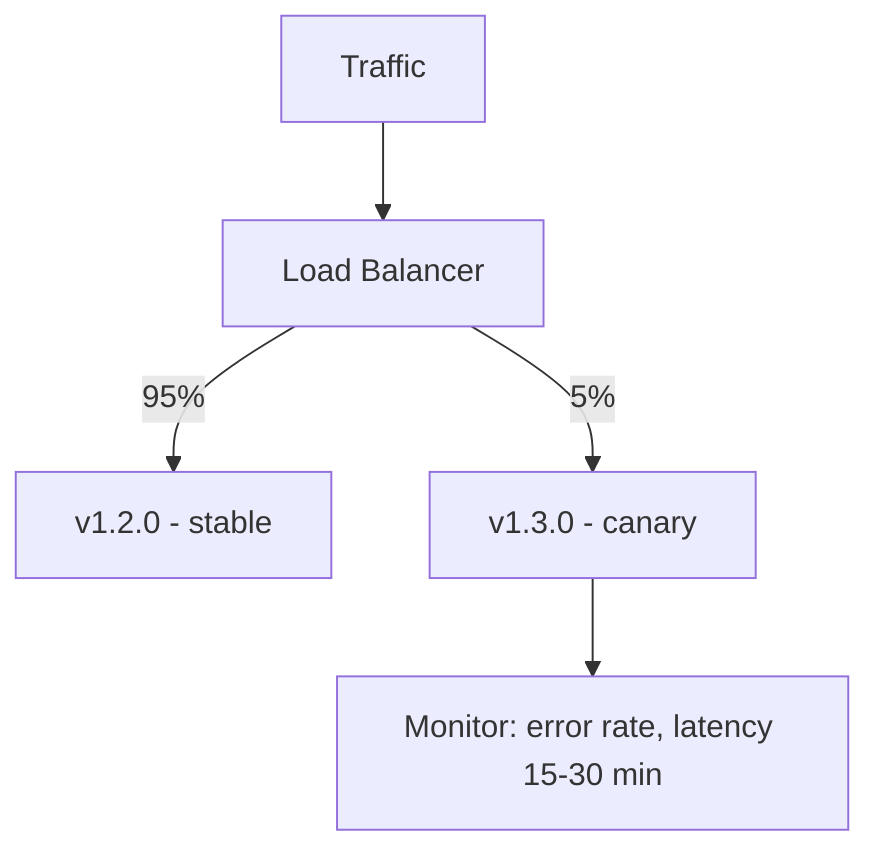

Release engineering adalah proses build, package, dan deploy software secara reliable dalam skala besar. Bukan sekadar "deploy code" — ini mencakup seluruh perjalanan software dari source control sampai production, dengan tetap menjaga kecepatan delivery.

Artikel ini membahas prinsip-prinsip dari Google SRE Book Chapter 8: hermetic builds, progressive delivery, dan cara membangun automated release pipeline dengan semantic versioning.

> Jika Anda belum membaca artikel sebelumnya, mulai dari [Advanced SRE: Data Integrity](/posts/advanced-sre-data-integrity/).

## Prerequisites

- Pemahaman CI/CD pipelines — baca: [Intermediate SRE: Alerting Strategy](/posts/intermediate-sre-alerting-strategy/)
- Error Budget Policy — baca: [Advanced SRE: Error Budget](/posts/advanced-sre-error-budget/)
- Pengalaman dengan container builds (Docker/OCI)
- Familiar dengan Kubernetes deployments dan GitHub Actions

## Apa itu Release Engineering

Di Google, release engineering adalah disiplin tersendiri — bukan tugas sampingan. Developer bertanggung jawab atas release service mereka sendiri, sementara release engineer menyediakan platform dan tooling yang memudahkan proses tersebut (Google SRE Book, Chapter 8).



## Prinsip Release Process

### Hermetic Builds

Hermetic build artinya: siapa pun yang menjalankan build, di mesin mana pun, hasilnya selalu sama. Tiga syaratnya:

- **Deterministic** — input sama = output sama, selalu
- **Isolated** — tidak bergantung pada package atau state di mesin host
- **Versioned** — semua tools dan dependency di-pin ke versi spesifik

### Containerized Builds

```dockerfile
# Build stage - pinned versions, no external dependencies
FROM golang:1.21.5-alpine3.19 AS builder
WORKDIR /app
COPY go.mod go.sum ./
RUN go mod download
COPY . .
RUN CGO_ENABLED=0 go build -ldflags="-s -w -X main.version=${VERSION}" -o /app/server

# Runtime stage - minimal attack surface
FROM gcr.io/distroless/static:nonroot
COPY --from=builder /app/server /server
ENTRYPOINT ["/server"]
```

### Automation Over Manual Process

| Principle | Manual Risk | Automated Benefit |
|-----------|-------------|-------------------|
| Consistency | Human error di langkah-langkah | Identik setiap kali |
| Speed | Berjam-jam per release | Menit per release |
| Auditability | "Kayaknya sudah melakukan X" | Trail log lengkap |
| Frequency | Mingguan paling bagus | Beberapa kali per hari |

## Deployment Strategies

### Canary Deployment



### Progressive Delivery

Gabungan canary + automated analysis + gradual rollout:

1. Deploy ke 1% → automated metrics check
2. Promosi ke 10% → automated metrics check
3. Promosi ke 50% → automated metrics check
4. Full rollout (100%)

Tools: Argo Rollouts, Flagger, Spinnaker.

### Rolling Deployment (Kubernetes Default)

```yaml
spec:
  strategy:
    type: RollingUpdate
    rollingUpdate:
      maxSurge: 25%
      maxUnavailable: 0
```

## Release Velocity vs Stability

Ini adalah tension klasik: tim product ingin release cepat, tim ops ingin stabilitas. SRE Book menyelesaikan ini dengan error budgets — selama budget masih tersisa, boleh release. Budget habis, fokus perbaiki reliability dulu.

Empat metrik utama untuk mengukur performa release (DORA metrics):

- Deploy frequency
- Lead time for changes
- Change failure rate
- Mean time to recovery (MTTR)

## Feature Flags

Feature flags memisahkan deployment dari release. Code sudah ada di production, tapi fitur baru bisa diaktifkan secara terpisah — tanpa perlu deploy ulang.

```yaml
flags:
  new_checkout_flow:
    enabled: false
    rollout_percentage: 0
    allowed_users: ["internal-testers"]
  improved_search:
    enabled: true
    rollout_percentage: 25
```

## Hands-on: Automated Release Pipeline

### Semantic Versioning dengan Conventional Commits

```bash
# Format commit message menentukan version bump
# fix: → PATCH (1.0.0 → 1.0.1)
# feat: → MINOR (1.0.0 → 1.1.0)
# feat!: or BREAKING CHANGE: → MAJOR (1.0.0 → 2.0.0)

git commit -m "feat: add payment retry logic"
git commit -m "fix: resolve timeout in checkout flow"
```

### GitHub Actions Release Pipeline

```yaml
name: Release Pipeline
on:
  push:
    branches: [main]

permissions:
  contents: write
  packages: write

jobs:
  release:
    runs-on: ubuntu-latest
    outputs:
      new_release: ${{ steps.semantic.outputs.new_release_published }}
      version: ${{ steps.semantic.outputs.new_release_version }}
    steps:
      - uses: actions/checkout@v4
        with:
          fetch-depth: 0
      - name: Semantic Release
        id: semantic
        uses: cycjimmy/semantic-release-action@v4
        env:
          GITHUB_TOKEN: ${{ secrets.GITHUB_TOKEN }}

  build-and-push:
    needs: release
    if: needs.release.outputs.new_release == 'true'
    runs-on: ubuntu-latest
    steps:
      - uses: actions/checkout@v4
      - name: Build and push container
        uses: docker/build-push-action@v5
        with:
          push: true
          tags: |
            ${{ env.REGISTRY }}/${{ env.IMAGE }}:${{ needs.release.outputs.version }}
            ${{ env.REGISTRY }}/${{ env.IMAGE }}:latest
```

### Argo Rollouts Progressive Delivery

```yaml
apiVersion: argoproj.io/v1alpha1
kind: Rollout
metadata:
  name: payment-service
spec:
  strategy:
    canary:
      steps:
        - setWeight: 5
        - pause: { duration: 5m }
        - analysis:
            templates:
              - templateName: success-rate
        - setWeight: 25
        - pause: { duration: 5m }
        - setWeight: 50
        - pause: { duration: 10m }
        - setWeight: 100
```

## Configuration Management

Menurut SRE Book, perubahan konfigurasi menyebabkan outage sama seringnya dengan perubahan code. Karena itu, perlakukan config sama seperti code: ada review, ada pipeline, ada rollback.

```yaml
apiVersion: v1
kind: ConfigMap
metadata:
  name: payment-service-config
  labels:
    app.kubernetes.io/version: "2022.10.15"
data:
  MAX_RETRY_ATTEMPTS: "3"
  TIMEOUT_MS: "5000"
  FEATURE_NEW_GATEWAY: "false"
```

> Jangan pernah menyimpan secrets di file config. Gunakan external secret managers seperti AWS Secrets Manager atau HashiCorp Vault.

## Studi Kasus: TechStartup Indonesia

### Konteks

TSI di Scale Phase (2022) berkembang menjadi 15 microservices dengan 6 squad yang release secara independen tanpa standarisasi.

Kondisi sebelumnya:
- Deploy time rata-rata 4 jam per service
- Change failure rate 23%
- Rollback time 45 menit
- Tim SRE menghabiskan 60% waktu untuk deploy
- Proses release manual tanpa standarisasi antar squad

### Apa yang Dilakukan

TSI mengimplementasikan platform release engineering terstandarisasi:

1. **Reusable GitHub Actions Workflow** — Satu template untuk semua 15 services
2. **Hermetic Container Builds** — Multi-stage Dockerfile dengan pinned dependencies
3. **Semantic Versioning** — Conventional Commits + automated version bumping
4. **Argo Rollouts Progressive Delivery** — Canary 5% → 25% → 50% → 100% dengan automated analysis

### Metrics Improvement

| Metric | Sebelum | Sesudah | Perubahan |
|--------|---------|---------|-----------|
| Deploy frequency | 2x/week | 12x/day | +500% |
| Lead time (commit→prod) | 4 hours | 18 minutes | -92% |
| Change failure rate | 23% | 4.2% | -82% |
| MTTR (rollback time) | 45 min | 2 min | -96% |
| SRE time on deploys | 60% | 10% | -83% |
| Release audit compliance | Manual/partial | 100% auto | ✓ |

### Lessons Learned

**Yang Berhasil:**
- Reusable workflow templates — satu perubahan improve semua 15 service
- Argo Rollouts automated analysis menghilangkan keputusan canary berdasarkan "gut feeling"
- Conventional Commits di-enforce via pre-commit hooks — developer adaptasi dalam 2 minggu
- Progressive delivery menangkap 3 release buruk di canary sebelum impact ke user

**Yang Perlu Dihindari:**
- Awalnya mencoba migrasi semua 15 service sekaligus — seharusnya mulai dari 2-3 pilot service
- Lupa meng-pin versi GitHub Actions — update runner merusak build selama sehari
- Tidak setup CODEOWNERS untuk shared workflow — breaking changes ter-ship tanpa review
- Skip changelog untuk internal services — membuat investigasi insiden lebih sulit

## Best Practices

- **Perlakukan release sebagai produk** — investasi di tooling, ukur developer experience
- **Hermetic builds wajib** — pin semua dependency, gunakan multi-stage builds
- **Automate seluruh proses** — kalau masih ada langkah manual, cepat atau lambat akan gagal
- **Gunakan semantic versioning** — nomor versi harus komunikasikan apa yang berubah
- **Progressive delivery** — jangan pernah langsung 0% ke 100% dalam satu langkah
- **Sign dan scan artifacts** — supply chain security adalah standar minimum
- **Rollback harus lebih cepat dari roll-forward** — desain sistem agar bisa instant rollback

## Selanjutnya

Artikel berikutnya: [Advanced SRE: Automation Evolution](/posts/advanced-sre-automation-evolution/) — bagaimana automation berevolusi dari scripts sederhana ke self-healing systems.

Topik terkait yang bisa dieksplorasi:
- Automation Evolution — evolusi dari manual ke self-healing systems
- Error Budget — mengatur release velocity melalui error budgets
- Toil Reduction — mengurangi repetitive deployment tasks

## References

- [Google SRE Book - Chapter 8: Release Engineering](https://sre.google/sre-book/release-engineering/)
- [Semantic Versioning 2.0.0](https://semver.org/)
- [Conventional Commits](https://www.conventionalcommits.org/)
- [Argo Rollouts Documentation](https://argoproj.github.io/argo-rollouts/)
- [DORA Metrics - State of DevOps](https://dora.dev/)

---

## Navigasi Series

⬅️ **Sebelumnya:** [Advanced SRE: Data Integrity](/posts/advanced-sre-data-integrity/)

➡️ **Selanjutnya:** [Advanced SRE: Automation Evolution](/posts/advanced-sre-automation-evolution/)