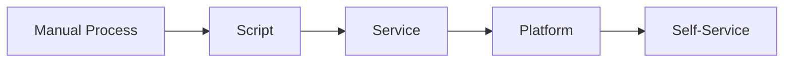
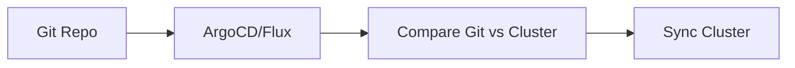

Automation bukan sesuatu yang binary — bukan cuma "manual" atau "otomatis". Ini adalah spektrum, dari runbook yang dijalankan manusia sampai sistem yang bisa detect, diagnose, dan resolve masalah sendiri tanpa campur tangan.

Artikel ini membahas evolusi automation berdasarkan Google SRE Book Chapter 7, lalu diperluas ke pattern modern: Kubernetes operators, GitOps, dan event-driven automation.

> Jika Anda belum membaca artikel sebelumnya, mulai dari [Advanced SRE: Release Engineering](/posts/advanced-sre-release-engineering/).

## Prerequisites

- Release Engineering — baca: [Advanced SRE: Release Engineering](/posts/advanced-sre-release-engineering/)
- Toil Reduction — baca: [Advanced SRE: Toil Reduction](/posts/advanced-sre-toil-reduction/)
- Pengalaman operasikan sistem production (2+ tahun)
- Familiar dengan Kubernetes controllers, operators, dan CRDs

## The Automation Hierarchy

Google SRE Book menggambarkan automation sebagai tangga dengan 5 level:

**Level 1: Manual** — Manusia baca runbook, eksekusi setiap langkah satu per satu.

**Level 2: Scripted** — Manusia jalankan script, tapi masih handle edge cases secara manual.

**Level 3: Automated** — Manusia trigger, sistem eksekusi end-to-end tanpa intervensi.

**Level 4: Autonomous** — Sistem trigger sendiri dan ambil keputusan dalam batasan yang sudah ditentukan.

**Level 5: Self-Healing** — Sistem detect, diagnose, dan resolve masalah tanpa manusia sama sekali.

| Level | Trigger | Execution | Decision | Example |
|-------|---------|-----------|----------|---------|
| Manual | Human | Human | Human | SSH ke server, restart process |
| Scripted | Human | Script | Human | Menjalankan `restart_service.sh` |
| Automated | Human | System | System | Klik "Deploy" di CI/CD |
| Autonomous | System | System | System (bounded) | HPA scale pods berdasarkan CPU |
| Self-Healing | System | System | System (adaptive) | Operator detect corruption, rebuild replica |

Insight kunci dari Chapter 7: **setiap level menjadi fondasi untuk level berikutnya**. Script berkembang jadi library, library jadi service, service jadi platform.

## Value of Automation

Google mengidentifikasi tiga nilai inti:

### Consistency
Manusia membuat kesalahan, terutama di bawah tekanan. Failover jam 3 pagi yang dijalankan engineer yang baru bangun tidur punya error rate jauh lebih tinggi dibanding yang dijalankan oleh code.

### Speed
Sistem otomatis bereaksi dalam hitungan detik. Kalau manusia: alert → bangun → buka laptop → cari context → diagnosa → bertindak. Itu bisa makan waktu 15-45 menit.

### Platform Building



Setiap investasi automation berlipat ganda — script untuk setup cluster berkembang jadi service, lalu jadi platform self-service yang bisa dipakai semua tim.

## Automation Pitfalls

Chapter 7 juga jujur soal sisi gelap automation:

- **Complexity Debt** — setiap automation itu code yang butuh maintenance
- **False Confidence** — "sudah otomatis, pasti aman" adalah asumsi berbahaya
- **Maintenance Burden** — automation code membusuk lebih cepat dari application code karena jarang di-review
- **Sorcerer's Apprentice Problem** — automation yang berjalan lebih cepat dari kemampuan manusia untuk menghentikannya

> Kalau automation bisa menyebabkan kerusakan lebih besar dari masalah yang dipecahkannya, maka automation tersebut butuh circuit breaker dan human approval gate.

## Modern Automation Patterns

### Kubernetes Operators

Operator meng-encode pengetahuan operasional ke dalam software. Konsepnya: extend control loop Kubernetes untuk manage custom resources secara otomatis.

```go
func (r *DatabaseReconciler) Reconcile(ctx context.Context, req ctrl.Request) (ctrl.Result, error) {
    var db v1alpha1.Database
    if err := r.Get(ctx, req.NamespacedName, &db); err != nil {
        return ctrl.Result{}, client.IgnoreNotFound(err)
    }

    actual, err := r.getActualState(ctx, &db)
    if err != nil {
        return ctrl.Result{}, err
    }

    if !reflect.DeepEqual(db.Spec, actual) {
        return r.reconcile(ctx, &db, actual)
    }

    return ctrl.Result{RequeueAfter: 30 * time.Second}, nil
}
```

### GitOps

GitOps mengubah source of truth: bukan "apa yang sedang running di cluster", tapi "apa yang ada di Git". Automation-nya sederhana — detect drift antara Git dan cluster, lalu reconcile.



### Event-Driven Automation

Sistem modern bereaksi terhadap event, bukan polling:

```yaml
apiVersion: argoproj.io/v1alpha1
kind: Sensor
metadata:
  name: pod-crash-loop-handler
spec:
  triggers:
    - template:
        name: restart-with-increased-memory
        k8s:
          operation: patch
```

## Self-Healing Systems

### Auto-Restart (Level 1)

```yaml
livenessProbe:
  httpGet:
    path: /healthz
    port: 8080
  initialDelaySeconds: 10
  periodSeconds: 5
  failureThreshold: 3
```

### Auto-Scale (Level 2)

```yaml
apiVersion: autoscaling/v2
kind: HorizontalPodAutoscaler
metadata:
  name: payment-service
spec:
  minReplicas: 3
  maxReplicas: 20
  metrics:
    - type: Resource
      resource:
        name: cpu
        target:
          type: Utilization
          averageUtilization: 70
  behavior:
    scaleUp:
      stabilizationWindowSeconds: 60
    scaleDown:
      stabilizationWindowSeconds: 300
```

### Auto-Rollback (Level 3)

```yaml
apiVersion: argoproj.io/v1alpha1
kind: Rollout
metadata:
  name: order-service
spec:
  strategy:
    canary:
      steps:
        - setWeight: 10
        - pause: {duration: 5m}
        - analysis:
            templates:
              - templateName: error-rate-check
        - setWeight: 50
        - pause: {duration: 10m}
        - analysis:
            templates:
              - templateName: latency-check
```

### Circuit Breakers (Level 4)

```yaml
apiVersion: networking.istio.io/v1beta1
kind: DestinationRule
metadata:
  name: payment-gateway
spec:
  host: payment-gateway.prod.svc.cluster.local
  trafficPolicy:
    outlierDetection:
      consecutive5xxErrors: 5
      interval: 30s
      baseEjectionTime: 60s
      maxEjectionPercent: 50
```

## Kapan TIDAK Mengotomatisasi

| Situation | Why Not | Alternative |
|-----------|---------|-------------|
| Novel incidents | Tidak ada pattern untuk di-encode | Runbooks + decision trees |
| Judgment calls | Tergantung konteks | Human-in-the-loop approval |
| Event langka (<1/tahun) | ROI negatif | Dokumentasikan prosedurnya |
| High-blast-radius + uncertain | Kerusakan melebihi manfaat | Semi-automated dengan gates |
| Proses yang cepat berubah | Automation langsung membusuk | Tunggu sampai stabil |

## Mengukur Efektivitas Automation

| Metric | Formula | Target |
|--------|---------|--------|
| Toil Reduction | (manual_before - manual_after) / manual_before | >50% |
| MTTR | Mean time from alert to resolution | <15 min |
| Human Intervention Rate | manual_interventions / total_incidents | <20% |
| Automation Success Rate | successful_runs / total_runs | >95% |
| False Positive Rate | unnecessary_actions / total_actions | <5% |

## 🏢 Studi Kasus: TechStartup Indonesia

### Konteks

TSI di Optimization Phase (2023) perlu mengurangi operational toil.

Kondisi sebelumnya:
- Tim SRE menghabiskan 60% waktu untuk task repetitif
- 47 bash script tersebar di 3 repo tanpa test dan tanpa ownership
- Database failover makan waktu rata-rata 23 menit
- Certificate renewal menyebabkan 2 outage dalam 6 bulan
- Human intervention rate 85% untuk semua incidents

### Apa yang Dilakukan

TSI adopt pendekatan tiga pilar:

1. **Custom Kubernetes Operators** — Database failover otomatis (23 min → 47 sec), dengan `requireApproval: true` di awal
2. **GitOps dengan ArgoCD** — Multi-cluster deployment, drift detection, dan automated sync
3. **Event-Driven Automation** — Argo Workflows untuk remediation otomatis (restart, scale, failover)

### Metrics Improvement

| Metric | Sebelum | Sesudah | Perubahan |
|--------|---------|---------|-----------|
| DB Failover Time | 23 min | 47 sec | -96% |
| SRE Toil (hrs/week) | 30 hrs | 8 hrs | -73% |
| Human Intervention Rate | 85% | 18% | -79% |
| Automation Success Rate | N/A | 97.3% | — |
| MTTR (P1 incidents) | 45 min | 8 min | -82% |
| Cert-Related Outages | 2/6 months | 0/12 months | -100% |

### Lessons Learned

**Yang Berhasil:**
- Mulai dari task toil tertinggi (DB failover) memberikan ROI langsung dan buy-in tim
- Build operator dengan `requireApproval: true` di awal, baru hapus gate setelah confidence tumbuh
- Investasi di observability operator (Prometheus metrics untuk setiap reconcile loop) menangkap bug lebih awal
- Migrasi bertahap — menjalankan script lama paralel dengan operator baru selama 4 minggu

**Yang Perlu Dihindari:**
- Jangan automate tanpa circuit breakers — operator scaling pertama TSI hampir scale ke 200 pods
- Jangan skip integration tests — operator cert-rotation works di staging tapi gagal di prod karena IAM roles berbeda
- Jangan build custom jika community operators tersedia — TSI membuang 3 minggu build cert operator sebelum menemukan cert-manager
- Jangan automate proses yang belum terdokumentasi — automation meng-encode asumsi yang hidden

## Best Practices

- **Mulai dengan observability** — tidak bisa automate apa yang tidak bisa di-observe
- **Automate berlapis** — Script → Test → Gate → Release. Jangan langsung fully autonomous
- **Setiap automation butuh kill switch** — cara disable instan tanpa perlu deploy code
- **Test automation di production** — chaos engineering memvalidasi self-healing benar-benar bekerja
- **Dokumentasikan "kenapa tidak"** — kalau memutuskan TIDAK automate sesuatu, catat alasannya
- **Perlakukan automation sebagai produk** — butuh owner, SLO, test, monitoring, dan deprecation plan
- **Ukur toil secara kontinu** — track berapa jam per minggu yang dihabiskan untuk task repetitif

## Selanjutnya

Artikel berikutnya: [Advanced SRE: Distributed Consensus](/posts/advanced-sre-distributed-consensus/) — managing critical state di distributed systems menggunakan consensus algorithms.

Topik terkait yang bisa Anda eksplorasi:
- Distributed Consensus — Raft, etcd, dan leader election
- Toil Reduction — identifikasi dan eliminasi toil secara sistematis
- Release Engineering — automated release pipeline dan progressive delivery

## References

- [Google SRE Book - Chapter 7: The Evolution of Automation at Google](https://sre.google/sre-book/automation-at-google/)
- [Kubernetes Operator Pattern](https://kubernetes.io/docs/concepts/extend-kubernetes/operator/)
- [ArgoCD Documentation - Automated Sync Policy](https://argo-cd.readthedocs.io/en/stable/user-guide/auto_sync/)
- [Argo Events - Event-Driven Automation](https://argoproj.github.io/argo-events/)
- [Istio - Circuit Breaking](https://istio.io/latest/docs/tasks/traffic-management/circuit-breaking/)

---

## Navigasi Series

⬅️ **Sebelumnya:** [Advanced SRE: Release Engineering](/posts/advanced-sre-release-engineering/)

➡️ **Selanjutnya:** [Advanced SRE: Distributed Consensus](/posts/advanced-sre-distributed-consensus/)

📚 [Kembali ke Series Index](/posts/sre-learning-series-index/)
