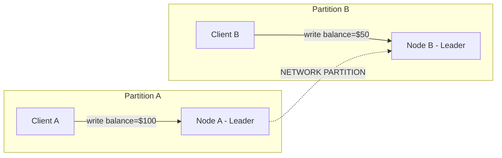
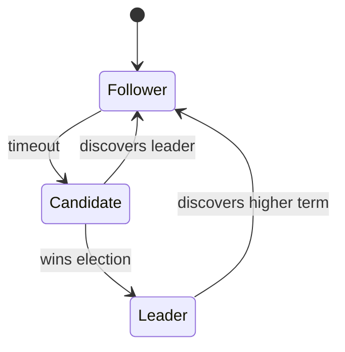
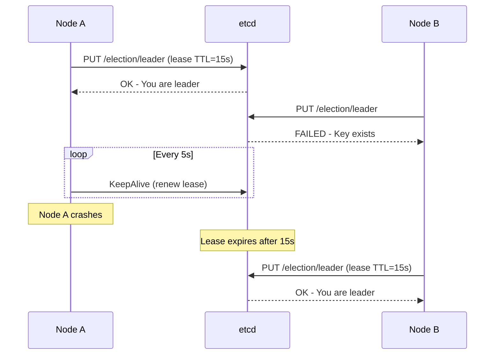

Distributed consensus adalah fondasi dari setiap sistem terdistribusi yang reliable. Intinya: bagaimana beberapa node bisa sepakat soal shared state, padahal network tidak selalu reliable dan mesin bisa mati kapan saja.

Artikel ini membahas consensus algorithms (Paxos, Raft, ZAB), implementasi praktis (etcd, Consul, CockroachDB), dan pattern untuk mengelola critical state — leader election, distributed locks, dan job scheduling. Referensi utama: Google SRE Book Chapters 23-25.

> Jika Anda belum membaca artikel sebelumnya, mulai dari [Advanced SRE: Automation Evolution](/posts/advanced-sre-automation-evolution/).

## Prerequisites

- Data Integrity — baca: [Advanced SRE: Data Integrity](/posts/advanced-sre-data-integrity/)
- Pemahaman fundamental distributed systems (CAP theorem, network partitions)
- Pengalaman dengan Kubernetes dan etcd
- Familiar dengan Go dan gRPC

## Kenapa Distributed Consensus Penting

Tanpa consensus, sistem terdistribusi mengalami:

- **Split-brain** — dua node sama-sama yakin mereka leader
- **Data inconsistency** — replica berbeda menyajikan value berbeda
- **Lost updates** — concurrent write saling overwrite tanpa terdeteksi
- **Zombie leaders** — leader yang terpartisi terus terima write yang akhirnya hilang

Contoh split-brain scenario:



Hasilnya: kedua client yakin payment berhasil, tapi balance inconsistent di kedua sisi. Ini yang consensus algorithms cegah.

Google SRE Book (Chapter 23): **"Use distributed consensus systems for critical state."**

## Consensus Algorithms Overview

### Raft (Ongaro & Ousterhout, 2014)

Raft sengaja di-design agar mudah dipahami (berbeda dengan Paxos yang terkenal sulit). Raft memecah consensus menjadi tiga sub-problem:

1. **Leader Election** — satu leader per term, dipilih oleh majority vote
2. **Log Replication** — leader menambahkan entry, mereplikasi ke follower
3. **Safety** — committed entry tidak pernah hilang atau ditimpa



Key properties:
- Election timeout: di-randomize (150-300ms) untuk avoid split vote
- Committed = sudah ter-replicate ke majority (⌊n/2⌋ + 1 node)

### Comparison Summary

| Algorithm | Understandability | Performance | Production Use |
|-----------|------------------|-------------|----------------|
| Paxos | Low | High | Google Chubby, Spanner |
| Raft | High | High | etcd, Consul, CockroachDB |
| ZAB | Medium | Medium | ZooKeeper, Kafka (legacy) |

## Managing Critical State

### Leader Election

Pattern paling umum: acquire lease pada key yang di-back oleh consensus. Lease punya TTL — kalau leader gagal renew, node lain bisa take over.



### Distributed Locks dan Fencing Tokens

Distributed lock bersifat **advisory** — hanya bekerja kalau semua participant menghormatinya. Masalahnya: zombie lock. Fencing token menyelesaikan ini:

1. Client A acquire lock, dapat token=33
2. Client A mengalami GC pause atau network delay (lock expire tanpa disadari)
3. Client B acquire lock (karena sudah expire), dapat token=34
4. Client A bangun, kirim write dengan token=33
5. Storage **reject** token=33 karena sudah pernah lihat token=34 → data aman

> Redis Redlock kontroversial untuk correctness ([lihat analisis Martin Kleppmann](https://martin.kleppmann.com/2016/02/08/how-to-do-distributed-locking.html)). Untuk safety-critical lock, gunakan etcd atau ZooKeeper.

### Distributed Locks Anti-patterns

| Anti-pattern | Problem | Solution |
|-------------|---------|----------|
| Lock without TTL | Dead client hold lock selamanya | Selalu set TTL |
| Lock without fencing | Zombie holder corrupt data | Gunakan fencing token |
| Long-held locks | Block semua pekerjaan lain | Jaga critical section pendek |
| Lock for performance only | Consensus overhead terlalu tinggi | Gunakan optimistic concurrency |

## Hands-on: Leader Election with etcd + Go

```go
package main

import (
	"context"
	"fmt"
	"log"
	"os"
	"os/signal"
	"time"

	clientv3 "go.etcd.io/etcd/client/v3"
	"go.etcd.io/etcd/client/v3/concurrency"
)

func main() {
	nodeID := os.Getenv("NODE_ID")
	if nodeID == "" {
		nodeID = "node-1"
	}

	cli, err := clientv3.New(clientv3.Config{
		Endpoints:   []string{"localhost:2379"},
		DialTimeout: 5 * time.Second,
	})
	if err != nil {
		log.Fatal(err)
	}
	defer cli.Close()

	sess, err := concurrency.NewSession(cli, concurrency.WithTTL(10))
	if err != nil {
		log.Fatal(err)
	}
	defer sess.Close()

	election := concurrency.NewElection(sess, "/election/scheduler")

	ctx, cancel := context.WithCancel(context.Background())
	defer cancel()

	sigCh := make(chan os.Signal, 1)
	signal.Notify(sigCh, os.Interrupt)
	go func() {
		<-sigCh
		fmt.Printf("[%s] Resigning leadership\n", nodeID)
		election.Resign(ctx)
		cancel()
	}()

	fmt.Printf("[%s] Campaigning for leader...\n", nodeID)
	if err := election.Campaign(ctx, nodeID); err != nil {
		log.Fatal(err)
	}

	fmt.Printf("[%s] I am the leader!\n", nodeID)

	for {
		select {
		case <-ctx.Done():
			return
		case <-time.After(3 * time.Second):
			fmt.Printf("[%s] Performing leader duties\n", nodeID)
		}
	}
}
```

Jalankan dengan beberapa instance:

```bash
# Terminal 1
NODE_ID=node-1 go run main.go

# Terminal 2
NODE_ID=node-2 go run main.go

# Kill terminal 1 — node-2 becomes leader within 10s (TTL)
```

## Distributed Cron & Job Scheduling

Single-machine cron punya dua masalah fatal: kalau mesin mati, job tidak jalan. Kalau ada beberapa mesin, job bisa jalan duplikat.

Solusinya: leader-based scheduling dengan consensus store yang track job ownership. Dan satu aturan penting — job HARUS idempotent, karena at-least-once delivery adalah guarantee terbaik yang bisa didapat di sistem terdistribusi.

## Failure Modes and Recovery

| Scenario | Impact | Mitigation |
|----------|--------|-----------|
| Single node failure | Raft handle otomatis (<1 detik) | Automatic leader election |
| Quorum loss | Cluster unavailable | Restore dari snapshot |
| Network partition (minority) | Terpartisi menjadi read-only | Client retry ke majority |
| Data corruption | Inconsistent state | `etcdctl snapshot restore` |

```bash
# Check etcd cluster health
etcdctl endpoint health --cluster
etcdctl endpoint status --cluster -w table

# Key metrics to monitor
# etcd_server_has_leader (should always be 1)
# etcd_server_leader_changes_seen_total (spikes = instability)
# etcd_disk_wal_fsync_duration_seconds (>10ms = disk too slow)
```

## Studi Kasus: TechStartup Indonesia

### Konteks

TSI di Scale Phase (2022 Q1) melakukan ekspansi multi-region dan menghadapi masalah critical distributed state dalam pemrosesan pembayaran.

Masalah yang terjadi:
- 3 replicas payment service memproses order yang sama secara concurrent
- Terjadi double-charge dan inventory oversell
- 23 insiden double-charge di Q4 2021
- $47,000 dalam refund yang salah

Kondisi sebelumnya (Redis SETNX untuk locking):
- Single Redis sebagai SPOF
- Tanpa fencing tokens
- Tanpa audit trail
- Lock service uptime hanya 99.2%

### Apa yang Dilakukan

TSI deploy dedicated consensus-based locking:

1. **5-Node etcd Cluster** — Dedicated cluster (terpisah dari K8s etcd), di 3 AZ
2. **Go-Based Lock Service Sidecar** — Payment app tidak perlu etcd client library langsung
3. **Fencing Token Pattern** — Menggunakan etcd revision (monotonically increasing)
4. **Audit Logging** — Setiap lock acquisition/release di-log untuk PCI-DSS compliance

### Metrics Improvement

| Metric | Sebelum | Sesudah | Perubahan |
|--------|---------|---------|-----------|
| Double-charge incidents | 23/quarter | 0/quarter | -100% |
| Lock service uptime | 99.2% | 99.99% | +0.79% |
| Payment timeout rate | 8% (peak) | 0.3% (peak) | -96% |
| Lock acquisition p99 | 45ms | 12ms | -73% |
| PCI-DSS audit findings | 3 critical | 0 critical | -100% |
| Refund costs (monthly) | $15,700 | $200 | -99% |

### Lessons Learned

**Yang Berhasil:**
- Dedicated etcd cluster untuk locking (terpisah dari K8s etcd) — isolate blast radius
- Fencing token menggunakan etcd revision — monotonically increasing, tidak depend clock
- Lock sidecar pattern — payment app tidak perlu etcd client library
- 5-node cluster di 3 AZ — survive AZ failure sambil maintain quorum

**Yang Perlu Dihindari:**
- Jangan gunakan Redis Redlock untuk payment-critical lock — risiko clock skew tidak acceptable
- Jangan share etcd cluster dengan Kubernetes control plane — noisy neighbor kill API server
- Jangan set lock TTL terlalu pendek — GC pause di Java menyebabkan false expiration
- Jangan skip fencing token — "mungkin tidak akan terjadi" menghabiskan $47K untuk TSI

## Best Practices

- **Gunakan cluster size ganjil (3 atau 5)** — maximize fault tolerance per node
- **Pisahkan consensus cluster per fungsi** — isolate blast radius
- **SSD storage dengan <10ms fsync** — Raft membutuhkan durable write
- **Monitor leader change** — election yang sering = masalah network/disk
- **Selalu gunakan fencing token** — prevent corruption dari zombie leader
- **Buat job idempotent** — at-least-once adalah yang terbaik yang bisa didapat
- **Backup etcd snapshot** — quorum loss membutuhkan restore dari backup

## Selanjutnya

Artikel berikutnya: [Advanced SRE: Testing for Reliability](/posts/advanced-sre-testing-for-reliability/) — testing consensus system under failure dan strategi reliability testing komprehensif.

Topik terkait yang bisa Anda eksplorasi:
- Testing for Reliability — load testing, chaos engineering, dan DR drills
- Data Integrity — backup strategy dan data validation
- Chaos Engineering — testing distributed systems under failure

## References

- [Google SRE Book - Chapter 23: Managing Critical State](https://sre.google/sre-book/managing-critical-state/)
- [Raft Consensus Algorithm](https://raft.github.io/)
- [etcd Documentation](https://etcd.io/docs/)
- [Martin Kleppmann - How to do distributed locking](https://martin.kleppmann.com/2016/02/08/how-to-do-distributed-locking.html)
- [Consul Architecture](https://developer.hashicorp.com/consul/docs/architecture)

---

## Navigasi Series

⬅️ **Sebelumnya:** [Advanced SRE: Automation Evolution](/posts/advanced-sre-automation-evolution/)

➡️ **Selanjutnya:** [Advanced SRE: Testing for Reliability](/posts/advanced-sre-testing-for-reliability/)