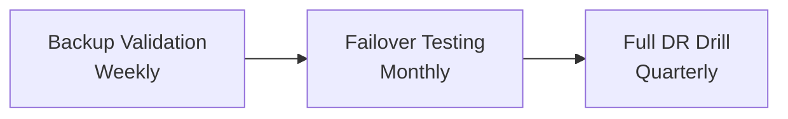
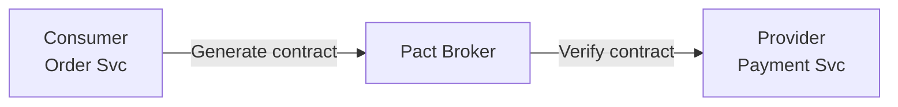

Reliability tidak terjadi secara kebetulan — reliability harus di-test sampai terbukti ada. Artikel ini membahas spektrum penuh reliability testing: dari unit test yang menangkap regresi, sampai disaster recovery drill yang membuktikan sistem bisa survive saat kegagalan besar.

Referensi utama: Google SRE Book Chapters 16-17.

> Jika Anda belum membaca artikel sebelumnya, mulai dari [Advanced SRE: Distributed Consensus](/posts/advanced-sre-distributed-consensus/).

## Prerequisites

- SLI/SLO/SLA — baca: [Advanced SRE: SLI, SLO, dan SLA](/posts/advanced-sre-sli-slo-dan-sla/)
- Chaos Engineering — baca: [Advanced SRE: Chaos Engineering](/posts/advanced-sre-chaos-engineering/)
- Pengalaman dengan Kubernetes dan arsitektur microservices
- Familiar dengan CI/CD pipeline (GitHub Actions atau sejenisnya)

## The Reliability Testing Pyramid

Reliability testing bukan cuma unit test. Ada beberapa layer, masing-masing menjawab pertanyaan berbeda:

| Layer | Pertanyaan yang Dijawab | Frekuensi |
|-------|------------------------|-----------|
| Unit / Component | Apakah fungsi ini handle edge case? | Every commit |
| Integration / Contract | Apakah service berkomunikasi dengan benar? | Every commit |
| Load / Stress | Bisa handle traffic expected dan peak? | Per release |
| Chaos Engineering | Apakah sistem degrade secara graceful saat failure? | Weekly |
| DR Drills | Bisa recover dari kegagalan besar? | Quarterly |

Semakin ke atas, semakin mahal dan jarang dijalankan — tapi semakin tinggi confidence yang didapat.

## Types of Reliability Tests

| Test Type | Purpose | Duration | Traffic Pattern |
|-----------|---------|----------|-----------------|
| Smoke | Verifikasi basic functionality setelah deploy | 1-5 min | Minimal requests |
| Load | Validasi performance pada expected traffic | 15-60 min | Steady ramp-up |
| Stress | Cari breaking point beyond capacity | 30-60 min | Beyond peak |
| Soak | Detect memory leak, resource exhaustion | 4-24 hours | Sustained load |
| Spike | Test sudden traffic spike | 10-30 min | Sharp spikes |
| Chaos | Validasi fault tolerance | Varies | Normal + failures |

## Testing in Production

### Canary Analysis

```yaml
apiVersion: argoproj.io/v1alpha1
kind: AnalysisTemplate
metadata:
  name: success-rate
spec:
  metrics:
    - name: success-rate
      interval: 60s
      successCondition: result[0] >= 0.995
      provider:
        prometheus:
          address: http://prometheus:9090
          query: |
            sum(rate(http_requests_total{service="{{args.service-name}}",
              status=~"2.."}[5m])) /
            sum(rate(http_requests_total{service="{{args.service-name}}"}[5m]))
```

### Traffic Shadowing

Copy production traffic ke versi baru tanpa affect user:

```yaml
apiVersion: networking.istio.io/v1beta1
kind: VirtualService
metadata:
  name: catalog-service
spec:
  http:
    - route:
        - destination:
            host: catalog-service
            subset: stable
          weight: 100
      mirror:
        host: catalog-service
        subset: canary
      mirrorPercentage:
        value: 20.0
```

### Dark Launching

Aktifkan code path baru di production tanpa expose ke user:

```go
func ProcessOrder(ctx context.Context, order Order) (*Result, error) {
    result, err := currentProcessor.Process(ctx, order)

    if featureflags.IsEnabled("new-order-processor") {
        go func() {
            newResult, newErr := newProcessor.Process(ctx, order)
            metrics.CompareResults("order-processing", result, newResult, err, newErr)
        }()
    }

    return result, err
}
```

## Disaster Recovery Testing



### Backup Validation Script

```bash
#!/bin/bash
DB_SNAPSHOT=$(aws rds describe-db-snapshots \
  --db-instance-identifier prod-aurora-cluster \
  --query 'DBSnapshots | sort_by(@, &SnapshotCreateTime) | [-1].DBSnapshotIdentifier' \
  --output text)

aws rds restore-db-instance-from-db-snapshot \
  --db-instance-identifier "restore-test-$(date +%Y%m%d)" \
  --db-snapshot-identifier "$DB_SNAPSHOT" \
  --db-instance-class db.t3.medium \
  --no-multi-az

# Validate row counts against production
PROD_COUNT=$(psql "$PROD_DSN" -t -c "SELECT count(*) FROM orders WHERE created_at > now() - interval '24h'")
RESTORE_COUNT=$(psql "$RESTORE_DSN" -t -c "SELECT count(*) FROM orders WHERE created_at > now() - interval '24h'")

if [ "$PROD_COUNT" -ne "$RESTORE_COUNT" ]; then
  echo "ALERT: Row count mismatch!"
  exit 1
fi
```

### Failover Testing Checklist

| Test | Validation | Pass Criteria |
|------|-----------|---------------|
| RDS failover | Promote read replica | < 60s downtime |
| AZ evacuation | Drain one AZ | Zero dropped requests |
| DNS failover | Switch Route53 records | < 5min propagation |
| Redis failover | Kill primary node | Auto-failover < 30s |
| EKS node failure | Terminate random node | Pods reschedule < 2min |

## Load Testing with k6

```javascript
import http from 'k6/http';
import { check, sleep } from 'k6';
import { Rate, Trend } from 'k6/metrics';

const errorRate = new Rate('errors');
const checkoutDuration = new Trend('checkout_duration');

export const options = {
  stages: [
    { duration: '2m', target: 100 },
    { duration: '5m', target: 100 },
    { duration: '2m', target: 500 },
    { duration: '5m', target: 500 },
    { duration: '2m', target: 0 },
  ],
  thresholds: {
    http_req_duration: ['p(95)<500', 'p(99)<1000'],
    errors: ['rate<0.01'],
    checkout_duration: ['p(95)<2000'],
  },
};

export default function () {
  const catalog = http.get('http://api.internal/v1/products?page=1&limit=20');
  check(catalog, { 'catalog 200': (r) => r.status === 200 });
  sleep(1);

  const start = Date.now();
  const checkout = http.post('http://api.internal/v1/orders/checkout', JSON.stringify({
    payment_method: 'credit_card',
    shipping_address_id: 'addr-123',
  }), { headers: { 'Content-Type': 'application/json' } });

  checkoutDuration.add(Date.now() - start);
  errorRate.add(checkout.status !== 200);
  check(checkout, { 'checkout 200': (r) => r.status === 200 });
  sleep(2);
}
```

## Contract Testing for Microservices

Salah satu penyebab outage paling umum di arsitektur microservices adalah integration failure — service A mengubah response format tanpa memberitahu service B. Contract testing memastikan kedua sisi sepakat soal API schema:



```go
func TestPaymentServiceContract(t *testing.T) {
    pact := dsl.Pact{
        Consumer: "OrderService",
        Provider: "PaymentService",
    }
    defer pact.Teardown()

    pact.AddInteraction().
        Given("a valid payment method exists").
        UponReceiving("a charge request").
        WithRequest(dsl.Request{
            Method: "POST",
            Path:   dsl.String("/v1/charges"),
            Body: map[string]interface{}{
                "amount":   50000,
                "currency": "IDR",
            },
        }).
        WillRespondWith(dsl.Response{
            Status: 200,
            Body: map[string]interface{}{
                "charge_id": dsl.Like("ch_abc123"),
                "status":    "succeeded",
            },
        })
}
```

## Outage → Test Case Pipeline

Setiap outage harus menghasilkan setidaknya satu test case baru:

| Incident Type | Test to Add | Example |
|---------------|-------------|---------|
| Capacity exhaustion | Load test dengan ceiling lebih tinggi | DB connection habis saat sale |
| Cascading failure | Chaos experiment (kill dependency) | Payment timeout → cart failure |
| Data corruption | Backup restore + integrity check | Bad migration corrupt order |
| Configuration error | Smoke test buat config validation | Env var salah di production |
| Dependency failure | Contract test + circuit breaker test | Third-party API ubah schema |

## Continuous Reliability Testing in CI/CD

```yaml
name: Reliability Tests
on:
  push:
    branches: [main]
  schedule:
    - cron: '0 2 * * 1'

jobs:
  smoke-test:
    runs-on: ubuntu-latest
    steps:
      - uses: actions/checkout@v4
      - name: Deploy to staging
        run: kubectl apply -k overlays/staging/
      - name: Run smoke tests
        run: k6 run tests/smoke/all-services.js
        timeout-minutes: 5

  load-test:
    needs: smoke-test
    runs-on: ubuntu-latest
    steps:
      - uses: actions/checkout@v4
      - name: Run load test
        run: |
          k6 run tests/load/checkout-flow.js \
            --out json=results.json
      - name: Check thresholds
        run: |
          python scripts/check-load-results.py results.json \
            --p95-latency 500 \
            --error-rate 0.01
```

## Studi Kasus: TechStartup Indonesia

### Konteks

TSI di Scale Phase (2022) mengalami outage 45 menit saat flash sale 11.11 yang menelan Rp 2,3 miliar revenue.

Insiden ini mengekspos gap besar:
- Tidak memiliki load testing
- Tidak ada chaos experiment
- Prosedur DR tidak pernah di-test
- Testing hanya sebatas unit test (72% coverage) dan basic integration test

### Apa yang Dilakukan

TSI build program reliability testing komprehensif selama 8 minggu:

1. **k6 Load Testing** — Termasuk flash sale simulation berdasarkan traffic pattern 11.11
2. **Litmus Chaos Experiments** — Mulai di staging 2 minggu, lalu production dengan circuit breaker
3. **Custom DR Scripts** — Backup validation dan failover testing otomatis
4. **Grafana Dashboard** — Tracking hasil reliability testing, visible untuk leadership
5. **CI/CD Integration** — Semua test di-automate agar benar-benar di-run setiap release

### Metrics Improvement

| Metric | Sebelum | Sesudah | Perubahan |
|--------|---------|---------|-----------|
| P1 Incidents/Quarter | 3 | 0.5 | -83% |
| MTTR (P1) | 38 min | 12 min | -68% |
| Flash Sale Success Rate | 87% | 99.8% | +14.7% |
| Known Capacity Limit | Unknown | Documented | ∞ |
| DR Recovery Time (actual) | Never tested | 18 min | N/A |
| Test Coverage (reliability) | 0% | 78% | +78% |

### Lessons Learned

**Yang Berhasil:**
- Mulai dengan load test dari insiden nyata (traffic pattern 11.11) memberikan hasil langsung relevan
- Menjalankan chaos experiment di staging dulu selama 2 minggu sebelum production — build team confidence
- Meng-automate semua test di CI/CD memastikan test benar-benar di-run
- Membuat reliability testing dashboard di Grafana membuat hasil visible untuk leadership

**Yang Perlu Dihindari:**
- Jangan menjalankan chaos experiment di production tanpa circuit breaker dan kill switch
- Jangan set load test threshold terlalu ketat di awal — mulai longgar, perketat seiring waktu
- Jangan skip "steady state hypothesis" dalam chaos experiment — butuh baseline untuk comparison

## Best Practices

- **Test dari insiden** — setiap postmortem P1/P2 harus menghasilkan minimal satu reliability test baru
- **Automate semuanya** — manual reliability test pasti di-skip cepat atau lambat, masukkan ke CI/CD
- **Test di production dengan aman** — gunakan canary analysis, feature flag, dan traffic mirroring
- **Ketahui limit sebelum user yang menemukan** — ukur kapasitas secara kontinu lewat load test
- **Latih recovery** — backup dan prosedur failover yang tidak pernah di-test itu asumsi, bukan plan
- **Mulai kecil untuk chaos** — kill satu pod dulu sebelum kill seluruh AZ
- **Sediakan kill switch** — setiap experiment harus bisa di-stop secara instan

## Selanjutnya

Selamat! Kita telah menyelesaikan series **Belajar SRE dari Dasar** — 23 artikel dari foundation hingga advanced. Berikut resources untuk melanjutkan perjalanan SRE:

- [Google SRE Books (free online)](https://sre.google/books/) — SRE Book, Workbook, dan Building Secure & Reliable Systems
- [DORA State of DevOps Report](https://dora.dev/) — riset tahunan tentang engineering performance metrics
- [Principles of Chaos Engineering](https://principlesofchaos.org/) — framework untuk chaos engineering di production

## References

- [Google SRE Book - Chapter 17: Testing for Reliability](https://sre.google/sre-book/testing-reliability/)
- [Google SRE Book - Chapter 16: Tracking Outages](https://sre.google/sre-book/tracking-outages/)
- [k6 Documentation](https://grafana.com/docs/k6/latest/)
- [Litmus Chaos Engineering](https://litmuschaos.io/docs/)
- [Pact Contract Testing](https://docs.pact.io/)
- [Principles of Chaos Engineering](https://principlesofchaos.org/)

---

## Navigasi Series

⬅️ **Sebelumnya:** [Advanced SRE: Distributed Consensus](/posts/advanced-sre-distributed-consensus/)